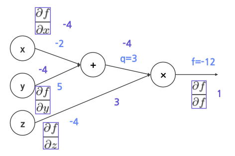
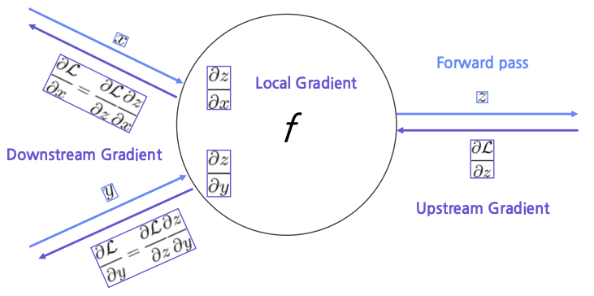
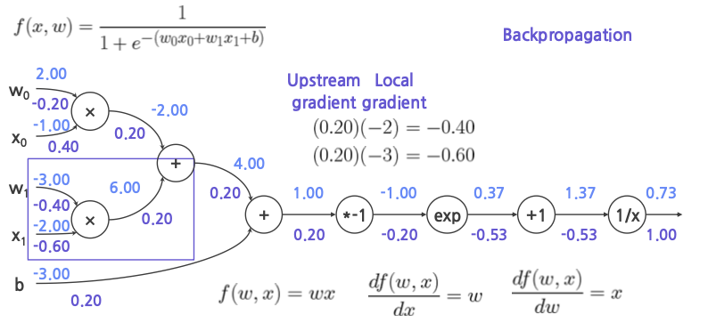
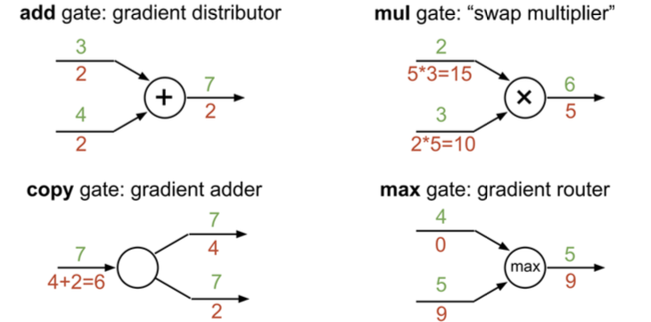

`Backpropagation`은 경사하강법을 사용하여 가중치를 업데이트하는 과정을 말한다.

## Computational Graph
-----------

Forward/backwrad propagation 과정을 그래프로 나타낸 것이다.

Computation graph를 이용해서 컴퓨터가 gradient를 간단하게 계산할 수 있도록 변환할 수 있다.

## Forward Pass
---------

$f(x, y, z) = (x + y)z$ 이며 $x = -2$, $y = 5$, $z = -4$ 라고 가정해보자.

위의 값을 통해 최종값을 구하는 과정을 `Forward Pass`라고 말한다.

## Backpropagation
--------

`Backpropagation`은 input이 입력되면 이에 따라 loss 값이 얼마나 변화하는지, 즉 loss를 입력된 파라미터에 대해 미분한 값을 계산하는 과정이다.

- input: $x$, loss: $f$ &rarr; $\frac{\partial f}{\partial x}$
- input: $y$, loss: $f$ &rarr; $\frac{\partial f}{\partial y}$

## Chain Rule
-----------

- Upstream Gradient : loss를 output에 대해 미분
- Local Gradient : output을 input에 대해 미분
- Downstream Gradient: loss를 input에 대해 미분한 값으로 Upstream Gradient와 Local Gradient를 곱으로 표현된다.

## Logistic Regression: Backpropagation
--------

## Patterns in Gradient Flow
---------

역전파를 진행하는 과정에서 몇몇 gate는 계산 과정에서 특정한 패턴을 가지고 있다.

