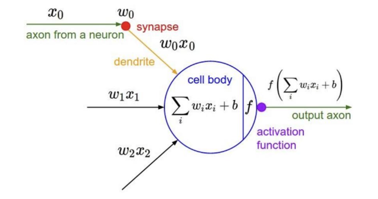

## Activation Functions
-------

nonlinear한 함수를 어떻게 활성화(activation)할 것인지 결정하는 과정에서 나온 개념이다.

Activation Function에는 다양한 함수가 존재하며 목적에 따라 적절한 함수를 선택하여 사용한다.

### Sigmoid Function

- 출력값이 확률분포 형태로 나오는 것을 원할 때 사용
- 출력 값의 범위: [0, 1]
- 가장 많이 사용되었던 함수

단점은 아래와 같다.

- Vanishing Gradient: input이 크거나 작을 때 기울기가 0에 가까워진다.
    - $x = 10$, $\sigma(x) \approx 1$ 이기 때문에 $ 1 - \sigma \approx 0$ 이므로 그레디언트는 0에 수렴
    - $x = 0$, $\sigma(x) \approx 0$ 이기 때문에 그레디언트는 0에 수렴

- **출력값들이 zero-centered** 하지 않는다.
    - 입력 $x$ 가 모두 양수라 가정하면 출력값의 범위가 [0, 1]이므로 항상 양수이므로 그레디언트의 부호가 변하지 않는다. 즉, **그레디언트가 특정 방향으로만 업데이트된다.**

- exp()의 연산이 비싸다.

### Tanh Function

- 출력 값의 범위: [-1, 1]
- Zero-cetered

단점은 다음과 같다.

- Vanishing Gradient 문제가 여전히 발생한다.
    - 커진 sigmoid 뉴런과 비슷함: $tanh(x) = 2\sigma(2x) - 1$

### ReLU Functions

- + 영역에서 항상 기울기가 있기 때문에 saturate 되지 않는다.(Vanishing Gradient 발생 X)
- 연산이 효율적이다.
- sigmoid 나 tanh보다 빨리 수렴한다.

단점은 다음과 같다.

- 출력값애 zero-centered 되지 않는다.
- **Dead ReLU problem**: 출력값이 음수라면 saturated 되는 문제가 발생한다.
- **$x=0$ 일때 미분 불가능하다.**

### Leaky ReLU(Rectified Linear Unit)

- 모든 영역에서 saturate 되지 않는다.
- 연산에 효율적이다.
- sigmoid나 tanh 보다 수렴 속도가 빠르다.
- No Dead ReLU 문제: gradient vanishing 되지 않는다.

단점은 다음과 같다.

- 추가적인 하이퍼파라미터($x$가 0 미만일 때의 기울기)

### ELU(Exponential Linear Unit)

- ReLU의 모든 장점
- (Leaky) ReLU에 비해 saturated된 음수 지역은 견고성을 더한다.

하지만, `exp()` 연산이 비싸다는 단점이 있다.

위의 내용을 정리하면 아래와 같이 정리할 수 있다.

- 학습률을 주의하면서 `ReLU`를 사용한다.
- sigmoid or tanh는 사용하지 않으며 마지막 층에 사용한다.

## Weight Initialization
---------

가중치 초기화를 하는 방법에 따라 학습이 빠르고, 높은 성능을 가지는 파라미터로 수렴할 수 있다.

### Small Gaussian Random

표준 정규 분포를 작은 상수(0.01)로 곱하는 방식이며 얕은 신경망에서는 좋은 결과를 내며 널리 쓰인다.

하지만, 깊은 신경망을 구축할 때는 모델이 학습하면서 기울기 값이 작아지며 결국 모든 기울기가 0에 가까워져 학습이 진행되지 않는다.

### Large Gaussian Random

이 방식으로 가중치를 초기화하면 극단 값으로 밀려나간다는 단점이 있다. 이 때 tanh에서는 gradient가 0에 가까워져 학습이 되지 않는다.

### Xavier Initialization

`Xavier 초기화`는 입력값과 출력값의 분산이 비슷하게 유지되도록 가중치를 초기화하는 방법으로, 활성화 함수가 입력의 분산을 지나치게 왜곡하지 않는다는 전제를 기반으로 설계되었다.

- 입력 뉴런 수에 따라 가중치의 분산을 설정하여 각 층의 출력이 적절한 분포를 유지하도록 설계되었다.
    - forward/backward 시 값의 Exploding/Vanishing을 방지한다.
- sigmaid나 tanh와 같은 선형성을 지닌 함수들과 조합할 때는 Xavier 초기화가 출력 분포를 안정적으로 유지하는 데 유리하다. 

그러나 ReLU와 같은 비선형성과 비대칭성을 가지는 활성화 함수를 사용할 경우 출력값의 절반이 0이 되며 분산이 왜곡될 수 있기 때문에, Xavier Initialization의 가정에 맞지 않으므로 최적의 결과를 내기 어렵다.

## Learning Rate Scheduling
-------------

모든 optimizer(SGD, SGD + Momentum, AdaGrad, RMSProp, Adam)들은 특정 학습률을 필요로 한다.

- 매우 높은 학습률: loss가 급증할 수 있다.
- 매우 낮은 학습률: loss는 줄어들지만 매우 천천히 움직인다.

대부분 큰 초기 학습률에서 시간이 지날수록 감소하는 방식으로 학습률을 변경하여 학습을 진행할 수 있다.

### Learning Rate Decay

1. 처음에는 큰 학습률을 사용한다.
2. 최적의 해에 접근하기 위해서 작은 학습률을 사용한다.

좋은 Learning Rate를 찾는 방법을 정리하면 다음과 같다.

- traing을 시작할 때 너무 큰 학습률을 사용하면 loss가 급격히 상승하는 등의 문제가 발생할 수 있다.
- 따라서 초기에 0에 가까운 작은 학습률을 사용하고 linear하게 증가시키다가 학습이 잘 진행되면 이 학습률을 유지한다.
    - 전체의 10%에서 warmup이 발생합니다.
- 더 이상 loss값이 줄어들지 않으면 기존에 유지하던 학습률을 줄여 학습을 이어서 진행한다.
- 더 큰 미니 배치는 큰 초기 학습률을 사용합니다. (With larger mini-batch, use larger initial
learning rate)

또한, Learning rate를 decay하는 방법은 Cosine, Liear, Inverse Sqrt 수식을 이용해서 조절할 수 있다.

