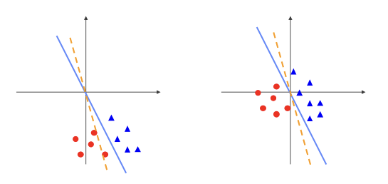

## Data Preprocessing
---------

데이터를 이용하여 모델을 학습하기 전에 데이터가 skew되거나 잘 정리되지 않는 상태라면 모델 학습에 적절한 형태로 처리하는 과정이 필요하다. 이런 과정을 `Data Preprocessing` 이라고 한다.

이러한 과정을 거치면 데이터 전처리를 하지 않고 학습할 때보다 더 좋은 성능을 보여준다.

### Zero-centering & Normalization

모든 입력값이 양수일 때, sigmoid function과 비슷하게 gradient 과정에서 특정 방향으로만 업데이트 되는 문제점을 가지고 있다.

이러한 문제점을 해결하기 위해 데이터의 분포를 0을 중심으로 분포할 수 있도록 만들어 주는 것이 모델 학습에 도움이 된다. 이를 `zero-centering` 이라고 한다.

추가적으로 `normalize`하기 위해 표준편차로 나눈다.

`zero-centering`를 하면 아래와 같은 효과를 얻을 수 있다.

- weight의 작은 변화에 덜 민감해진다.
- optimize하기 쉽다.

### PCA & Whitening

- `PCA`
    - 가장 분산이 넓은 축을 중심으로 rotate한다.
    - 데이터가 정규화하여 zero-center을 만들고 축을 정렬한다.
- `whitening`
    - convariance 행렬을 만든다.
    - 각각의 축은 같은 중요도를 갖고 있다.

이러한 과정을 통해 분산이 굉장히 큰 파라미터를 없애주면서 데이터의 키가 되는 본질적인 성질만 표현할 수 있도록 압축시켜준다.

## Data Augmentation
-----------

`Data Augmentation`은 아래와 같은 조건에 처해있을 때 사용한다.

- 실제 데이터셋의 양이 적다.
- 데이터의 의미에 영향을 주지 않고 각각의 데이터들을 수정하는 방법들이 존재한다.
- classifier은 불변해야한다.
- 큰 데이터 셋을 가지는 것은 돈이 많이 들기때문에 기존 데이터를 최대한 활용해야한다.

### Horizontal Flips

이미지의 시멘틱에 따라 좌우로 이미지를 반전 시킬 수 있다.
- 수직으로 뒤집는 경우 의미가 왜곡될 수도 있다.

### Random Crops

이미지의 일부분을 잘라서 데이터를 늘린다.

`Translation invariance`: 몇 개의 픽셀만 이동한 두 개의 이미지를 비슷하다고 인식한다.

이미지 뿐만 아니라 audio, video, text, sequence에도 해당된다.

### Scaling

- 이미지의 크기에 관계없이 물체는 인식되어야한다.
- 다양한 크기의 이미지에서 무작위로 크롭한 이미지를 훈련 이미지로 사용할 수 있다.

#### Random Crops and Scaling: Common Practice

For training:

- 범위에 있는 L을 랜덤으로 선택합니다. [256, 480].
- 짧은 면의 길이가 L이 되도록 크기를 조정합니다.
- 조정된 이미지에서 224*224 패치를 무작위로 샘플링 합니다.

For testing:

- 이미지의 크기를 다음 5개 사이즈로 조정합니다. {224, 256, 384, 480, 640}
- 224*224 사이즈 이미지 10개를 크롭하여 분류를 진행합니다
- 이 이미지들의 평균 혹은 최대값을 최종 분류에 사용합니다.

### Color Jitter

- 빛이나 다른 요인들에 의해 색깔은 다르게 보일 수 있다.
- 요인들의 변화에 classifier이 영향을 받지 않기를 목표로 한다.

위의 방법 뿐만 아니라 여러 다른 테크닉도 있다.

- Translation
- Rotation
- Streching
- Shearing
- Add noise
- Mix two images
- Apply a filter

참조: [Data Augmentation method](https://journalofbigdata.springeropen.com/articles/10.1186/s40537-019-0197-0)
