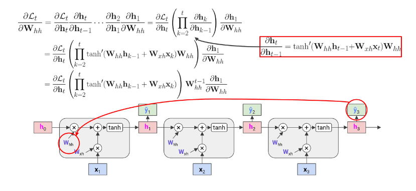
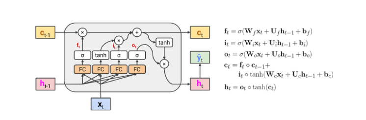
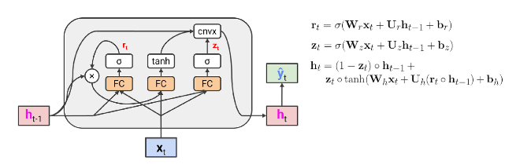
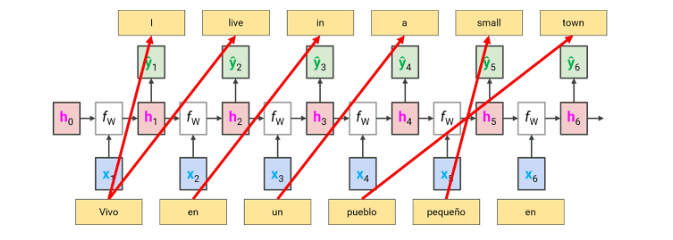
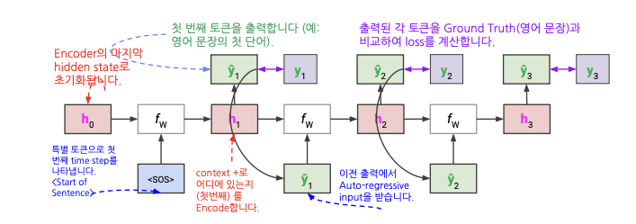

## RNN

`RNN(Recurrent Neural Network)`은 시계열 데이터를 처리하기 위한 모델이다.

$$
h_t = f_w(h_{t-1}, x_t)
$$

### RNN의 장단점

**장점** 
- 가변적인 길이의 input sequence를 처리할 수 있음.
- 입력이 많아져도 **모델의 크기는 증가하지 않음.**
    - 동일한 weight 파라미터를 사용하기 때문에 크기가 증가 X
- (이론적으로) t 시점에서 수행된 계산은 여러 단계 이전의 **정보를 사용할 수 있음.**
- 모든 단계에서 동일한 가중치가 적용됨

**단점** 
- Recurrent computation이 느림
- Sequence output inference는 **병렬화(parallelization)가 어려움**
- Vanilla RNN은 훈련 중 **기울기 소실(vanishing gradient)** 문제를 겪음
- Vanilla RNN은 종종 시퀀스 내 **장거리 의존성(long-range dependence)**를 모델링하는데 실패함
- 실제로는 여러 단계 이전의 정보에 접근하기 어려움
    - 뒤로 갈수록 앞의 정보에 대한 기억이 떨어짐

### Exploding / Vanishing Gradient Problem

RNN은 각 time step에서 같은 matrix를 multiply하는 구조이다.

RNN cell을 더 자세히 살펴보자.

수식은 $h_t = tanh(W_{hh}h_{t-1} + W_{xh}x_t)$ 이다.

$\mathbf{h} _{t}$ 에서 $\mathbf{h} _{t-1}$ 로 backprop를 진행하기 위해 편미분을 하면 아래와 같다.

$$
\frac{\partial{\mathbf{h}_t}}{\partial{\mathbf{h}_{t-1}}} = tanh'(\mathbf{W}_{hh}\mathbf{h}_{t-1} + \mathbf{W}_{xh}\mathbf{x}_{t})\mathbf{W}_{hh}
$$

위의 과정을 $\mathscr{L}$ 에서 $\mathbf{W}_{hh}$ 까지 backprop를 진행하면 아래와 같은 결과가 나온다.

- $\prod_{k=2} ^t \ tanh'(\mathbf{W} _{hh}\mathbf{h} _{k-1} + \mathbf{W} _{xh}\mathbf{x} _{k})$ 
    - `$tanh'` 가 거의 항상 1 미만이면 `기울기 손실(Vanishing gradients)`

- $\mathbf{W}_{hh}^{t-1}$
    - 1보다 큰 값이면 `기울기 폭발(exploding gradients)`
        - `클리핑(clip)`을 통해 thresholde값 이상이면 gradient를 조절하여 해결하는 경우도 있다.
    - 1보다 작은 값이면 `기울기 손실(vanishing gradients)`
        - `클리핑`으로 폭발을 해결해도 기울기 손실은 해결하지 못함

만약, `Xavier Initialization`을 통해 적절한 가중치로 초기화를 한다면?

- 어느 정도 deep model에서는 비교적 잘 작동하지만, 더 깊은 모델을 만들수록 0으로 수렴하는 결과를 얻게된다.

이 때, RNN 모델의 깊이를 결정하는 것은 `input sequence length` 이다. 입력 시퀀스가 길면 깊어가 깊어지고 짧으면 깊이 또한 얕다.

그러므로, 시퀀스 데이터의 길이가 길면 gradient의 값이 모델의 초기 레이어까지 잘 전달되지 않아 RNN 모델은 학습이 진행되지 않는다. 

## Long Short Term Memory(LSTM)
--------

RNN의 단점을 보완하기 위한 방안으로 `Long Short Term Memory` 모델이 고안되었다.

먼저, 아래는 Vanilla RNN 모델에서 weight matrix를 FC(fully-connected) box로 표현한 그림이다.

$$
FC = W_{xh}x_t + W_{hh}h_{t-1}
$$

RNN이 FC를 통과하는 backward 과정에서 기울기 소실(vanishing gradient) 문제가 발생한다.

이를 방지하기 위해, `cell state`라 불리는 새로운 hidden state 세트와 FC 계층을 우회하는 highway를 도입했다. 

모델에는 $c_{t-1}$ 을 더한 후 non-linearity를 추가한다.

`cell state`는 이전 상태($c_{t-1}$) 에서 $tanh$ 값을 더해서 현재 상태를 내보내는 역할을 한다.

하지만 모델이 깊어지면 이 `cell state` 도 너무 많은 정보들을 담고 있을 것이기 때문에 오래된 기억을 지우는 메커니즘이 필요하다.

이 역할을 하는 것을 `forget gate`라고 한다.

`forget gate`는 입력으로 얻은 값에 `sigmoid`를 사용하여 0~1 사이의 값을 구하고, 값이 1에 가까워질수록 데이터를 유지해야하는 신호로 인식하게 된다.

이러한 방식으로 장기 기억을 조절하며 이러한 기능 또한 모델이 학습한다.

LSTM에는 forget gate 외에 `input gate`와 `output gate`도 있다. 

- `input gate` : 새로운 입력을 얼마나 cell state에 더해줄 것인지 결정하는 게이트
    - 입력값에 `sigmoid`를 씌워 0~1 사이의 값을 가지게 만들고, 1에 가까운 수 일수록 새로운 입력값을 많이 반영해서 `cell state`에 더해준다.
- `output gate` : hidden state $h_t$로 내보낼 때 cell state $c_t$의 정보를 얼마나 반영할 지를 제어하는 게이트
    - 얼마나 내보낼지는 학습 데이터에 맞춰 파라미터가 학습하면서 정해진다.

위의 과정을 수식으로 정리하면 다음과 같다.

- LSTM은 Vanilla RNN 보다 **long-range information을 더 잘 보존하다.**
    - forget gate=1이고 input gate=0 이면, 이전 정보는 계속 유지하고 새로운 정보에 대한 반영은 전혀 하지 않게 작동하므로 계속 이전의 값을 유지한다.
- LSTM은 기울기 소실/폭발이 없다는 것을 보장하지는 않지만, 모델이 long-distance dependencies(장거리 의존성)을 학습하기에 더 쉬운 방법이다.

## Gated Recurrent Units (GRU)

LSTM과 유사한 또 다른 아이디어로 RNN에서 장거리 의존성(long-range dependency)을 제공한다.

- LSTM처럼 **추가적인 cell states가 필요하지 않음**
- LSTM보다 **적은 파라미터를 사용함**
- LSTM과 유사한 **graident highway**를 제공하며, 이전 hidden state와 input에서 계산된 새로운 **convex combination을 사용함**

> convex combination : 한 벡트를 다른 벡터의 `가중 평균(weighted average)`으로 표현한 것으로 이 때, 가중치는 0~1 범위이고 합이 1이어야 한다. 
>
> $$c = \alpha a + (1 - \alpha)b \ , \ \ \ \text{단} \ \ 0 \le \alpha \le 1 $$

위의 내용을 정리하면 다음과 같다.

- `LSTM`은 RNN에 대한 좋은 기본 선택이다.
    - RNN 이라고 말하는 경우, 대부분이 LSTM을 가르키는 경우가 많다.
- 더 빠른 게산과 적은 파라미터를 원한다면 GRU를 사용할 수 있다.
- 무거운 자연어 처리(NLP) 문제에 대해서는 `Transformer`가 쓰인다.

## Sequence-toSequence Models

한 언어로 주어진 문장을 다른 언어로 같은 의미의 문장을 생성하는 작업인 Machine Translation을 수행한다고 가정해보자.

이를 RNN으로 처리하면 위와 같이 처리될 수 있다.

하지만, 이러한 방식에는 문제점이 존재한다. 같은 의미를 갖더라도 언어마다 문장의 길이가 다르며 어순이 다르다. 또한, 현재 입력으로 출력이 불가능한 내용이 출력되어야 하는 경우도 있다.

이러한 문제를 해결하기 위한 모델이 바로 `seq2seq` 모델이다. 

`seq2seq` 모델은 대표적으로 기계 번역에 사용되는 모델이며 모델 구조는 입력을 받는 `Encoder`와 출력을 하는 `Decoder`로 구성되어있다.

- `Encoder` : 입력 문장의 모든 단어들을 순차적으로 입력받은 뒤에 마지막에 이 모든 단어 정보들을 압축해서 하나의 벡터로 만든다.
    - 모든 단어 정보를 압축해서 만든 벡터를 `컨텍스트 벡터(context vector)`라고 한다.
    - Many-to-one (여러 단어 &rarr; 하나의 벡터)
- `Decoder` : 컨텍스트 벡터를 입력으로 받아서 번역된 단어를 한 개씩 순차적으로 출력한다.
    - Decoder는 `Auto-regressive` 방식으로 단어를 생성해낸다.
    - One-to-many (하나의 벡터 &rarr; 여러 단어)
- 인코더와 디코더를 거쳐서 나온 loss는 인코더와 디코더 모두 훈련하는데 사용된다.

> `Auto-regressive` : 현재 출력된 값이 다음 단계의 input으로 사용

디코더의 단어 생성 방식을 그림으로 표현하면 아래와 같이 표현한다.

디코더에게 `<SOS>` 토큰을 주면 번역을 시작한다. 디코더의 처음 hidden state는 인코더의 마지막 hidden state로 초기화된다. 

위의 그림에서 볼 수 있듯이 hidden state($h$)와 예측값($\hat{y}$)를 다음 입력으로 사용한다.

디코더의 학습 단계에서는 `Teacher Forcing` 이라는 특별한 방법을 사용한다.

학습 초반에는 아직 모델이 데이터 학습이 안된 상태이기 때문에 예측값이 실제와 매우 다르게 나온다. 이를 다음 예측의 입력으로 사용하면 모델 학습이 불가능하다.

이를 방지하기 위해 **예측값을 다음 입력값으로 넣지 않고 대신 정답을 다음 입력으로 사용**한다.

반대로, 평가 단계에서는 실제로 예측값을 다음 입력으로 사용한다.

이러한 방식은 기존 RNN으로 기계번역을 수행할 때 발생하던 **입력 시퀀스와 출력 시퀀스의 길이가 서로 다른 문제**를 효과적으로 해결할 수 있다.

