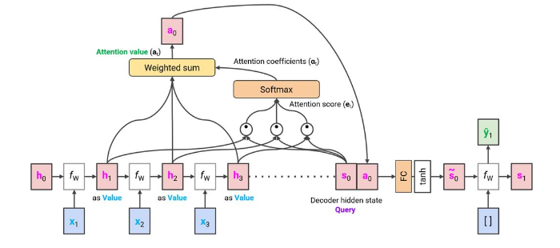
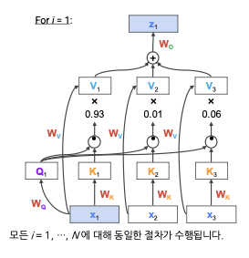

기존 RNN-based models(LSTM, GRU)의 한계점이 있다. 

seq2seq model에서 인코더를 거치면 `single embedding`으로 encoding된다. 이때 임베딩 벡터가 길면 `information loss` 발생, 즉 이전에 입력된 정보는 더 많이 잊혀지는 경향이 있다.

이러한 단점을 보완하기 위해 Decoder가 **모든 input step에서의 hidden state를 고려하며, 관련성이 높은 input token(or hidden state)**에 더 집중하여 ouput을 예측하는 방식을 사용한다.

이러한 방식으로 Long-term dependency 문제점이 완화될 수 있다.

## Attention 
-------

Attention 함수는 Query, Key, Value를 통해 Attention 값을 계산한다.

- `Query(Q, context)` : 비교하는 기준
- `Key(K, references)` : 비교하는 대상
- `Value(V, references)` : 비교하는 대상

`Attention 값`은 **value들의 가중치 평균**이며, 여기서 각 weight는 relevance `query`와 correspoding `key` 간의 관련성에 비례한다.

이를 계산하려면 아래와 같은 조건을 만족해야한다.

- `Q`와 `K`는 비교 가능해야하며 일반적으로 동일한 dimensionality를 가진다.
- `V`와 `Attention value`는 당연히 같은 dimensionality를 가져야한다.
- 실제 응용 사례에서는 이 4가지 요소가 모두 동일한 dimensionality를 가진다.

Attention을 seq2seq 모델에 대응을 하면 다음과 같다.

- Q : decoder의 time $t$ 에 대한 hidden state
- K : encoder의 모든 hidden states
- V : encoder의 모든 hidden states

> Seq2seq 에서는 Key와 Value를 똑같은 의미로 사용한다.

이를 통해서 Attention 값을 계산하는 과정을 그림으로 나타내면 아래와 같다.

- Decoder 현재 Query와 Encoder의 모든 Value(or Key) 사이의 `dot-product`를 계산한다.
    - 이 계산은 Q와 각각의 hidden state(Value) 사이의 `simularity`를 구하는 과정이다.
    
    $$
    \mathbf{e}_t = [\mathbf{s}_t^T\mathbf{h_1}, \ldots, \mathbf{s}_t^T\mathbf{h}_T] \in \mathbb{R}^T
    $$

- Q와 V의 내적 값을 모두 더해 `softmax` 함수를 취한다.

    $$
    \alpha_t = softmax(\mathbf{e}_t) = \frac{exp\{ \mathbf{e}_t \}}{\sum_{i} exp \{ [\mathbf{e}_t]_i \}} \in \mathbb{R}^T
    $$

- 각각의 Value와 softmax 함수를 거친 결과값을 `weight sum`을 취한다.
    - `weight sum`은 현재의 query와 가장 유사도가 높은 hidden state(value)에 더 집중하는 효과를 줄 수 있다.

    $$
    \mathbf{a}_t = \sum_{i=1}^T [\alpha_t]\mathbf{h}_i \in \mathbb{R}^h
    $$

    - 유사도가 높으면 $\alpha_{t, i}$의 값이 크므로 자연스럽게 Query와 가장 유사도가 높은 hidden state에 더 큰 비중을 두고 context vector를 만든다.

위의 과정을 거쳐 나온 값을 `attention value`라 한다.

마지막으로, attention value를 decoder hidden state와 연결하고 vanilla seq2seq model과 같이 진행한다.

위의 내용을 정리하면 다음과 같다.

- `Query` : decoder의 hidden state $s_0$
- `Key`, `Value` : encoder의 hidden states {$h_1, h_2, h_3$}
- `Attention value` : encoder hidden states의 가중치 평균
    - Weight: $s_0$와의 유사성

### Machine Translation with Attention

1. 번역할 문장들의 각 단어들을 hidden state인코딩하는 작업을 수행한다.
    - 인코딩하는 과정에서 LSTM 또는 GRU를 이용한다.
2. <start> 토큰이 들어가면 이후에는 디코딩 과정을 수행한다.
3. 디코딩 과정에서 Query(현재 hidden state)와 모든 hidden state(Value)를 각각 내적하여 유사성을 측정하고 weight sum을 구한다(위의 설명 참고).
4. Attention value 벡터를 decoding 단계의 현재 hidden state와 `concatenate` 한다.
5. concatenate된 벡터를 fully connected layer를 통과하여 단어를 예측한다.

이 과정을 `<end>` 토큰이 나올 때 까지 반복하며 이러한 방식은 input sequence와 output sequence의 길이가 달라도 상관이 없다. 즉, Many-to-Many 구조일 필요가 없다.

이 방법의 장점 중 하나는 위의 과정을 통해 `Attention Map`을 만들 수 있다. 이 맵을 통해 어떤 단어가 어떤 확률 분포를 통해 예측이 되었는 지 알 수 있다.

- 밝은 색일수록 해당 입력 단어와 출력 단어 사이의 연관성이 크다(모델이 더 집중한다)는 뜻을 의미한다.

 모델 예측 뿐만 아니라 모델의 결과를 시각화하여 해석할 수 있다.

## Transformers
--------------

Transformers를 보기 전에 MLP, CNN와 RNN을 살펴보자.

MLP와 CNN은 Training dataset의 입력 $x$에서 label $y$ 로 가장 잘 매핑되는 가중치 집합을 통해서 구성된다.

즉, input에 Weight paramters를 곱하여 ouput을 구하는 것이다.

RNN 같은 경우는 가변적인 데이터를 처리한다는 점에서 MLP와 CNN과 다르지만 본질적인 성질은 Weight paramters를 통해 output을 구한다.

하지만, Transformers는 Weight를 이용하여 예측값을 구하는 메커니즘과 다르다.

Transformers의 아이디어는 아래와 같다.

### Transformers의 Main idea

- 기본 가정 : input $x$는 서로 유기적으로 관련(`organically related`)된 여러 요소(`multiple elements`)로 분할될 수 있다.
    - 사회 속의 사람들
    - 문장 속의 단어
    - 비디오의 프레임
- `Self-attention` : 각 element는 해당 `context`(input의 다른 요소)에 참여하여 own representation을 개선하는 방법을 학습한다.
    - ex. 문장 안의 단어들은 다른 단어들과 유기적으로 연결되어 그 단어가 문장 속에서 가지는 의미(대표성)이 정의된다.

위에서 설명한 Attention과 Transformer의 차이점은 Attention에서 사용하지 않는 `Weight paramters`를 사용한다는 점이다.

Attention에서는 Query, Key, Value를 통해 Attention 값을 구했지만 Transformers에선 **$W_Q$, $W_K$, $W_V$를 사용**한다. 

또한 attention value를 **원래 공간에 다시 매핑하기 위해 $W_O$를 추가적으로 사용**한다.

- Input token {$x_1, x_2, \cdots, x_N$} 가 주어지면, 각 token $x_i$ 는 `linear transformation` 에 의해 각각의 Query $Q_i$, Key $K_i$, Value $V_i$ 벡터로 매핑된다.
- Linear weights($W_Q, W_K, W_V$) 는 `learned parameter`로 `모든 input`에서 공유된다.
- $W_Q \ (W_K, W_V)$ 는 일반적으로 **Query (Key, Value) 역할을 할 벡터를 표현하는 방법을 학습**한다.
- `attention value`를 원래 공간에 다시 매핑하는 또 다른 학습 가능한 매개변수 $W_O$ 가 필요하다.

> `linear transformation` : 벡터를 다른 차원의 벡터로 바꾸는 선형 연산으로 transformers에서는 $(\text{입력 벡터}) \times (\text{학습 가능한 행렬})$ 연산을 수행한다.

Transformers에서 Attention을 수행하는 방법은 다음과 같다.

- $i$에 대해 학습할 때 각 token $x_i$ 는 Query가 된다.
    - input sequence : {$x_1, \cdots, x_N$}
- Key와 Value는 $x_1, x_2, \ldots, x_N$ 에 해당한다.
- 이 떄, Query (Key, Value)를 벡터 형태로 바꾸기 위해 각각 $W_Q$ ($W_K$, $W_V$)를 곱한다.
- 곱해서 만들어진 Query ($Q_i$) 와 Key ($K_1, \ldots , K_N$) 를 dot-product 계산을 하여 각각의 유사도를 계산한다.
- 이 각각의 유사도에 Value ($V_1, \dots, V_N$) 를 곱한 후 모두 더한다.
- 이를 원래 embedding space로 매핑하기 위해 $W_O$를 곱하면 최종 결과값 $z_i$가 된다.

결과값 $z_i$의 의미는 $x_i$과 다른 input들과 연관성(유사도)를 반영하여 다시 표현한 값이다.

이러한 과정을 `contextualize`라고 말하며 이 단계를 반복해 여러 개의 Layer로 구성한다.