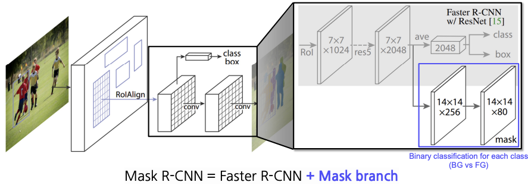
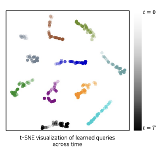

## Semantic segmentation
------------

이미지 분류를 영상 단위가 아니라 픽셀 별로 하는 것. 단, 같은 클래스(종류)이면서 서로 다른 물체(객체)를 구분하지 않는다.(Don't care about instances. Only care about **semantic category**)

**적용분야**

- 의료 이미지
- 자율 주행
- computational photography(object별로 조작할 수 있는 사진) 등

object의 구별이 쉬워지므로, object 별 이미지 수정을 하기 위한 인터페이스를 만드는 post-processing에 사용되기도 한다.

## Semantic segmentation Neural Net의 종류
-------

### Fully Convolutional Networks(FCN)

- 최초의 end-to-end semantic segmentation NN
    - 입력과 출력 페어만 있으면 신경망 내부가 한번에 자동 학습되는 구조
        - 이전까지는 내부 알고리즘을 직접 작성하고 결합함
- 임의의 크기인 input이 들어오더라도 이 사이즈에 맞는 output을 만들 수 있다.(출력의 해상도를 입력의 해상도에 따라 가변적으로 대응)
    - 학습에 사용한 이미지와 입력 이미지가 달라도 문제없이 작동한다(호환성 높음).

기존의 CNN은 마지막 부분에 Fully Connected Layer를 몇 단 두었었는데, FCN은 FC 대신 Fully convolutional layer만 사용한다.

이러한 방식에 어떤 차이가 있을까?

- *Fully* ***connected*** *layer* : 공간 정보를 고려하지 않고, fixed vector가 input으로 주어지면, output도 fixed vector로 처리된다.
- *Fully* ***convolutional*** *layer* : 입/출력이 모두 activation map(tensor)이다. $1 \times 1$ conv layer이다.
    - 각 위치에 대한 인식결과를 공간구조를 유지한 채로 작동한다.

Fully connected layer는 각 채널들을 일직선으로 쭉 펴서(flatten) concat한다. 이떄, 이미지의 공간적인 정보가 전부 mixing되는 효과가 발생한다.

그러므로 feature map 전체애 대해서 하나의 결과를 만드는 flattening을 빼야한다. 각 위치에 대한 인식결과를 독립적으로 수행하도록 위치마다 피처를 뽑는 형태로 만들고 각각을 flattening 하는 방식으로 해야한다.

이때, 각 위치에서 독립적으로 feature를 뽑아 flatten 하는 vector를 $1 \times 1$ convolution 필터로 생각할 수 있다. 이러한 필터를 합쳐서 feature map을 구성할 수 있다. 이 때, conv 연산이므로 sliding window 방식을 사용하기 때문에 좀 더 spatial한 데이터가 유지된다는 장점이 있다.

이 과정에서 Pooling 계층을 여러번 통과하고, stride가 있어 FC layer에 비해 좀 더 넓은 receptive field를 가지고 있기 때문에, high-resolution의 input이 들어오더라도 **결과값은 훨씬 low-resolution의 예측 스코어(히트맵)**(해상도가 떨어짐)를 가지게 된다.

### Upsampling

위에서 FCN의 단점을 해결하기 위해 `upsampling` 기법을 사용한다.

고해상도 이미지 input에 Conv 연산과 Pooling을 거치면서, 출력값은 자연스럽게 저해상도로 Downsampling된다. 

- 네트워크를 많이 거친 이미지는 공간에 대한 디테일한 정보는 손상된 상태이다.
    - Semantic하고 Holistic한 전체 정보에 대한 피처는 남아있음
- 네트워크를 적게 거친 이미지는 디테일한 정보를 가지고 있다.
    - Semantic 정보는 부족하지만 텍스처, 컬러, 엣지 같은 low-level 정보가 아직 남아있음

이를 마지막에 고해상도로 키워주는 연산이 Upsampling이다. 방법은 여러가지가 있지만, 최근에는 대표적으로 2가지가 사용된다.

- Transposed convolution
- Upsample and convolution

### 다시 FCN으로

그러나 아무리 Upsampling을 했다고 하더라도 한 번 떨어진 resolution을 충분히 원래대로 끌어올리기는 쉽지 않다. 연산 과정에서 잃어버린 정보들을 다시 살리는 일이기 때문이다.

결국, 목표대로 정확한 High-resolution의 output을 얻기 위해서는 두 마리 토끼를 다 잡는 미션을 수행해야 한다.

- Fine/Low-level/Detail/Local, 미세한 각 부분의 디테일을 살리면서도
- Coarse/Semantic/Holistic/Global, 전체적인 context를 볼 수 있는 넓은 시야를 가져야한다.

이 두 특징을 모두 가지기위해서 기존의 방법들을 모두 fusion한다.

1. 높은 layer의 activation map을 upsampling하여 해상도를 크게 끌어올린다.
2. 이에 맞추어 중간 layer의 activation map을 upsampling하여 가져오고, concat한다.

위에서는 FCN-8s가 가장 많은 layer들을 concat하는 형태가 된다. 이처럼 중간 layer들의 skip connection을 추가할 때 훨씬 더 명확한 이미지를 얻을 수 있다.

### FCN의 특징

- Faster
    - 직접 짠 컴포넌트(알고리즘)에 의존하지 않고 자동적으로 학습하는 end-to-end 구조이다.
- Accurate
    - feature 표현과 분류가 함께 최적화된다.

### U-Net

- FCN을 베이스로 만들어졌다.
- 낮은 층의 feature map과 높은 층의 feature map을 더 잘 결합하는 방식을 제시했다.
    - FCN의 skip connection과 유사한 방식이다.
- 좀 더 정교한 segmentation이 가능해졌다.

기존의 CNN 파트와 conv 연산을 적용하여 전체적인 feature map(holistic context)을 뽑아내는 downsampling 부분은 거의 같다. 여기서는 `Contracting path`라고 부른다.

- 이미지의 전반적인 context를 인코딩한다.
- $3\times3$ conv 를 사용한다.
- resolution이 줄어들 때마다 feature의 채널을 doubling 해준다.

원본 이미지의 해상도를 출력하기 위해 upsampling 파트가 있다. 여기에서는 `Expanding path`, `Decoding` 이라고 부른다.

- $2\times2$ conv 를 사용한다.
- 한번에 upsampling 하는 대신, 채널 수를 반으로 줄여가며 점진적으로 upsampling한다(즉, Contracting path의 대응되는 layer와 채널 수를 동일하게 맞춤).
- 대칭되는 Contracting path의 layer에서 **skip connection을 통해 대칭되는 feature map들을 가져와서 fusion(여기서는 concat)**해준다.

> 이때 input 이미지와 feature 이미지의 크기는 짝수여야 한다. 만약 홀수라면, Contracting/Expanding 파트에서 나머지 정보들이 유실된다.

## Object detection
------------

Object detection, 객체 검출은 CV에서 가장 시장수요가 높은 task 중 하나이다. 특히 자율주행(Autonomous driving), OCR(Optical Character Recognition) 등의 핵심 기술이다.

기존의 Semantic Segmentation과 [`Instance segmentation`, `Panoptic segementation`]의 차이점은, 전자는 class를 구별하지만 후자는 개체를 구별한다는 데에 있다(Instance를 구별하는가?). 예를 들어, 전자는 이미지에 나온 모든 사람들을 '사람'이라는 하나의 class로 묶어서 동일하게 취급하는데에 비하여, 후자는 Alex, Chris 등으로 각각 다른 사람으로 구별한다. 이중 Panoptic segemetation은 Instance segementation을 포함하고 있는 좀 더 큰 기술이다.

객체 검출(Object detection)은 이미지 분류(Image Classification)와 Box Localization의 조합이다. 일반 영상인식보다 좀 더 고차원의 task로, 먼저 Box의 좌표(좌상단, 우하단)를 잡아 객체를 찾아낸 뒤, 해당 객체의 카테고리를 분류한다.

## Two-stage detector
-------

초기의 Object detection은 two-stage approach를 사용한다. 이미지를 인식해서 feature를 뽑는 부분과 detection 부분을 나눠서 생각한다.

### R-CNN

초기 `R-CNN`의 핵심 아이디어는 미리 학습되어있는 Image classification 네트워크를 obejct detection에 적용하는 것이다.

**작동 원리**

1. 이미지를 입력한다.
2. 약 2000개(2k) 이하로 region proposal(BB 후보군)을 추출한다. 
    - 모델이 아니라 사람이 디자인한 알고리즘으로 수행
3. 각 region proposal을 CNN input에 적절한 크기로 warping(이미지 사이즈 일정하게 조정)을 해준다
4. target task가 아닌 다른 task에 대해 학습된 Pre-trained CNN에 넣는다.
5. CNN의 FC layer에서 추출된 feature를 기반으로 SVM의 linear classifier만을 이용해서 클래스를 학습한다.(fine-tuning)

이를 발전시켜 최종적으로는 end-to-end 학습이 가능한 형태의 네트워크를 만들어냈다.

- `Fast R-CNN`은 softmax classifier로 변경하여 역전파 수행이 가능한 형태가 되므로 사전 학습된 모델을 사용하지 않아도 된다.
- `Faster R-CNN`은 RPN이라는 별도의 모델을 두어서 학습할 수 있도록 구현된 end-to-end 학습이 가능하다.

## One-stage detector

two-stage detecor와는 다르게, 정확도를 조금 포기하더라도 속도를 올리는 데에 초점을 맞춘 **real-time detector**이다. r**egion proposal을 기반으로 한 RoI pooling을 사용하지 않고 곧바로 box regression과 classification만 사용하므로, 구조가 비교적 간단하고 속도가 훨씬 빠르다.**

### You Only Look Once(YOLO)

**작동 방식** 

1. 이미지를 그리드로 나눈다.
2. 각 grid에 대해서 score를 예측한다.
    1. B개의 Bounding box마다 박스 정보 4개(x,y,w,h)와 confident score(objectiveness score) 1개를 예측한다.
    2. class score(class probability)도 따로 예측한다.
3. 최종 결과는 NMS를 통해 확정한다.

각 위치마다 bounding box를 구조를 prediction을 하면 성능이 떨어지거나 너무 많은 bounding box가 나올 수 있다.

이를 방지하기 위해 `anchor box` 라는 개념이 나온다. 피처맵에서 각 위치마다 미리 정해놓은 aspect ratio와 scale의 단계를 몇 개로 한정을 해놓고 모델의 출력이 한정된 개수의 anchor을 기반으로 box 정보를 예측하게끔 설계한다.

이때, matching 된 box의 label 정보를 가지고 학습에 활용하고 그렇치 않은 정보에 대해서는 따로 loss를 적용하지 않는다.

위의 사진은 YOLO에서 출력 부분의 아키텍처다.

- S : 마지막 conv layer의 해상도
- B : anchor box의 개수
- C : class의 개수

## One-stage vs Two-stage
-------------

One-stage와 Two-stage의 차이점은 Rol pooling 이 있는지 없는지에 있다.

- one-stage : 미리 anchor box가 정의되어있는 것을 가지고 영역을 예측한 후에 classification과 box regression을 수행한다.
- two-stage : 각 영역을 bounding box를 prediction하고 이 feature를 따로 뜯어서 classification과 box refinement를 수행한다.

### Focal loss

Single-stage detector들은 RoI Pooling을 포기했는데, 이 때문에 모든 영역에서의 loss가 계산되고 그에 따라 일정 gradient가 발생하게 된다. 일반적인 영상의 경우 검출하고자 하는 객체의 면적은 얼마 되지 않고, 나머지 대부분은 background이다. 

이말은 즉, 정보가 많은 positive sample은 굉장히 적고, 유용한 정보가 없는 negative sample은 굉장히 많이 나온다는 말이다. 

`class imbalance` 문제를 해결하기 위해 `focal loss`라는 것이 도입되었는데, cross-entropy의 확장이라고 볼 수 있다.

Cross Entropy에서 확률 term이 추가되었는데, $\gamma$는 잘 맞추었는지 여부에 따라 결정된다. 잘 맞추었을 경우 loss를 더 적게 주고, 못 맞추었을 경우 loss를 더 크게 주어 penalty를 강화하는 것이다. 즉, $\gamma$가 클수록 훨씬 더 sharp하게 변화하게 된다.

### RetinaNet

위의 제안된 연구에서 또다른 중요한 제안으로 `Feature Pyramid Networks(FPN)`이 있다.

ResNet과 같은 encoding 구조가 있다면 이 feature map을 거꾸로 만든다. U-Net과 비슷하다고 할 수 있다.

Low level의 특징 layer들과 High level의 특징을 둘 다 잘 활용하면서도 각 scale별로 물체를 잘 찾기위한 multi scale구조로 만들어졌다.

중간중간 feature map들을 넘겨주고, 그 값들을 모두 더해준다(concat이 아니라 add로 fusion한다). 이후, class head와 box head가 따로 구별이 되어서 classification과 box regression을 각 위치마다 dense하게 수행된다.

SSD와 속도는 비슷하지만, 성능은 더 나은 모습을 보였다.

## Instance segmentation
----------

Semantic segmentation는 객체를 구분하지 못하는 반면에 `Instance segmentation`은 각각의 객체들을 구분하면서 동시에 class에 대한 정보도 같이 분석한다.

### Mask R-CNN

대표적인 모델로는 `Mask R-CNN`이 있다.

- RolAlign을 사용한다.
- Mask FCN predictor를 추가하였다.

Mask R-CNN은 Fast R-CNN에 `Mask branch`를 붙인 형태이다.

- 이미지 네트워크에서 RolAlign을 통해 좀 더 정교한 형태의 feature를 추출한다.
- 각각의 RolAlign에서 추출해낸 feature에서 class와 box에 대한 정보를 만들고 그 위에 Mask를 prediction하는 head를 추가한다.

### DensePose R-CNN & Mesh R-CNN

위의 Mask R-CNN은 단순히 instance segmentation을 수행할 뿐 아니라 일반적인 semi-instance segmentation으로 쉽게 확장할 수 있다.

대표적인 예로 DensePose R-CNN과 Mesh R-CNN이 있다. 

- DensePose R-CNN : 모델은 사람의 특성화된 3D Pose estimation을 한다.
- Mesh R-CNN : 3D Mesh를 수행하는 모델

이처럼 head만 새로 디자인해서 기존의 수행하지 못한 task를 해결할 수 있다.

## Transformer-based methods
-----------

NLP에서 큰 성공을 거둔 Transformer가 컴퓨터 비젼에 접목되어서 새로운 연구 결과들이 나오고 있다.

Transformer 기반의 모델로는 `DETR`과 `MaskFormer`가 있다.

### DEtection TRansformer(DETR)

페이스북에서 2020년 발표한 모델로, Objecte detection에 Transformer를 적용시킨 사례이다.

이 모델은 set prediction problem으로 바꿈으로써 기존의 region proposal network에서 non-maximum supression을 제거하는 알고리즘을 잘못된 bounding box를 제거하거나 merge하는 과정이 모델 내로 병합되었다.

1. CNN에서 뽑아낸 feature(공간의 특성이 남아있음)와, input image를 각 위치의 multi dimension으로 표현한 positional encoding을 쌍으로 하여 입력 토큰($d \times HW$)을 생성한다.(position-해당 position의 feature)
2. Transformer encoder를 통과시킨다. 이 때, encoder는 self-attention을 통해서 이 feature의 관계성을 종합적으로 다 살펴본다.
3. encoder에서 나온 feature들을 decoder에 넣어준다. 이 때, object queries도 같이 넣어 해당 위치에 어떤 feature가 존재하는지를 decoder의 출력값으로 받는다.
    - object queries : 학습된 위치 인코딩(Learned positional encodings for querying)
    - auto-regressive 형태가 아니라 각각의 N개의 object query를 미리 설정해 이 query들이 동시에 들어가 각각의 query에 대한 결과값을 도출하는 방식이다.
4. 위의 출력값을 FFN 네트워크의 입력값으로 사용한다.
5. 받아낸 출력값을 토대로 detection 파트(prediction heads)에서 box를 어떻게 그려야하는지 출력해주게 된다.
    - (class, box)의 예측 개수는 object query 개수와 동일하다.

이 때, 하이퍼파라미터로 N을 넣어주게 되는데, 이것은 한 이미지 내에서 검출될 수 있는 최대 object 개수를 의미한다.

추가적으로 스페셜 클래스 레이블인 Null 이 있는데 이는 object가 없다는 의미이다.

#### DETR Loss

DETR에서는 각각의 출력이 나오면 Label과 매칭을 하여 Loss를 적용한다. 이때, `Bipatite matching`이라는 매칭 방법을 사용한다.

`Bipatite matching`은 2개의 set이 있을 때 각각의 matching을 찾는 방법으로 개별적으로 매칭할 시 생길 수 있는 중복 매칭을 없애기 위한 알고리즘이라고 이해할 수 있다.

이렇게 매칭된 label 데이터와 loss를 계산을 해서 최종적으로 학습을 진행하게 된다.

### MaskFormer

`MaskFormer`은 transformer가 detection 뿐만 아니라 segmentation에서도 사용되기 시작한 연구이다.

이 연구에서도 `binary mask set`으로 예측하는 형태이며 각각의 mask에 single class를 할당한다.

여기서 핵심은 sematic segmentation이나 instance lavel segmentation을 개별적으로 보는 것이 아니라 한 Mask calssification으로 보는 것으로 하나의 모델로 두 개의 task를 수행할 수 있다.

1. MaskFormer는 backbone 네트워크로 시작하여 입력의 feature를 추출하고 좀 더 강화된 feature를 뽑기 위해서 pixel decoder를 거쳐 per-pixel embedding을 생성한다.
2. backbone만 거처 추출된 feature는 transformer decoder의 입력값으로 사용된다. 이 transformer은 DETR과 유사하게 구성되어 있다.
3. transformer decoder의 출력은 MLP의 입력값으로 사용되어 최종적으로 N class prediction을 수행한다.
4. 위의 과정과 병렬적으로 진행하는데, transformer decoder에서 나온 값과 per-pixel embedding를 inner-product 계산을 하면 binary mask로 디코딩되어 N mask prediction를 수행한다.
5. 3, 4번 과정에서 나온 결과값을 cross-entropy 와 Binary mask loss를 측정한다.

$$
\mathcal{L}_{mask-cls}(z, z^{gt}) = \sum_{j=1}^N \bigg[-log p_{\delta_{(j)}}(c_j^{gt}) + \mathcal{l}_{c_{j}^{gt} \ne \emptyset} \mathcal{L}_{mask}(m_{\delta_{(j)}}, m_{j}^{gt})\bigg]
$$

### Unified Model

MaskFormer를 Semantic segmentation과 Instance segmentation 모델을 하나의 모델 표현할 수 있는 `Unifiled Model`로 볼 수 있으며 이를 확장하여 `Panoptic segmentation`로 볼 수 있다.

`Panoptic segmentation`는 Instance segmentation 외에 배경 부분에 대한 segmentation도 동시에 제공하여 Semantic segmentation과 Instance segmentation를 결합한 형태라고 볼 수 있다.

### Uni-DVPS

Uni-DVPS 연구는 하나의 단일 모델로 Panoptic segmentation를 수행하는데 이미지 뿐만 아니라 비디오에도 Panoptic Segmentation를 적용한다.

이 모델은 시공간적으로 일관된 전체론적 segmentation과 및 depth 추정을 동시에 수행하는 것을 목표로 한다.

- Feature extractor
- Unified Transformer decoder with unified query
    - 하나의 query가 주어졌을 떄 추후에 decoder을 통과한 다음에 segmentation task와 depth estimation task에 동시에 사용된다.
    - 위를 수행하기 위해 query는 multi-task를 수행할 수 있도록 학습이 유도된다.
- Feature gate
    - unified query가 decoder를 통과해서 나왔을 때 각각 segmentation에 대한 embedding과 depth task에 대한 embedding으로 분화가 된다.
    - 이때 Fixel decoder에서 나온 feature map에 대해서도 각각 유리한 feature로 gate된다.
- Task heads (class, mask, depth)

위의 과정은 비디오에서 하나의 프레임에 대한 작동 과정이다.

이를 비디오에 적용하기 위해서는 query-based tracking 을 사용해야한다.

- 학습된 query가 각각의 instance와 대응되는 형태가 된다는 것을 관찰되었다.
- 하나의 object는 여러 프레임에 걸처서 굉장히 유사한 query 형태를 가진다.

이를 통해 query matching을 통해 video tracking 을 수행할 수 있다.

segmentation task와 depth estimation task 모두 좋은 성능을 내는 밸런스를 찾기 매우 어렵지만 transfomer decoder 구조가 multi task를 잘 수행할 수 있는 좋은 모델이 될 수 있다는 것을 시사한다.

## Segmentation foundation model
----------

`Segmentation Anything Model(SAM)`은 Meta에서 나온 모델로 어떤 object 이든지 task-specific training 없이 사용할 수 있는 유용한 툴이다.

### Task : promptable segmentation

- 프롬프트는 매우 모호하게 주어지며 이 때 이미지가 들어왔을 때 최종 결과는 프롬프트에 대응하는 이미지에 valid mask를 씌운 것이다.

### Model : Segmentation Anything Model

- MAE 방식으로 Pre-trained 된 Vision Transformer를 사용
- image encoder을 통해 feature를 추출해낸다. 이때 출력된 feature map은 $C\times H \times W$ 형태로 공간적인 정보와 채널이 담겨있다.

#### Prompt encoder
- sparse prompts(point, boxes, text)와 dense prompts(masks) 핸들링할 수 있는 부분으로 나눠져 있다.
- Mask가 conditional로 주어졌을 떄는 convolution layer를 단순하게 통과를 하고나서 element-wise summation 하는 형태로 이미지가 embedding된다.
- text가 주어졌을 땐 다음과 같이 Point embedding 된다.
    - Point embed = Positional encoding(PE) + Learned type embed
    - Points: Type={foreground, background}
    - Box: Type={top-left, bottom-right}

### Mask decoder

작동과정은 다음과 같다.

1. 입력: [mask output tokens, prompt tokens] 을 입력으로 받는다.
2. Cross-Attention (토큰 &rarr; 이미지 임베딩): 토큰들을 query로, 이미지 임베딩을 key/value로 사용해 cross-attention을 수행한다.
3. Point-wise MLP: 각 토큰마다 독립적으로 작은 MLP를 적용한다.
4. Cross-Attention (이미지 임베딩 &rarr; 토큰): 이번에는 이미지 임베딩을 query로, 토큰들을 key/value로 사용하고 이 과정을 통해 이미지 임베딩이 prompt 정보를 반영할 수 있게 업데이트된다.
5. 반복 × 2: 위의 과정(2~4단계)을 두 번 반복한다.
6. 업샘플링 (Upsampling): 업데이트된 이미지 임베딩을 두 개의 Transposed Convolution 층을 이용해 4배 업샘플링한다.
7. 토큰 &rarr; 이미지 임베딩 Attention: 토큰들이 다시 한 번 이미지 임베딩에 attention을 수행한다.
8. Output Token 처리: 업데이트된 “output token”을 작은 3-layer MLP에 통과시킨다.
9. 마스크 예측: 최종 마스크는 이미지 임베딩과 output token 사이의 dot product로 계산됩니다.

- 모델을 모호성(ambiguity) 에 대응하도록 만들기 위해 다음과 같은 방법을 수행한다.
    - 모델은 여러 개의 마스크(3개) 를 동시에 예측한다.
    - 훈련 과정에서는 각 예측된 마스크와 정답 마스크(ground truth) 사이의 손실(loss)을 계산하고 그 중 가장 낮은 손실에 대해서만 역전파(backpropagation)를 수행한다.

### Data engine

- 굉장히 다양한 데이터로 구성하기 위해 data engine을 별도로 만들었다.
- 구축할 때 사용한 기법은 다음과 같다.
    - model 하나를 학습하면서 annotate를 돕게 만들고 이렇게 해서 얻은 데이터를 다시 학습하여 더 좋은 모델을 만든다(이를 반복).
- 구축하는 과정은 크게 3단계로 이루어진다.
    - **Assisted-manual stage**
        - 처음에는 일반적인 공개 세그멘테이션 데이터셋으로 SAM을 학습한다.
        - annotator가 이미지를 전경/배경 마스크로 라벨링한다.
        - annotator가 모델이 생성한 마스크를 수정/보정한다.
        - 충분한 마스크 라벨이 쌓이면, 새로 라벨링된 마스크만 가지고 모델을 다시 학습시킨다.
        - 모델을 총 6번 재학습했고, 12만 장 이미지에서 430만 개 마스크를 수집했다.
    - **Semi-automatic stage**
        - 목표: 마스크의 다양성을 늘리기.
        - 모델이 자신있게 예측한(confident) 마스크는 자동으로 감지하고, annotator는 덜 두드러진 객체에 집중하도록 한다.
        - 1단계에서 수집한 마스크 전부를 사용해, 범용 “object” 카테고리로 Faster R-CNN 탐지기를 훈련시킵니다 &rarr; 이를 이용해 confident mask를 탐지한다.
        - 모델을 5번 재학습하며 새로운 데이터로 보강한다.
        - 18만 장 이미지에서 590만 개 마스크를 추가 수집 &rarr; 총 1,020만 개 마스크 확보.
    - **Fully-automatic stage**
        - 모델에 32×32 규칙적 격자(grid) 점을 프롬프트로 입력 → 각 점마다 잠재적으로 객체일 수 있는 마스크 세트를 예측한다.
        - 모델의 IoU prediction 모듈을 활용해 신뢰도 높은 마스크만 선택한다.
        - Stable mask 식별: 확률맵을 0.5−δ와 0.5+δ 기준으로 잘랐을 때, 비슷한 마스크가 나오면 안정적인 마스크로 간주
        - 신뢰도 높고 안정적인 마스크만 선택한 뒤, NMS(Non-Maximum Suppression) 를 적용해 중복 마스크 제거한다.
        - 총 1,100만 장 이미지에서 11억 개의 고품질 마스크를 생성한다.

즉, SAM 데이터 엔진은 수동 &rarr; 반자동 &rarr; 완전 자동으로 점점 확장하면서 규모(데이터 수)와 다양성을 크게 늘려 초거대 마스크 데이터셋을 만든다.

### Grounded SAM: Grounding DINO + SAM

- 사전 학습된 특정 객체 클래스 없이도 이미지를 탐지하고 분할할 수 있다.
- GroundingDINO의 zero-shot detection 능력을 활용해, 컨텍스트 정보를 제공하고 객체의 초기 위치(localization) 를 잡아준다.
- Auto-distill grounding 기법을 사용해, 모델이 복잡한 시각 데이터를 광범위한 감독(supervision) 없이도 이해하고 처리할 수 있도록 돕는다.

요약하자면, Grounded-SAM은 GroundingDINO의 zero-shot 탐지력과 SAM의 강력한 분할 능력을 결합한 모델로, 특정 클래스에 한정되지 않고도 물체 탐지 + 분할을 수행할 수 있게 만들었다.

