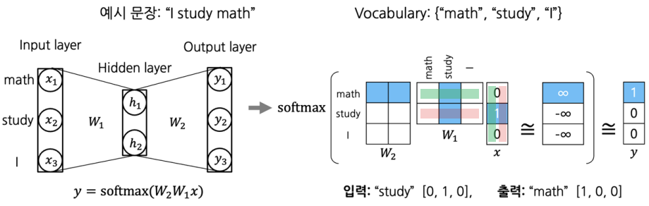

Word Embedding을 살펴보기 전 One-Hot Encoding에 대해 먼저 알아보자

## One-Hot Encoding
---------

`One-Hot Encoding`은 단어를 Categorical variable로 Encoding한 벡터로 표한하는 방법이다. 

단어는 하나의 차원이 각각의 단어를 뜻하도록 표현할 수 있으며 해당 차원에는 1로 표현하고 해당되지 않은 차원은 모두 0으로 표현되어 이를 `Sparse representation(희소 표현)` 이라고 부른다.

- 예시: 혈액형 (A, B, AB, O)
    - $A = [1 \ \ 0 \ \ 0 \ \ 0]^T$
    - $B = [0 \ \ 1 \ \ 0 \ \ 0]^T$
    - $AB = [0 \ \ 0 \ \ 1 \ \ 0]^T$
    - $O = [0 \ \ 0 \ \ 0 \ \ 1]^T$
    
이때, 서로 다른 단어들의 내적 유사도(Dot-product similarity)는 항상 0이다. 그리고 단어들 간의 유클리드 거리는 항상 $\sqrt{2}$ 이다.

하지만, 이러한 방식은 문제점이 있다.

만약, 두 단어의 뜻이 유사한 경우에는 유사도가 높게 나오는 거리는 가깝게 표현되는 것이 바람직하지만 원-핫 인코딩은 이러한 특성이 전형 반영되지 않게 항상 유사도가 0이고 거리는 $\sqrt{2}$ 이라는 단점이 있다.

또 다른 단점으로는, 메모리 효율성이 떨어진다.

예를 들어 단어 10,000개가 있다고 가정해보자. 단어 벡터가 one-hot encoding되어 sparse vector로 표현될 때 9999개의 값아 0임에도 불구하고 10,000차원의 vector를 사용해 굉장히 비효율적이다.

이러한 비효율성을 해결하기 위해 `Dense Representation(밀집 표현)`을 사용한다.

### Distributed Vector Representation

Distributed vector(or Dense Vector)은 다음과 같은 특징을 가지고 있다.

- 단어의 의미를 여러 차원에 0이 아닌 값의 형태로 표현
- 유클리드 거리, 내적, 코사인 유사도는 단어간 의미론적 유사성을 나타냄

Dense vector로 표현한 Word embedding의 대표적인 방법은 `Word2Vec`이 있다. 이 방법은 주변 단어의 정보들을 이용해 단어 벡터를 표현한다.

## Word2Vec
---------

`Word2Vec`은 특정한 단어가 주어졌을 때, 이 단어의 **주변에 나타나는 다른 단어가 나타나는 확률분포를 모델링**하는 것이다. 

주변에 어떤 단어가 나타날 지에 대한 확률분포가 곧 그 단어의 의미를 결정하는 즉, **인접한 단어들 간의 의미가 비슷할 것이라고 가정**한다.

예를 들어, "Cat"이라는 단어의 앞뒤로 올 확률, $P(w \| cat)$ 이 높은 단어를 구한다고 하자.

- “Meow” : 0.57
- “Potato” : 0.03
- “Paris” : 0.05
- “Pet” : 0.34
- “Baquette” : 0.01

이때, 구하는 확률분포 $P(w \|cat)$ 는 "Cat"의 의미를 결정한다.

Word2Vec에서는 이러한 확률분포를 잘 모델링하고 이에 기반한 각 단어에 적절한 dense vector representation을 얻기 위해서 제안한 방법 두 가지 예측 Task가 있다.

한 가지는 `Continuous Bag of Words(CBoW)`고 다른 한 가지는 `Skip-gram`이 있다.

### Skip-gram

`Skip-gram`은 주어진 문장에서 어떤 특정한 단어가 입력으로 주어질 때 주변에 나타나는 단어들이 무엇인지 예측하는 방식이다. 이 방식이 이후에 나올 CBoW보다 더 많이 사용된다.

주변 단어를 예측할 때, 앞 뒤로 각각 몇 개의 단어까지 예측할 지를 정하는 파라미터 `Window_size`가 있다.

- Window_size가 3이라면 앞 뒤로 각각 3개씩 총 6개의 단어를 에측한다.

이를 2-layer neural network로 시각화하면 아래의 그림과 같다.

학습 과정은 다음과 같다.

1. 주어진 문장을 Tokenize 한다.
2. unique words를 모아서 Vocabulary 사전을 구성한다.
3. 각 단어를 Vocab size 만큼의 dimension을 가지고 원-핫 벡터로 표현한다.
4. Sliding Window 기법을 적용하여, 한 단어를 중심으로 앞 뒤로 나타난 각 word와 함께 입출력 쌍을 구성한다.
    - 위의 그림은 Window size를 1로 설정한 그림이다.
    - e.g. `"I study math"` &rarr; `[(I, study), (study, I), (study, math), (math, study)]`
5. 원-핫 벡터 size 만큼의 입/출력 size를 갖는 2-layer NN을 만든다. 이 때, **입력 노드와 출력 노드 사이의 hidden layer의 노드 수**는 `hyperparameter`로, 워드 임베딩을 수행할 좌표공간의 차원수로 설정한다.
    - weight는 (#hidden nodes, #input nodes), (#output nodes, #hidden nodes)의 shape가 된다.
    - Hidden Layer의 차원은 일반적으로 사전의 사이즈보다 작은 수로 설정한다. 
6. 입력값을 넣어 linear 변환을 하고, softmax 함수를 적용시켜 확률분포 벡터($\hat{y}$) 를 만든다.
    - 이 때 입력값 $x$는 원-핫벡터이므로, $W_x$ **내적 시에 해당 단어와 관련있는 단어들만 1이 곱해져 반영되고, 그렇지 않은 단어들은 0이 되어 반영되지 않는다.**
    - 따라서 실제로 구현할 때는 이 레이어를 Embedding Layer라고 부르고, **일일이 행렬곱하는 대신 반영될 column만 바로 뽑아온다**(위의 사진에서 $W_1$ 의 파란 컬럼).
7. 확률분포벡터와 ground truth(정답 레이블)를 비교하여 거리가 가까워지도록 softmax loss를 적용시킨다.
    - 이 때, ground truth값과 비슷해지도록 하려면, 이론적으로는 softmax 함수의 logit값, 즉 linear 변환을 모두 통과한 값이 정답 클래스만 $\infty$ 가 되고, 나머지는 모두 $−\infty$가 되어야한다.

파라미터를 모두 학습시키고 난 뒤, $W_1$ 과 ​$W_2$ 임베딩 벡터 둘 중 아무것이나 Word2Vec의 모델로 사용해도 된다. 이는 **Word2Vec이 기본적으로 단어간의 관계도를 측정하는 방식이기 때문에, 순서 상관없이 단어와 단어 간의 weight vector만 있으면 되기 때문**이다. 그러나, 컨벤션으로는 $W_1$를 많이 사용한다. 

또, output이 나오면 `PCA(Principal Component Analysis)`를 통해서 2차원으로 차원축소하여 scatter plot 형태로 시각화하곤 한다.

> 중간에 있는 Hidden Layer에 non-liear activation function을 적용하지 않는다. 
> 이러한 방식이 단순히 선형결합이라고만 볼 수 없다. 그 이유는 이 Layer가 입력과 출력보다 훨씬 작은 차원이기 때문에 이는 입력 정보를 더 작은 차원의 벡터로 압축한 후 이 압축 정보를 통해 예측하한다고 볼 수 있다.

### Word2Vec 속성

각 단어 벡터, 또는 공간상의 벡터 포인트는 단어간의 관계를 나타낸다. **같은 관계를 가진다면 같은 형태의 vector로 표시**된다.

또, Word2Vec을 이용하여 여러 단어들 중 가장 상이한 단어를 골라내는 `Word Intrusion Dectection`을 수행할 수도 있다. 

여러 단어가 주어지면, 한 단어를 중심으로 다른 단어들의 유클리드 거리를 계산하여 평균낸다. 모든 단어에 대해 이를 수행하였을 때, 유클리드 거리 평균이 가장 먼 단어, 즉 가장 관계가 없는 단어를 찾아 솎아낼 수 있다.

### Word2Vec 적용

Word2Vec은 자연어 처리 대부분의 분야에서 성능 개선에 사용되고 있다.

- 단어 유사도
- 기계 번역(Machine Translation)
- 형태소 분석(Part-of-speech(POS) tagging)
- 개체명 인식(Named entity recognition,NER)
- 감정 분석
- 군집화
- 어휘 의미 구성(semantic lexicon building)

또, 이미지를 설명하는 캡션을 생성하는 Image Captioning 분야에도 사용된다.
