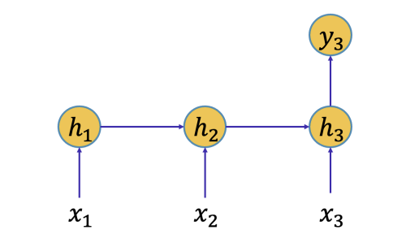
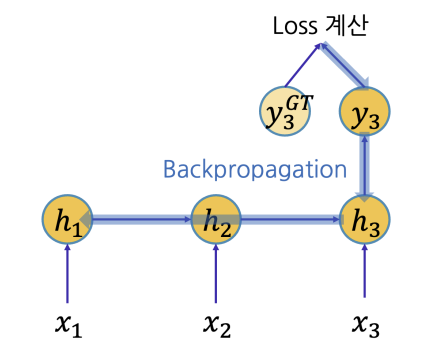

Language model이나 Question answering 태스크로 해당 문제를 풀 때

- 각 단어는 하나의 Timestep에서 주어지는 Token에 대응되고
- 단어 하나씩 One-hot vector로 표현되어 모델에 입력
- 다음 단어를 맞추기 위하여 이전에 **입력/생성된 단어 정보를 저장하고 있어야 함**

만약 정답과 관련된 단어가 빈칸에서 너무 멀다면?

## RNN의 문제점
---------

위의 상황에서 RNN을 통해 Task를 수행하면 아래와 같은 문제가 발생한다.

- 정답과 관련된 정보 외의 많은 정보가 여러 Time-step을 거치면서 고정된 크기의 Hidden state에 저장
    - 고정된 크기 = 정보 저장 공간
- **Forward propagation 과정 중에 $W_{hh}$ 를 계속 곱함**
    - 반복적인 계산으로 인해 해당 정보가 변질될 수 있음

## RNN의 학습 과정
-----------

RNN 아키텍쳐는 아래처럼 표현할 수 있다.

- $V$, $W$, $U$ : 가중치 행렬
- $b$ : 편향 벡터

학습 과정은 다음과 같다. 

1. 입력이 도착하면 은닉층 레이어를 거쳐 레이블을 예측한다.
2. 실제 레이블과 추정된 레이블의 차이를 평가하기 위해 손실함수를 계산한다.
3. 총 손실 함수 $L$이 계산되고, 이를 통해 순방향 패스가 완류된다.
4. 역방향 패스로 다양한 미분을 계산한다.

기울기를 `layer`와 `Time-step`에 걸쳐 역전파하는 과정이 필요하여 이에 따라 각 Time-step 마다 다음 식과 같이 현재 시간 단위까지 이전 기여도를 모두 합산해야 한다.

$$
\frac{\partial{\mathbf{L}}}{\partial{W}} = \sum_{i=1}^{T}\frac{\partial \mathcal{L}_i}{\partial W} \propto \sum_{i=0}^T \bigg( \prod_{i=k+1}^y {\color{red}{\frac{\partial h_i}{\partial h_{i-1}}}} \bigg) \frac{\partial h_k}{\partial W}
$$

이 식에서는 **시간 단계 $t=T$ 에서 전체 손실 함수 $\mathbf{L}$** 의 기울기에 대한 시간 단계 $k$ 에서의 상태의 기여도를 계산하며 이를 통해 학습 과정에서의 문제는 은닉 상태의 비율에서 발생할 수 있다.

좀 더 심플한 RNN 형태의 예시를 통해 알아보자.

### RNN 학습 예시

먼저 **Forward propagation** 과정은 다음과 같다.

위의 그림에서 input 벡터($x$)와 hidden state 벡터($h$) 그리고 output 모두 스칼라 값으로 가정하자.

- $h_1 = tanh(ah_0 + bx_1 + c)$
- $h_2 = tanh(ah_1 + bx_2 + c)$
- $h_3 = tanh(ah_2 + bx_3 + c)$
- $y = dh_3 + e$

그리고 Ground truth 값과 예측값을 비교하여 loss 계산을 진행한다. 계산한 loss 값을 이용하여 **Backward propagation** 과정을 진행한다.

이때 최종 output을 $f(=y_3)$ 로 표현하자.

$x_1$ 입력으로부터 $y_3$를 잘 예측할 수 있는 정보가 $h_1$ 에 잘 담기도록 해야하며 이를 위해 $x_1$ 에서 제공된 정보를 $h_1$의 값이 잘 담을 수 있도록 하는 학습에 필요한 gradient signal은 $\frac{df}{dh_1}$ 으로 표현할 수 있다.

$\frac{df}{dh_1}$  을 구하기 위해서는 `backpropagation` 이 필요하다.

$$
\begin{align*}
\frac{df}{dh_1} = \frac{df}{dh_1} = \frac{dh_2}{dh_1} \times \frac{dh_3}{dh_2} \times \frac{df}{dh_3}
\end{align*}
$$

$\frac{df}{dh_3}$의 값은 $d$ 이며 $\frac{dh_{i}}{dh_{i-1}}$ 는 $\frac{1}{2} a$ 이므로 이를 적용하면 아래와 같다.

$$
\frac{df}{dh_1} \le \frac{1}{2} a \times \frac{1}{2} a \times d
$$

이때, $a$ 값에 따라 두 가지의 결과가 나올 수 있다.

- $\| a \| > 1 \Rightarrow \lim_{n \to \infty} a_n = \infty$ &rarr; Exploding Gradient
- $\| a \| < 1 \Rightarrow \lim_{n \to \infty} a_n = 0$ &rarr; Vanishing Gradient

> $\underset{x}{\text{max}} \bigg(\frac{d}{dx} tanh(x) \bigg) = \frac{1}{2}$ 이다.

이렇게 Time-step 간의 Gap이 커지면 커질수록 첫번째 Time-step에 도달하는 gradient가 굉장히 크거나 작은 값이 될 것이며 이는 학습이 불안정해지거나 학습이 잘 안될 수 있는 원인이 된다.

## Exploding / Vanishing Gradient

$$
\mathbf{h}_t = \text{tanh}(W_{hh} \mathbf{h}_{t-1} + W_{xh}\mathbf{x}_t + \mathbf{b})
$$

위 수식은 첫 Hidden-state vector에 $W_{hh}$ 를 반복적으로 곱하는 것과 유사하다.

$$
\mathbf{h}_t \propto W_{hh}^{t-1} \mathbf{h}_1
$$

이 때, $W_{hh}$ 가 `Eigendecomposition`을 통해 $VDV^{-1}$ 로 분해될 수 있다고 가정하자.
- $V$는 정사각 행렬로 $W_{hh}^T$ 의 eigenvector들을 column으로 가진다.
- $D$는 diagonal matrix(대각 행렬)로써 eigenvalue들을 diagonal entry의 값으로 가진다.

$$
W_{hh}^{t-1} \mathbf{h}_1 = VD^{t-1}V^{-1} \mathbf{h}_1
$$

행렬 $D$는 Eigenvalue의 대각 행렬이므로, Eigenvalue의 지수승을 곱한다.

$$
\begin{bmatrix}
2 & 0 \\
0 & 0.3
\end{bmatrix}^{t-1}
\begin{bmatrix}
a \\
b
\end{bmatrix} = 
\begin{bmatrix}
2^{t-1} & 0 \\
0 & 0.3^{t-1}
\end{bmatrix}^{t-1}
\begin{bmatrix}
a \\
b
\end{bmatrix}
$$

따라서 가중치 행렬 $W_{hh}$ 를 `Eigendecomposition` 했을 때, 
- Eigenvalue의 절대값이 1보다 크다 &rarr; Exploding Gradient
- Eigenvalue의 절대값이 1보다 작다 &rarr; Vanishing Gradient

