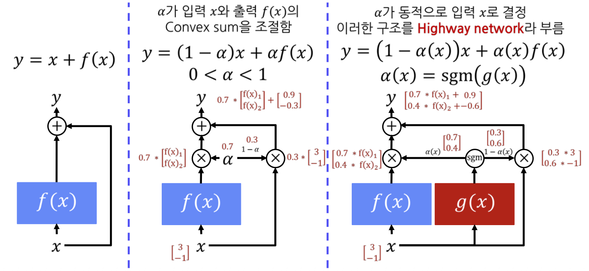
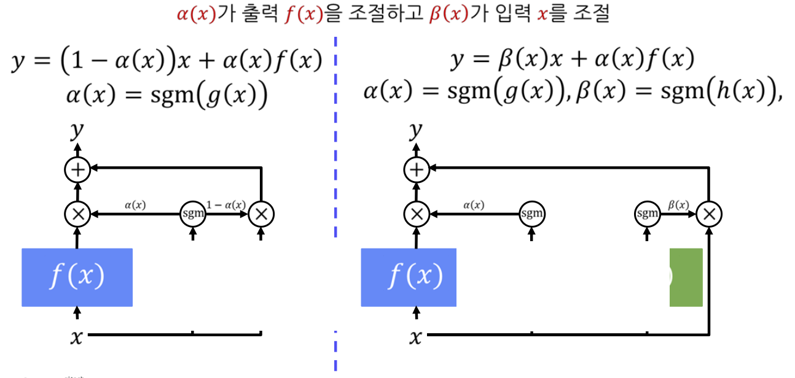

## LSTM(Long Short-Term Memory)
--------

`LSTM(Long Short-Term Memory)` 모델은 RNN과 같이 매 Time step 마다 반복적으로 동일 모듈을 적용한다. 모델 안에는 4개의 Vector를 계산하는 신경망이 존재한다.

LSTM과 Vanilla RNN과의 차이점은 **hidden state를 계산하는 방식**이다. 

RNN은 전 단계의 hidden state와 현재 input을 통해 현재 hidden state를 구했다. 반면에, LSTM은 hidden state를 계산하는 방법이 훨씬 복잡해졌다. 

LSTM에서는 RNN에 없던 `cell state`가 있는데 전 Time step의 cell state 정보로부터 일부의 정보만을 담도록 변환된 벡터를 해당 Time step의 hidden state가 된다. 즉, cell state가 RNN의 hidden state의 역할을 한다고 말할 수 있다.

cell state의 업데이트 과정이 동일한 $W_{hh}$ 행렬을 반복적으로 곱하는 것이 아니라 좀 더 복잡한 계산을 거쳐서 업데이트를 한다.

이러한 방법은 `Gradient Vanishing`과 `Exploding` 문제를 방지한다.

### Highway network

LSTM에서는 ResNet 모델에서 사용한 기법인 `skip connection`을 변형한 `Highway network` 기법을 사용한다.

- 첫번째 구조 : skip connection은 입력값과 함수를 거친 출력값을 그대로 더하는 방식이다.
- 두번쨰 구조 : 이를 발전시켜 입력과 함수의 출력값의 비율($\alpha$)를 조정하는 방식으로 계산할 수 있다.
    - 여기서 $\alpha$는 고정된 값으로 적용되는 상수라고 볼 수 있다.
- 세번째 구조 : 입력과 함수의 출력값에 곱해지는 가중치 또한 동적으로 만든 방식이다.
    - $g(x)$ : 가중치를 계산하는 function
    - $\alpha(x)$ 는 $g(x)$를 입력으로 한 sigmoid 함수의 출력값으로 사용하여 0과 1 사이의 값으로 범위를 변경해주는 과정을 거친다.

입력, 출력, 가중치 모두 동일한 차원이다.

LSTM의 구조는 세번째 구조에서 더 발전된 구조를 갖는다.

첫번째 구조에서는 입력 $x$와 함수의 출력값 $f(x)$ 모두 $\alpha(x)$ 라는 가중치에 영향을 받는다. 하지만 두번째 구조는 입력과 출력이 동적인 서로 다른 가중치에 영향을 받는다.

최종 결과값은 동적인 서로 다른 가중치의 영향을 받는 값들의 합으로 결정된다.

### LSTM의 Notation

- $f$ : Forget gate, Cell의 내용을 지울지 결정
- $i$ : Input gate, Cell의 내용을 적을지 결정
- $g$ : Function output, Cell에 적을 내용
- $o$ : Output gate, Cell의 내용을 출력할지 결정
