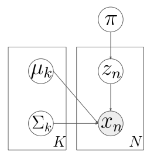
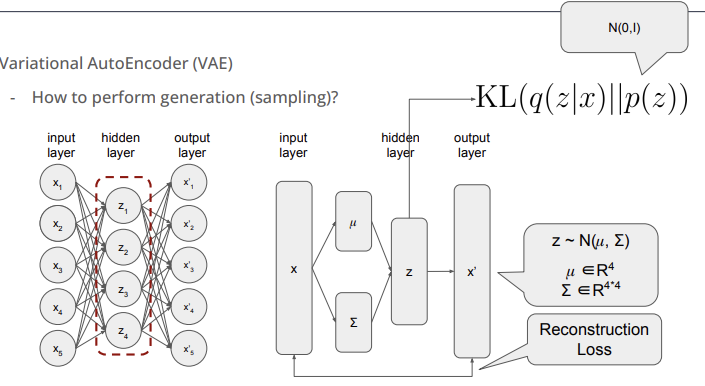
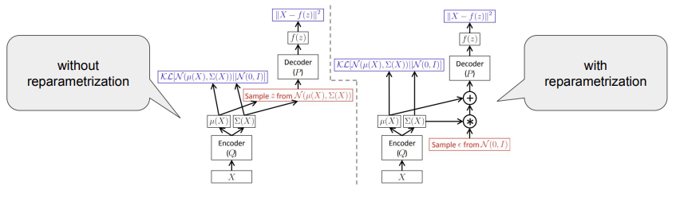

## 생성모델
---------

`생성모델 (Generative Models)`은 간략히 정리하면 다음과 같다.
 
- Data: $(x, y)$ or $(x)$
- Goal: 관찰된 여러 샘플들이 추출된 어떠한 분포를 표현하는 모델 학습
- 분포를 통해 새로운 샘플 생성
- 생성된 데이터가 어떠한 과정에 의해서 어떠한 분포로 생성이 되었는지 알 수 있음

## 그래피컬 모델
--------

`가우시안 모델(Gaussian Mixture Models, GMM)` 이 있다고 하자.

만약, k개의 가우시안 모델이 있다고 할 때, 이를 수식과 그래프로 각각 표현하면 아래와 같다.

$$
p(x) = \sum_{i=1}^{K} \pi_{i} N(x|\mu_i, \sigma_i)
$$

다른 표현 방식으로 데이터가 만들어지는 과정을 나타내는 것이 있다. 이를 `generative process` 라고 말하며 이를 표현하면 아래와 같다.

$$
\begin{align*}
&z_n \sim \text{Multinomial}(\pi) \\
&x_n \sim \text{Gauusian} \big( \mu_{z_n} \sum\nolimits_{z_n} \big)
\end{align*}
$$

## Variational AutoEncoder (VAE)
-------

VAE를 알아보기 전에 AutoEncoder가 무엇인지 먼저 살펴보자.

`AutoEncoder`는 input data가 들어오면 ouput data를 다시 복원하는 것이 목적이다. 이때, input data($x$)와 output data($x'$) 의 차이를 줄여나가면서 학습을 진행한다.

AutoEncoder를 사용하는 주된 목적은 바로 `차원 축소`이다. 

- input에서 바로 ouput을 출력하는 것이 아니라 중간에 input layer보다 **차원이 작은 hidden layer를 거치면서 데이터가 압축**된다. 
- 이 과정을 통해 불필요한 데이터를 버리고 중요한 데이터만 가지고 압축이 된다.

이렇게 해서 압축된 데이터는 시각화할 때 굉장히 유용하다.

예를 들어, MNIST 데이터를 생성한다고 하자. MNIST 데이터는 28 x 28 로 이를 일렬로 늘이면 784가 된다. 이때, 각각의 값은 0과 1로 이루어진 이진 변수이므로 고려해야할 파라미터의 수는 $2^784$ 이다.

이를 효율적으로 수행하기 위해서 `Variational AutoEncoder(VAE)` 를 이용한다.

> **AutoEncoder 와 VAE 의 차이점** 
> VAE는 `확률적 생성 모델`로서 데이터를 생성하는 것이 주요 목적이며, AE는 데이터 압축과 복원을 목표로 하는 `비확률적 모델`이다. 
> AE는 latent space 의 해석이 굉장히 어려우며 학습된 latent space가 연속적이지 않는 반면에 VAE는 이러한 한계를 극복한 모델이다.
>
> 1. [Variational Autoencoder (VAE) vs Autoencoder (AE)](https://velog.io/@ryuseunghan/Variational-Autoencoder-VAE-vs-Autoencoder-AE)  
> 2. [Autoencoder 와 Variational Autoencoder의 직관적인 이해](https://medium.com/@hugmanskj/autoencoder-%EC%99%80-variational-autoencoder%EC%9D%98-%EC%A7%81%EA%B4%80%EC%A0%81%EC%9D%B8-%EC%9D%B4%ED%95%B4-171b3968f20b)

많은 수의 파라미터들을 사용하는 대신 차원축소를 통해 적은 수의 파라미터를 가지고 이미지를 생성해낼 수 있다.

만약, AutoEncoder로 학습을 하고 이미지를 생성하는 부분인 hidden layer와 output layer만 가져와서 가우시안 분포를 따르는 랜덤한 값을 넣어줄 때 원하는 이미지를 얻을 수 있을까?

답은 원하는 이미지를 얻을 수 없다. 그 이유는 훈련을 할 때, **hidden layer가 어떤 분포를 따르는지 알 수 없으며 우연히 같은 분포를 따른다고 하더라도 어떤 확률 모수를 따르는지를 알 수 없기 때문이다.**

이를 해결하기 위해 학습을 할 때 hidden layer의 분포를 원하는 분포로 만들어주는 것이다. 이를 수학적으로 표현하면 $KL(q(z \| x) \|\| p(z))$ 를 최소화 시키는 것이다.

위의 그림에서 input $x$ 로부터 평균과 공분산을 구하며 이를 통해 가우시안 분포 $q(z \| x)$ 가 정의가 된다. 이 둘을 이용해서 $z$를 샘플링 하며 이때 데이터가 압축된다. 압축된 데이터를 통해 desampling 과정을 거쳐 최종 ouput 이 나온다.

그러면 $KL(q(z \| x) \|\| p(z))$ 를 어떻게 최소화할 수 있을까?

먼저 KL divergence를 먼저 살펴보자. 아래는 KL divergence 수식이다.

$$
KL(q||p) = \int_x q(x) log \ \frac{q(x)}{p(x)} dx = \mathbb{E}_q[log(q) - log(p)]
$$

만약, p와 q가 비슷할수록 $log \ \frac{q(x)}{p(x)}$ 가 0에 가까워지므로 $KL(q \| \| p)$ 또한 작아진다.

학습을 위해 최소화해야하는 식으로 Reconstruction Loss도 있다.

이를 KL divergence와 합치면 아래와 같은 VAE 목적식이 된다.

$$
L_i = -\mathbb{E}_{z\sim q_{\phi(z|x_i)}}[log \ p_{\theta}(x_i |z)] + KL(q_{\phi}(z|x_i)||p(z))
$$

- KL divergence 부분인 $q_{\phi}(z\|x_i)$ 와 $p(z)$ 사이의 거리를 최소화 시키는 방식으로 최적화
- Reconstruction loss는 원래의 input 데이터 $x_i$가 ouput $z$ 로부터 잘 나오도록 하는 목적이기 때문에 최대화 시킨다.
    - 최소화 시키는 쪽으로 최적화 시키기 위해 (-)를 붙인다.
    - 모든 값에 대한 기대값을 구하지 않고 sampling 해서 평균을 구한다(Monte Carlo estimation).

이러한 과정을 그림으로 표현하면 아래와 같이 표현할 수 있다.

Autoencoder와 VAE 기반의 추천시스템 모델을 개발할 수 있다.