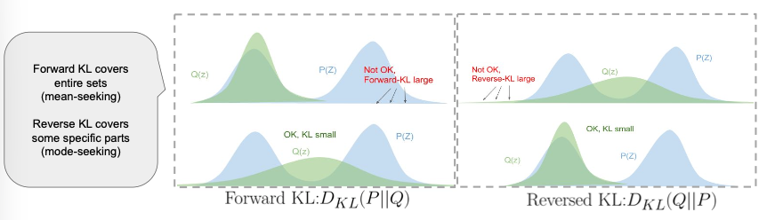
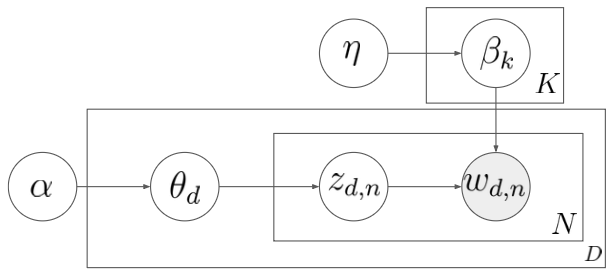

`변분추론(Variational Inference)`는 생성 모델을 학습하기 위해서는 별도의 과정이다.

주어진 데이터가 있을 때, 이 데이터를 가장 잘 설명할 수 있는 모델 파라미터를 추론하는 방식으로 학습을 하는데 이를 수행하기 어렵기 때문에 근사하는 방식으로 해결한다.

$$
\begin{align*}
&\text{The model : } p_{\theta}(x) \\
&\text{The data : } D = \{ x_1, \ldots, x_n \} \\
&\text{Maximum likelihood : } \theta \leftarrow \text{argmax}_{\theta} \frac{1}{N} \sum_{i} log \ p_{\theta} (x_i) \\
&\text{Maximum likelihood : } \theta \leftarrow \text{argmax}_{\theta} \frac{1}{N} \sum_{i} log \ \int p_{\theta} (x_i, z) \ dz \\
&\text{Alternative : } \theta \leftarrow \text{argmax}_{\theta} \frac{1}{N} \sum_{i} {\color{red}{E_{z \sim p(z | x_i)}}} log \ p_{\theta} (x_i, z)
\end{align*}
$$

이때, 모든 $z$가 아닌 z를 **랜덤하게 posterior에서 샘플링**을 하여 계산한다. 이러한 과정을 여러번 수행한 후 이 수행한 값에 평균을 취한다. 이러한 방식을 `Monte Carlo Approximation` 이라고 한다.

여기서 가질 수 있는 의문점은 왜 **Posterior에서 샘플링해야하는지** 그리고 **어떻게 하면 Posterior를 구할 수 있는지** 이다.

이제부터 이 두 질문의 답을 살펴볼 것이다.

## VI를 위한 기본 개념
-----

위의 두 질문을 답을 이해하기 위해서 `Convex function` 과 `Jensen's Inequality`를 알아보자.
 
`Convex function`와 `Concave function` 은 각각 다음과 같은 조건을 만족한다.

- Convex function

    $$
    \begin{align*}
    &\text{For all } 0 \le t \le 1 \text{ and all } x_1, x_2 \in X \\
    &f(tx_1 + (1 - t)x_2) \le tf(x_1) + (1-t)f(x_2)
    \end{align*}
    $$

    - example: $x, x^2, e^{x}$

- Concave function

    $$
    \begin{align*}
    &f \ : \ X \rightarrow R \\
    &f \text{ is concave if} - f \text{ is convex}
    \end{align*}
    $$

    - example: $log \ x$

위 두 함수에 대해 `Jensen's Inequality`를 만족한다.

$$
\begin{align*}
&\phi(E[X]) \le E[\phi(X)] \text{ where } \phi \text{ is convex function} \\
&\phi(E[X]) \ge E[\phi(X)] \text{ where } \phi \text{ is concave function} \\
\end{align*}
$$

이와 관련된 예로는 다음과 같은 수식이 있다.

$$
Var(x) = E[x^2] - E[x]^2 \ge \Rightarrow E[x]^2 \le E[x^2]
$$

## Variational Inference
----------

실제로 구해야 할 것은 $\text{argmax}_ {\theta} \frac{1}{N} \sum_{i} log \ p_{\theta} (x_i)$ 이다. 여기서 $log \ p_{\theta}(x_i)$ 부분을 아래와 같이 변형하여 표현할 수 있다.

$$
\begin{align*}
log\ p(x_i) &= log \int p(x_i|z)p(z)dz \\
&= log \int p(x_i|z)p(z)\frac{q_i(z)}{q_i(z)}dz \\
&= log \ E_{z \sim q_i(z)} [\frac{p(x_i|z)p(z)}{q_i(z)}]
\end{align*}
$$

여기서 $log$ 함수는 `Jensen's Inequality` 에 따라서 다음과 같은 부등호를 만족한다.

$$
\begin{align*}
log\ p(x_i) &= log \ E_{z \sim q_i(z)} [\frac{p(x_i|z)p(z)}{q_i(z)}] \\
&\ge E_{z \sim q_i(z)}[log \ \frac{p(x_i|z)p(z)}{q_i(z)}] \\
&= E_{z \sim q_i(z)}[log \ p(x_i|z) + log \ p(z)] - E_{z \sim q_i(z)} [log \ q_{i}(z)] \\
&= \color{red}{E_{z \sim q_i(z)}[log \ p(x_i|z) + log \ p(z)] + H(q_i)}
\end{align*}
$$

- $H(q_i)$ : 엔트로피의 정의로 얼마나 random variable 이 불확실한지를 측정하는 metric
- $E_{z \sim q_i(z)}[log \ p(x_i\|z) + log \ p(z)]$ : $z$를 샘플링하는 것이 주어진 데이터 $x_i$를 얼마나 잘 설명할 수 있는지를 의미

### KL divergence

`divergence`는 두 분포의 유사성을 측정하는 것으로 크게 3가지로 나뉜다.

- f-divergence
- H-divergence
- IPM(integral probability metrics)

이 중 f-divergence의 하나의 종류로 `KL-divergence` 가 존재한다. `KL-divergence`는 두 분포 사이를 $log$ ratio를 통해서 비교한다.

$$
    \begin{align*}
    KL(p(x)||q(x)) = sum_{x} p(x) log \ \frac{p(x)}{q(x)} = -\sum_{x} p(x) log \ \frac{q(x)}{p(x)} \\
    KL(p(x)||q(x)) = \int_{x} p(x) log \ \frac{p(x)}{q(x)} \ dx = - \int_{x} p(x) log \ \frac{q(x)}{p(x)} \ dx
    \end{align*}
    $$

KL-divergence의 정의에 Jensen's inequality를 이용하면 **항상 0 이상**임을 알 수 있다.

$$
\begin{align*}
KL(p(x)||q(x)) &= - \int_{x} p(x) log \ \frac{q(x)}{p(x)} \ dx \\
&= E_{p}[-log \frac{q(x)}{p(x)}] \\
& \ge -log \ E_{p}[\frac{q(x)}{p(x)}] \\
&= -log \int p(x)\frac{q(x)}{p(x)} \ dx \\
&= 0
\end{align*}
$$

즉, KL-divergence는 **두 분포가 완전히 동일하면 0이고 차이가 날수록 값이 커진다**.

위의 그림에서 Q를 바꿀 수 있다고 가정하자.

이때, KL-divergence를 낮추기 위해서 Q를 어떻게 이동해야할까?

- Forward KL : $log$에 $p(x)$가 곱해지기 때문에 p(x)가 큰 경우에는 $log \ \frac{p(x)}{q(x)}$ 의 값이 작아져야 하기 때문에 **P가 큰 곳들에 Q가 어떻게서든 겹치는 구간이 필요**하다.
- Reversed KL : $log$에 $q(x)$가 곱해지기 때문에 p(x)가 큰 경우에는 $log \ \frac{p(x)}{q(x)}$ 의 값이 작아져야 하기 때문에 **Q는 P가 큰 구간들 중 하나라도 잘 덮으면 된다**.

이제 KL-divergence에 다른 두 분포 $q_i(z)$ 와 $p(z\|x_i)$ 를 대입해보자.

- $q_i(z)$ : variational posterior로 최적화 대상
- $p(z\|x_i)$ : posterior

목표는 $q_i(z)$를 $p(z\|x_i)$와 유사하게 학습하는 것으로 KL의 값을 낮추는 방향이다.

$$
\begin{align*}
KL(q_i(z)||p(z|x_i)) &= E_{z \sim q_i(z)}[log \ \frac{q_i(z)}{p(z|x_i)}] \\
&= E_{z \sim q_i(z)}[log \ \frac{q_i(z)p(x_i)}{p(z, x_i)}] \\
&= -{\color{red}{(E_{z \sim q_i(z)}[log \ p(x_i|z) + log \ p(z)] + H(q_i))}} + log \ p(x_i) \\
&= -L_i(p, q_i) + log \ p(x_i)
\end{align*}
$$

위의 수식을 정리하면 다음과 같다.

$$
\begin{align*}
log \ p(x_i) &= L_i(p, q_i) + KL(q_i(z) || p(z|x_i)) \\
&\ge L_i(p, q_i)
\end{align*}
$$

- 왼쪽의 항 : 데이터의 대한 log likelihood로 **이미 샘플링이 되었기 때문에 이 값은 고정된 값**이며 현재 추정하고 싶은 값이다.
- 오른쪽 항 : 가변적인 값으로 현재 low-bound 가 $L_i(p, q_i)$ 이기 때문에 이 값을 최대로 올려야 우리가 추정하고 싶은 값과 가까워진다. 
    - 최대로 올리기 위해서는 **KL의 값이 0에 가까워져야하며 이는 $q_{i}(z)$ 가 $p(z\|x_i)$ (posterior)에 가까워져야한다**.

종합하면, 우리의 목표는 posterior을 잘 추정하면 데이터에 대한 log likelihood의 값을 구할 수 있다.

$$
\begin{align*}
\text{original : } & \theta \leftarrow \text{argmax}_{\theta} \frac{1}{N} \sum_{i} log \ p_{\theta}(x_i) \\
\text{change : } & \theta \leftarrow \text{argmax}_{\theta} \frac{1}{N} \sum_{i} L_{i}(p, q_{i}) \\
\end{align*}
$$

ex. $q$ : Gaussian

$$
\begin{align*}
&q_{i}(z) = N(\mu_i, \sigma_i) \\
&\nabla_{u_i} \ L_{i}(p ,q_{i}) \\
&\nabla_{\sigma_{i}} \ L_{i}(p, q_{i}) \\
&\text{gradient ascent on } \mu_i, \sigma_i
\end{align*}
$$

하지만, 이 방식의 문제점은 각각의 데이터마다 파라미터가 존재하는 즉, 굉장히 많은 파라미터를 최적화시켜야한다. 위의 예시와 같은 경우는 데이터가 n개라면 파라미터의 개수는 $2^n$ 개이다.

이러한 문제를 해결하기 위한 방법이 바로 `Amortized variational inference` 이다.

> **Amortized variational inference**
>
> 이 방법은 `신경망(neural network)`을 이용해, 주어진 데이터를 입력으로 넣으면 그에 대응하는 `분포의 파라미터(ex. 평균, 분산)`를 출력하도록 학습하는 방식이다.
>
> 즉, 각 데이터마다 서로 다른 분포(평균과 공분산)를 추정하지만, 그 파라미터들을 직접 학습하는 대신 **하나의 신경망이 모든 데이터에 대해 공통으로 작동**한다. 따라서 데이터의 개수가 늘어나더라도 모델이 학습해야 하는 **파라미터의 총 개수가 증가하지 않는다는 장점**이 있다.
>
> 이러한 아이디어를 기반으로 한 대표적인 모델이 바로 `Variational AutoEncoder(VAE)` 이다.

## Mean-Field Variational Inference
-----------

위의 방식에서 $log \ p(x_i)$ 를 구하기 위해 low-bound를 값을 최대화시키는 방식으로 접근하였다.  

$log \ p(x)$ 의 low-bound를 다르게 볼 수도 있다.

$$
\begin{align*}
log p(x) & \ge \text{ELBO} \\
&= E_{q(z)}[log \ p(x|z) + log \ p(z)] + H(q) \\
&= E_{q(z)}[log \ p(x|z) + log \ p(z) - log \ q(z)] \\
&= E_{q(z)}[log \ p(x, z) - log \ q(z)]
&= E_{q(z)}[log \ p(x|z)] + E_{q(z)}[log \ \frac{p(z)}{q(z)}] \\
&= E_{q(z)}[log \ p(x|z)] - \text{KL}(q(z) || p(z))
\end{align*}
$$

위의 수식을 이용하기 위해서는 $q(z)$를 알아야하며 이때 $q(z)$ 가 가장 좋은 분포는 실제 posterior 와 가까웠을 때 이다.

