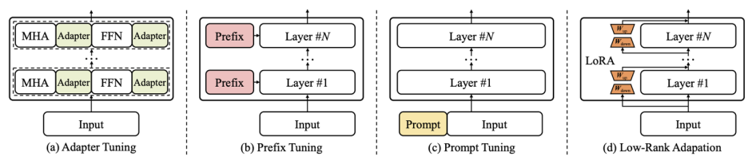

기존의 Fine-Tuning 방법은 일반적으로 범용 웹 데이터를 기반으로 사전 학습을 수행하고 Downstream task에 맞추어 fine-tuning을 진행했다. 

이러한 학습 방식은 특정 task에서 성능 향상을 보장한다. 좀 더 세부적으로 3가지 방법으로 구분할 수 있다.

- Feature-Based Approach : 사전학습 모델로부터 Embedding을 추출하고 classifier를 학습하는 방법
- FineTuning I : Ouput layer들을 업데이트 하는 방법
- FineTuning II : 모든 layer들을 업데이트  하는 방법

각각의 방법의 성능과 효율성은 아래와 같다.

이러한 단점을 극복하기 위한 방법이 바로 `in-context learning(ICL)` 이다.

- GPT 3 (175B)가 발표된 이후에는 finetuning 없이도 언어모델을 쉽게 활용할 수 있게 됨
- Target task에 대해 몇 가지 예시를 모델에 입력해주게 될 경우 모델을 튜닝하지 않고 쉽게 문제를 풀 수 있게 되었음 (few-shot prompting)

하지만 이런 방식에도 여러 단점이 존재한다.

- 모델을 지속적으로 추가 학습하는 과정으로 인해 언어 모델이 기존에 학습한 정보를 잊는 현상(Catastrophic forgetting)을 야기함
- 연구에 따르면 모델의 모든 파라미터를 새로운 데이터에 대해 학습하는 것이 항상 정답은 아님
- 모델의 크기가 커짐에 따라, 모델의 전체 파라미터를 학습하는 것이 어려워짐
- 특히 각 downstream task마다 독립적으로 학습된 모델을 저장하고, 배포할 때 막대한 시간과 컴퓨팅 자원이 필요해짐

신뢰성 측면에서 살펴보면 ICL의 특징은 아래와 같다.

- ICL은 모델을 따로 튜닝할 필요 없이 문제를 효과적으로 풀이 가능
- ICL을 위해서는 Demonstrations, Test input 만 가지고 모델의 입력으로 사용
- 하지만 몇몇 경우에 random한 label을 넣어주더라도 문제를 잘 해결한다는 연구 결과 결과가 존재
    - 즉, ICL의 결과물을 항상 신뢰하기 어려울 수 있음을 시사

이러한 이유로 파라미터 수가 많은 LLM을 효율적으로 학습할 수 있는 방법을 고안해냈다. 그 방법이 바로 `Parameter-Efficient Fine-Tuning`이다.

## PEFT
---------

`PEFT`는 모델의 모든 parameter를 학습하지 않고 일부 파라미터만 Fine-Tuning 하는 방법이다.

가장 대표적인 방법으로 4가지가 있다.

이 방법은 Transformer 모델의 모든 파라미터를 업데이트 하지 않고, 각 방법론별로 소량의 파라미터를 효과적으로 업데이트한다.

- MHA는 multi-head attention, FFN은 feed-forward network를 의미함

### Adapter

기존에 이미 학습이 완료된 모델의 각 레이어에 학습 가능한 FFN을 삽입하는 구조이다.

Adapter layer는 transformer의 vector를 더 작은 차원으로 압축한 후 비선형 변환을 거쳐 원래 차원으로 복원하는 병목 구조(bottlenect architecture)로 이루어진다.

이러한 과정을 거치는 이유는 모델의 파라미터를 줄이기 위함이다.

Adapter 모듈은 Fine-Tuning 단계에서 특정 target task에 대해 최적화 되고 나머지 transformer 레이어는 모두 고정된다. 

이 방법의 단점은 bottleneck layer의 추가로 inference latency가 매우 증가하는 모습을 보여 사용하기가 어렵다.

### Prefix Tuning

Transformer의 각 레이어에 prefix라는 훈련 가능한 vector를 추가하는 방법으로, prefix는 가상의 embedding으로 간주될 수 있다.

이는 각 task를 더욱 잘 풀이하기 위한 벡터를 최적화하여 기존 모델과 병합할 수 있다.

원래의 fine-tuning이라면 transformer의 모든 파라미터를 튜닝시켜야하지만, Prefix-Tuning은 사전학습된 transformer의 벡터는 고정하고 앞에 붙인 prefix 벡터만 최적화를 진행하고 이를 기존 모델과 병합한다.

### Prompt Tuning

모델의 입력 레이어에 훈련 가능한 prompt vector를 통합하는 방법론으로 input 문장에 직접적인 자연어 prompt를 덧붙이는 prompting과는 다른 개념이며 embedding layer를 최적화하는 방법론이다.

Prompt tuning도 target task에 최적화된다.

### Low-rank Adaptation(LoRA)

사전 학습된 모델의 파라미터를 고정하고, 학습 가능한 rank decomposition 행렬을 삽입하는 방법이다.

행렬의 차원을 'rank' 만큼 줄이는 행렬과, 다시 원래의 차원 크기로 바꿔주는 행렬으로 구성된다.
- Low rank decomposition이라고 표현함

레이어마다 hidden states에 lora parameter를 더하여 tuning하며 **PEFT methods 중 가장 널리 쓰이는 방법론**이다.

이 과정을 수식으로 표현하면 다음과 같다.

$$
\begin{align*}
W \leftarrow W + \color{red}{\Delta W} \\
\Delta W = A \cdot B^{T} \\
A \in \mathbb{R}^{m \times r} \ \ \ B \in \mathbb{R}^{n \times r} \\
\color{red}{r \ll min(m, n)}
\end{align*}
$$

- $\Delta W$ : Low-rank decomposition을 진행한 parameter
- $r \ll min(m, n)$ : 기존 모델의 크기보다 감소된 rank를 의미

LoRA의 장점은 다음과 같다.

- 새롭게 학습한 파라미터를 기존 모델에 합쳐 줌으로서 추가연산이 필요하지 않음
- inference speed도 유지하며 모델의 아키텍쳐를 변형하지 않고도 활용할 수 있음
- 기존 Method 대비 월등히 높은 성능을 보이며 encoder 모델과 decoder 모델에서 모두 우수한 성능을 기록하였다.