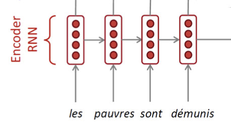

## Seq2Seq Model
---------

- 일련의 단어를 `Encoder` 로 입력 받아, 변환된 일련의 단어를 `Decoder`로 출력
    - Encoder가 입력을 고정 크기의 `Latent vector`로 변환하고 이를 Decoder의 첫 State로 사용
- 길이가 가변적인 입력과 출력을 다룰 수 있음
- 많은 NLP 응용 분야에 사용 가능
    - 기계 번역, 대화 시스템, Question answering 등등

### RNN Seq2Seq Model의 한계

RNN는 입력과 출력에 대해 다음과 같이 5가지로 분류할 수 있다.

이 중 Sequence-to-Sequence, 그 중에서도 특히 Machine translation(기계 번역)은 many to many 에 해당된다.

하지만, 이러한 RNN 기반 Seq2Seq 모델은 한계들이 존재한다. 만약 기계번역 모델을 RNN Seq2Seq Model을 사용해 만든다고 가정해보자.

> RNN는 Encoder에서 Decoder로 넘어갈 때 하나의 hidden vector만 넘길 수 있으며 이 hidden vector를 `Latent vector` 라고도 한다.

- Encoder의 마지막 hidden state에 input 문장에 대한 모든 정보를 담아서 Decoder에 전달해야 한다.
- 하지만, 문장이 길어지면 모든 정보를 마지막 hidden state에 제대로 담지 못하는 문제가 발생하기 때문에 이는 정보 변질, 손실의 위험으로 이어진다.
    - 특히 Encoder의 마지막 hidden state에만 의존하여 정보를 전달받기 때문에 앞쪽 정보를 거의 저장하지 못한다.
- Encoder의 앞 정보를 저장하지 못해 Decoder에서 첫 단어부터 제대로 번역하지 못하는 문제가 발생할 수 있고, 첫 단어가 잘못되면 이후 단어들도 엉망이 될 가능성이 높다.

이렇게 Encoder 문장의 많은 정보를 고정된 크기의 `Latent vector`에만 담아야 해서 나타나는 문제를 `Bottleneck problem` 이라고 한다. 

## Attention
-----

Bottleneck 문제를 해결하기 위해서 고안한 방법이 `Attention` 방법론이다. 

이 방법은 Decoder의 각 Time step 마다, 입력 Sequence에서 만들어진 Hidden-state vector 중 **필요한 부분에 집중**하여 그 정보를 가져가 쓸 수 있도록 한다.

- Decoder가 Encoder의 마지막 hidden state vector에만 의존하는 것이 아니라 모든 Time step의 vector들 중 필요한 정보들을 선택적으로 사용한다. 
- 각 Encoder의 hidden state vector는 그 전까지 입력으로 주어진 입력 시퀀스와 현재 주어진 token으로 이루어져있다.

### Attention 동작 방식

> Core Idea: Decoder의 **각 time step마다**, Source Sentence(=Encoder에 들어온 문장)의 특정 부분을 보자.

- **Encoder**
    - 기존의 RNN과 크게 다르지 않음
    - Sequence 단어 임베딩 벡터가 차례로 입력으로 들어가고, 각 time step마다 다음 hidden state를 전달된다
    - 마지막 단어가 들어가는 time step에서 나온 hidden state는 decoder의 시작 hidden state로 전달된다.

    

- **Decoder**
    
    

    1. Encoder 마지막 hidden staet가 Decoder의 처음 hidden state가 Decoder의 처름 hidden state로서 전달되는 과정
        - 그 다음 Decoder에서는 이 처음 hidden state 벡터($h_0^{d}$) 와 문장의 시작을 알리는 <START>(=<SOS>) 토큰의 임베딩 벡터를 입력으로 받아서 hidden state 벡터($h_{1}^{d}$) 를 만들어낸다.
        
    2. 만들어진 hidden state 벡터($h_1^{d}$)를 가지고, Encoder의 단어들을 다시 본다. 정확히 말하면, $h_{1}^d$ 가 Encoder Sequence의 각 단어들의 hidden state 벡터와 각각 내적 연산(dot-product)를 수행한다.
        - 예를 들어 Encoder의 hidden 벡터들을 왼쪽부터 $h_1^{e}$, $h_2^{e}$, $h_3^{e}$, $h_4^{e}$ 라고 명칭을 붙이면, 그림 속 4개의 파란 점들은 각각 왼쪽부터 ($h_1^{e}$ 와 $h_1^{d}$ 내적 값), ($h_2^{e}$ 와 $h_1^{d}$ 내적 값), ($h_3^{e}$ 와 $h_1^{d}$ 내적 값), ($h_4^{e}$ 와 $h_1^{d}$ 내적 값)을 의미한다.
        - 참고로 여기서 내적값은 두 벡터를 내적한 값이고, 내적값은 두 벡터의 코사인 유사도와 비례하며 이 값이 클수록 두 벡터는 연관성이 크다는 것을 의미한다.
        
    3. 예시로 위에서 구한 내적값이 각각 7, 1, -1, -2가 나왔다고 하자. 이 값들을 **softmax 함수**를 통과시켜서 전체 합이 1이고 모든 값이 0과 1 사이인 확률값으로 바꾼다.

        

    4. 위에서 구해진 확률값 0.85, 0.08, 0.04, 0.03은 각각 Encoder의 hidden state 벡터의 가중치로서 사용이 된다. 즉, Decoder의 현재 time step에서, Encoder의 어느 단어의 정보를 좀 더 참고하고 좀 덜 참고할 것인지를 정하는 값이다. 따라서 마지막에 있는 Attention output은 각 encoder hidden 벡터와 가중치의 곱의 합을 구해진다.

        $$
        \text{(Attention output vector)} = 0.85 \times h_{1}^{d} + 0.08 \times h_{2}^{e} + 0.04 \times h_{3}^{e} + 0.03 \times h_{4}^{e}
        $$

        - 이렇게 구해진 Attention output vector를 context vector라고도 부른다.

    5. 앞에서 구한 context vector와 Decoder의 첫번쨰 hidden state에서 나온 output vector를 concatenate 해서 최종 output vector를 구한다.

    6. 마지막으로 최종 출력값인 현재 time step의 다음 단어를 내뱉는다. 
        - RNN Seq2Seq 에서는 최종 출력값을 내보낼 때 현재 time step의 output vector만을 사용했지만, Attention에서는 그 output vector와 context vector를 모두 고려해서 다음 단어를 예측하는 것이 차이점이다.

위의 과정이 Decoder의 하나의 time step이다. 다음 time step들도 같은 방식으로 진행된다.

위의 과정을 요약하자면 아래와 같이 요약할 수 있다.

- Attention 분포를 활용하여 Weighted Sum 계산
    - Encoder의 Hidden state에서 필요한 부분 추출
    - Attention 출력은 Attention 점수가 컸던 Hidden state의 내용을 많이 담음
- Attention 출력과 Decoder hidden state를 Concatenation 후, $\hat{y}_1$ 을 계산
- 각 Decoder Time step마다 예측에 가장 도움을 주는 Encoder 내의 Hidden state에 집중하는 방법을 학습

### Attention의 장점

- Attention module을 통해 `기계번역`의 성능이 크게 향상
    - Decoder가 입력의 특정 부분들에 집중할 수 있게 하여 매우 효과적
- Attention이 `Bottleneck` 문제를 해결
    - Decoder가 Bottleneck을 우회하여 입력을 직접 확인할 수 있음
- Attention은 `Vanishing gradient` 문제가 발생하지 않음
    - 아주 먼 과거 Hidden state 까지 가는 Gradient flow의 지름길을 제공

Attention은 `Attention Map`으로 시각화도 할 수 있는데 이러한 시각화는 다음과 같은 장점이 있다.

- Attention은 `사람이 해석 가능 (Interpretability)`
    - Attention 분포를 조사하여 Decoder가 어디에 집중했는지 알 수 있음
    - 모델이 혼자서 서로 다른 언어 간에 단어 레벨의 `Alignment`을 학습한 것
    - Alignment를 명시적으로 학습할 필요가 없음