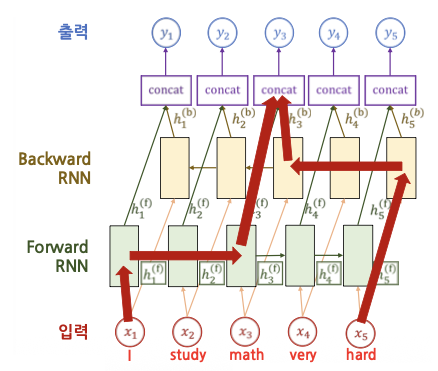
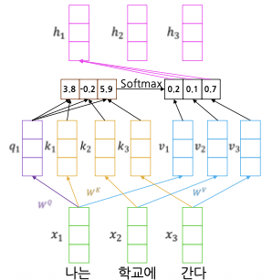
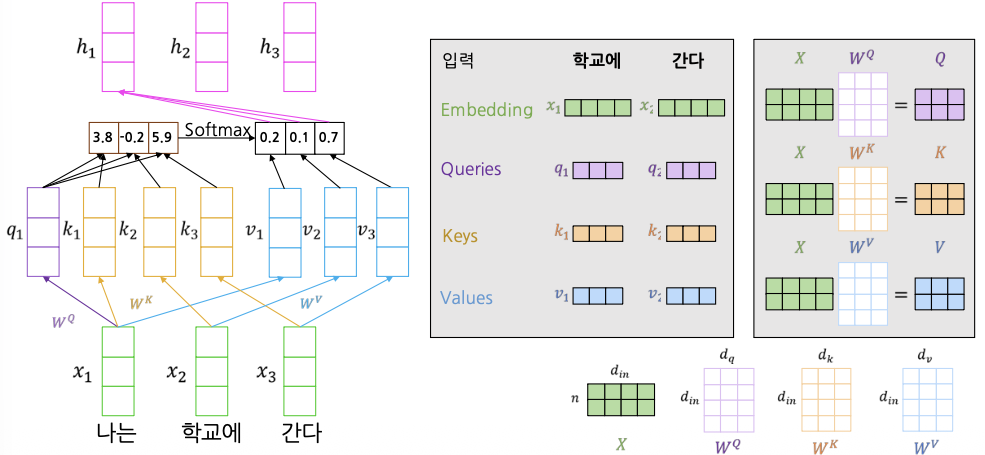
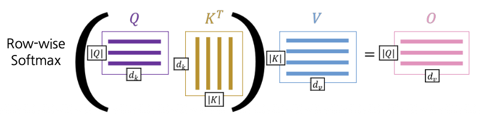
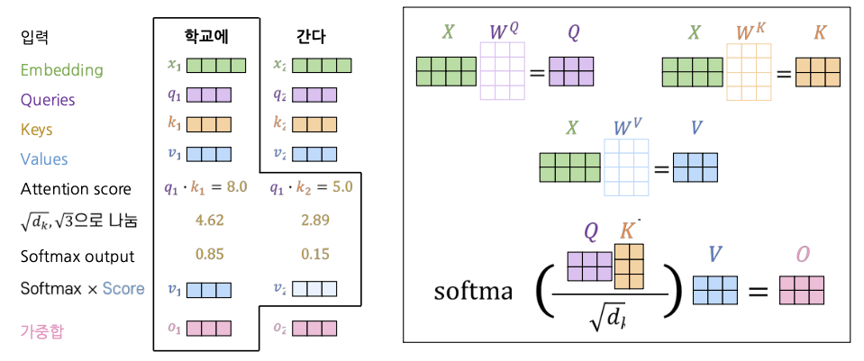
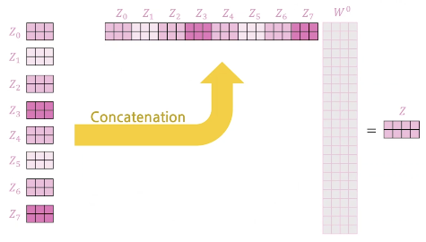

RNN 계열의 모델에서 시퀀스를 인코딩 과정을 살펴보자. 

위의 그림을 통해 알 수 있듯이 원하는 단어에 접근하기 위해서는 여러 Timestep을 거쳐야 하는데 이 과정이 많으면 정보가 손실되거나 변질될 수 있다. 

이러한 문제가 일어나지 않기 위해서는 직접적으로 접근하는 방식을 통해 해결할 수 있는데 이 방법이 바로 Attention 방법이다.

seq2seq 모델에서 입력 문장의 각각의 단어가 Encoder를 거칠 때 마다 hidden state vector가 출력되며 최종 layer에서 인코딩된 hidden state vector가 output으로 나온다. 

이 vector에 Attention을 적용하여 필요한 정보들을 각각의 Decoder에 반영한다. 마지막 Decoder layer에서는 전 Decoder의 output과 Encoder의 마지막 hidden state vector를 concat하여 출력 layer의 input으로 사용한다.

이때 디코더는 마치 기존의 seq2seq 구조처럼 시작 심볼 <sos>를 입력으로 받아 종료 심볼 <eos>가 나올 때까지 연산을 진행한다.

## Self-attention의 개념
-----

Self-Attention을 설명하기 위해 동물과 해당 동물의 다리 개수가 매핑된 Hash Table $T$가 있다고 가정하자.

|Key(동물)|Value(다리 개수)|
|--------|--------------|
|강아지|4|
|닭|2|
|문어|8|
|오징어|10|
|고양이|4| 

- `Query` : 어떤 동물을 입력
- `Query`와 정확하게 일치하는 Key의 Value를 출력
    - $T(\text{"강아지"}) = 4$
    - $T(\text{"문어"}) = 8$
- 만약 정확히 매칭되지 않는다면 문제가 발생
    - $T(\text{"사자"}) = \text{"Error: Key is not found"}$

다만, 딥러닝 모델에서는 벡터 형태를 입력으로 받기 때문에 **Key와 Value가 모두 특정한 차원으로 이루어진 Vector** 로 이루어져있다.

- Key와 Value의 벡터 차원은 같을 필요가 없다.
- 찾고자하는 Query를 Key 벡터와 매칭하기 때문에 Query는 Key와 차원이 같은 벡터로 구성된다.

**Attention은 Soft matching을 통한 Hash table** 이라고 말할 수 있다.

- `Query`와 정확히 일치하는 Key가 없어도 유사한 Key를 찾아 활용
    - Query, Key, Value가 모두 벡터로 표현
    - Query-Key 간의 Soft한 유사도(softmax 계산)를 가중치로 사용하여 Value의 가중 평균을 계산

위의 그림은 Self-Attention 과정을 표현한 것으로 이 과정을 거치면 입력 벡터들이 서로 다른 가중 평균을 취한 결과 벡터가 나타난다.  

이때, 입력 벡터를 그대로 사용하면 정보의 표현력이 제한되므로 입력 벡터에 가중치 벡터($W^Q$ , $W^K$ , $W^V$ )를 곱하는 선형변환을 적용한다.

위의 과정을 수식을 표현하면 다음과 같다.

- 입력 : Query $q$ 하나와 여러 Key-Value($k$, $v$) 쌍
    - Query, Key, Value는 모두 벡터 형태
- 출력: Value 벡터의 가중 평균(Weighted average)
    - 각 Value의 가중치는 대응되는 Key와 Query의 Inner product로 계산
    - Query와 Key는 같은 크기의 차원 $d_k$를 가지고, Value는 $d_v$ 차원을 가짐

$$
\text{Attention}(q, K, V) = \sum_{i} \frac{\text{exp}(q \cdot k_i)}{\sum_{j} \text{exp}(q \cdot k_j)} v_i
$$

만약 Query가 여러 개 있다면 이를 행렬 Q의 형태로 쌓을 수 있다.

$$
\text{Attention}(Q, K, V) = \text{softmax}(QK^T)V
$$

## Scaled dot-product attention
--------

위의 방식은 문제점이 있다.

- $d_k$가 커지면 Dot-product $q \cdot k$ 의 분산이 증가
    - Softmax 내 특정 값이 유난히 커질 가능성이 증가
    - Softmax 출력이 한 값에 편중되는 분포를 가짐
    - **Gradient가 매우 작아짐**

해결 방법은 **Query / Key 벡터의 길이**만큼 출력 값의 분산값을 줄이는 것이다.

$$
\text{Attention}(Q, K, V) = \text{softmax} \bigg( \frac{QK^T}{\sqrt{d_k}}\bigg) V
$$

## Multi-head attention
------

Scaled dot-product attention을 거친 결과들을 취합하는 형태로 동작하는 방식이 `Multi-head attention` 이다.

Query와 가장 유사한 Key의 Value를 활용하면 하나의 Attention은 하나의 Softmax에 기반한다.

이러한 계산 방식때문에 주어진 단어가 가장 연관성이 높은 단어에 치중하여 인코딩되므로 상대적으로 연관성이 낮은 단어가 주어진 단어의 인코딩 결과에 반영되지 못하는 문제점이 있다.

- ex. I came home late
    - 주어진 단어 : I
    - 계산 결과 : came(0.7), home(0.15), late(0.05)
    - 하나의 계산 결과만 사용하면 came에만 집중하여 인코딩하므로 나머지 단어인 home과 late에 대한 정보가 인코딩에 반영이 되지 못함 

위의 문제를 해결하기 위해서 `Multi-head attention`으로 여러 Softmax를 활용한다.

- Q, K, V를 $W_i$ 행렬들을 통해 $h$ 개의 저차원 공간으로 매핑
- 각각의 차원에 Attention을 적용
- 이후 Attention 출력들을 Concatenation 한 후 선형 변환

$$
\begin{align*}
\text{MultiHead}(Q, K, V) = \text{Concat}(\text{head}_1, \ldots, \text{head}_h)W^{o} \\
\text{where } \text{head}_i = \text{Attention}(QW_i^Q, KW_i^K, VW_i^V)
\end{align*}
$$

위의 과정을 요약해서 하나의 그림으로 표현하면 아래와 같다.

### Attentino 시각화

Attention을 시각화하면 각 단어가 어느 다른 단어에 집중하는지 확인할 수 있다.

2개의 attetion을 사용한 경우와 8개의 attention을 사용한 경우를 시각화 한 결과이며, 같은 it이라는 단어에 대해서도 attention score가 조금씩 다르게 scoring이 되는 것을 확인할 수 있습니다.

### Self-Attention 비교

- Self-attention은 입력 길이가 비교적 짧을 때 효율적으로 계산됨
- Attention은 병렬 연산이 가능
    - Sequential operation이 $O(1)$
- 모든 단어까지의 Gradient flow 거리가 모두 동일
    - Maximum Path Length가 $O(1)$