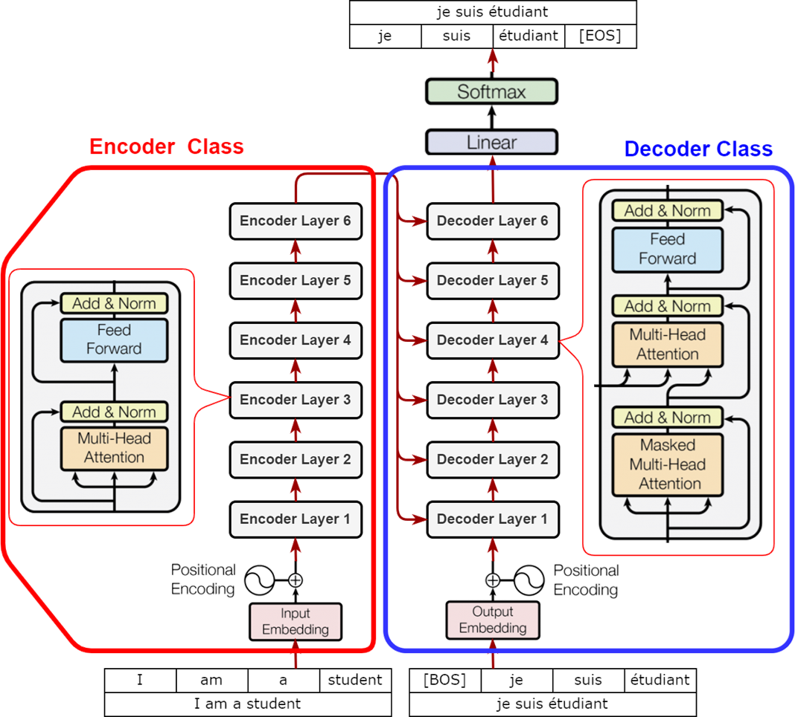

Transformer의 구조는 아래 그림과 같이 구성되어 있다.

위의 그림에서 보면 Nx 라고 쓰여있다. 이는 Transformer 구조가 N개 쌓여있다는 의미로 RNN으로 구성된 Seq2seq에서 Encoder와 Decoder가 여러 레이어로 구성되어있는 것처럼 생각할 수 있다.

## Transformer Block
----------

먼저 Encoder 부분을 살펴보자

각 Block은 크게 두 개의 layer로 구분할 수 있다.

- `Multi-head attention`
    - Sequence dimension 축으로 Attention 적용
- `Feed Forward(Two-layer perceptron)`
    - Hidden dimension 축으로 MLP 적용
    - ReLU activation을 사용

위에서 구분한 layer에는 추가적으로 하나의 layer(Add & Norm)가 있다.

- `Add & Norm`
    - Residual connection : 입력 벡터가 Multi-Head Attention과 Add & Norm layer과 연결된 부분
    - Layer normalization

    수식으로 표현하면 다음과 같다.

    $$
    \text{LayerNorm}(x + \text{sublayer}(x))
    $$

### Layer Normalization

Layer Normalization에 대해서 좀 더 구체적으로 살펴보자.

- Normalization을 통해 입력을 평균 0, 분산 1로 변환
- Batch Normalization과 달리, 입력 예제 혹은 입력 길이 단위로 수행

$$
\mu^{l} = \frac{1}{H} \sum_{i=1}^{H} a_{i}^{l}, \ \ \ \sigma^{l} = \sqrt{\frac{1}{H} \sum_{i}^{H} (a_{i}^{l} - \mu^{l})^2}, \ \ \ h_{i} = f(\frac{g_i}{\sigma_i}(a_{i} - \mu_{i}) + b_{i})
$$

입력이 {학교에, 갑니다} 인 예시를 통해 Layer Normalization 계산 과정을 살펴보자.

1. Multi-Head Attention 거친 각 차원 벡터를 Normalization하여 평균과 분산을 0과 1로 변환
2. 각 차원 별로 학습 가능한 Parameter로 Affine transformation
    - 이 때 $y = \gamma x + \beta$ 식에서 $\gamma$ 와 $\beta 파라미터들은 학습과정 중에 최적화의 대상이다.

> Layer Normalization : 학습과정 중에 어떤 특정 노드에서 발견되는 activation 값들의 분포를 잘 조정
> - Non-linear unit을 통과할 때 가지는 입력값들의 분포를 적절한 범위 내에 있도록 조절함으로써 학습을 용이
> - overfitting을 방지하고 regularization 효과를 줄 수 있음

참고 : [Batch Normalization vs Layer Normalization](https://kwonkai.tistory.com/144)

### Feed Forward 
-----

- two layer로 구성되어 있으며 fully connected network이며 중간에 ReLU를 사용한다.
- sequence 길이 개수 만큼으로 이루어진 각각의 벡터들을 한번에 하나씩 Feed Forward Network를 통과한다.
- output 또한 sequence 길이에 해당하는 개수만큼으로 나오게 되고 입력벡터와 동일한 차원을 가지도록 한다.
- Residual connection을 통해 Feed Forward output과 input을 각 Time step 별로 더해주는 과정을 수행한다.
- Layer Normalization을 수행한다.

## Positional Encoding
-----

Positional Encoding을 설명하기에 앞서 이를 사용하는 주된 이유는 다음과 같다.

Transformer 블록을 사용했을 때 어떤 동일한 시퀀스 내에서 입력 단어의 순서가 바뀐다하더라도 각각의 해당 단어에 인코딩된 hidden state 벡터는 동일하게 나오는 문제가 발생한다.

이를 `Permutation-invariant` 라고 한다. 즉, 입력 순서가 뒤바뀌어도 똑같은 출력이 나온다.

따라서, Transformer 모델이 같은 단어들로 이루어진 입력 Sequence에 대해서도, 서로 다른 어순을 구별하도록 하기 위해, 각 단어에 현재 위치 정보를 넣을 필요가 있다.

- 원 Transformer 논문에선 `Sinusoidal function`을 활용
- 학습 가능한 Positional embedding을 사용하기도 함

### Sinusoidal Positional Encoding

- 서로 다른 주파수를 가진 Sinusoidal function을 활용

$$
\begin{align*}
PE_{(pos, 2i)} = sin(pos / 10000^{2i/{d_\text{model}}}) \\
PE_{(pos, 2i + 1)} = cos(pos / 10000^{2i/{d_\text{model}}})
\end{align*}
$$

ex. 각 time-step 또는 각 토큰 별로 주어지는 입력 벡터가 100차원이라고 생각해보자.

1. 50개의 서로 다른 주파수를 가지는 sin 및 cos 함수를 사용해서 해당 함수에 입력값을 대입하여 총 100개의 함수값을 이용하여 100차원 벡터를 구성한다.

2. 첫번째 time-step에서 나타난 토큰의 입력 벡터에 100개의 함수에 1을 대입하여 얻은 총 100개의 서로 다른 함수값들을 하나의 100차원 벡터로 구성하여 더해주는 방식으로 해당 토큰을 변형해준다. 

3. 이 과정을 매 time-step 또는 토큰에 적용하여 입력값들을 변형시킨다.

## Decoder
----

Transformer의 Decoder는 Encoder와 비슷하게 Multi-Head Attention 모듈을 중심으로 하는 어떤 특정 구조로 이루어진 하나의 블럭을 단위로 해서 이 블럭이 총 N개 쌓여있는 형태로 이루어져있다.

이 떄, Decoder의 입력에서 아직 추론이 시작히지 않은 즉, 아직 예측을 하나도 하지 않는 단계에서 입력으로 `<SOS> (start of sentence)` 를 넣어준다. 

Decoder가 예측한 단어는 현재 입력과 함께 다음 스텝의 입력으로 사용한다.

- 입력: \<SOS \> &rarr; 출력: 나는
- 입력: \<SOS \> 나는 &rarr; 출력: 학교에

이렇게 Decoder는 다음에 나타나는 단어를 순차적으로 예측하는 `Auto-Regressive` 한 방식으로 추론한다.

이러한 방식으로 학습을 진행하면 문제가 발생한다. 학습 초기에는 다음에 올 단어의 추론 정확도가 굉장히 떨어져 잘못된 단어를 예측할 수 있다. 하지만, 잘못 예측한 단어를 입력으로 사용하면 이 학습은 무의미한 과정이다. 

따라서, 학습 과정에서 나타나는 문제점을 해결하기 위해서는 실제 값과 동떨어진 값을 예측했다고 하더라도 그 다음 Time-step의 입력으로 주는 값은 정답을 입력으로 줌으로써 다음 단어를 예측할 때 올바른 정보를 참조할 수 있도록 한다.

이를 구현하기 위해 Decoder의 입력으로 전체 문장에서 오르쪽으로 shift한 문장(마지막 단어가 잘린 형태)을 사용한다.

하지만, 이를 사용하면 발생하는 문제점이 있다. 이 방식을 사용하면 현재 디코더가 추론을 아직 하지 않는 단어에 접근할 수 있기 때문이다.

- ex. \<SOS \> 다음 단어를 예측하지만 "\<SOS \> 나는 학교에" 가 입력으로 주어지기 때문에 다음 예측 단어에 접근 가능

이러한 문제를 해결하기 위해서 Decoder에서는 `Masked Multi-Head Attention` 기법을 사용한다.

### Masked Attention

`Masked Attention`은 `Causal attention`이라고도 부르며 Self-attention이 과거 생성 정보만을 참조한다.

- 아직 생성되지 않은 단어는 추론 과정 중엔 접근할 수 없음
- Softmax 출력을 수정하여 아직 생성되지 않은 단어를 참조하지 못하게 함

위의 그림에서 초록색 행렬에서 가중치가 저장되어있다. 이때, 빨간색 글씨가 가르키는 행렬값들은 \<SOS \>의 다음 단어를 예측하는데 사용되는 입력 벡터에 대한 정보를 담고있다.

이러한 값을 참조하지 못하게 하기 위해서 해당 행렬값을 $-infty$로 대체함으로써 이 값에 softamx를 씌운 값이 0이 되도록 한다. 이렇게 Mask를 씌우는 방식을 통해 다음 단어 예측에 사용되는 정보들에 접근하지 못하도록 만든다.

위의 방식으로 변형된 attention weight들을 가지고 해당 행렬과 Value Matrix를 곱한다.

### Cross Attention

`Cross Attention`은 Encoder-decoder 간의 attention 하는 방법이다.

- Query: Decoder의 Causal-attention 결과
- Key & Value: Encoder의 최종 layer에서 계산한 vector

Self-Attention 과 Cross-Attention 은 Input 을 제외하면 차이가 나지 않는다.(동일한 계산 방법)

하지만 Input, 목적에서 차이가 있으며 `Self-Attention` 은 번역작업 기준 Source 언어의 토큰별 관계를 파악하기 위해 진행한다면, `Cross-Attention` 은 **Target 언어와 Source 언어의 Token 간 관계를 파악**하기 위해 사용된다.