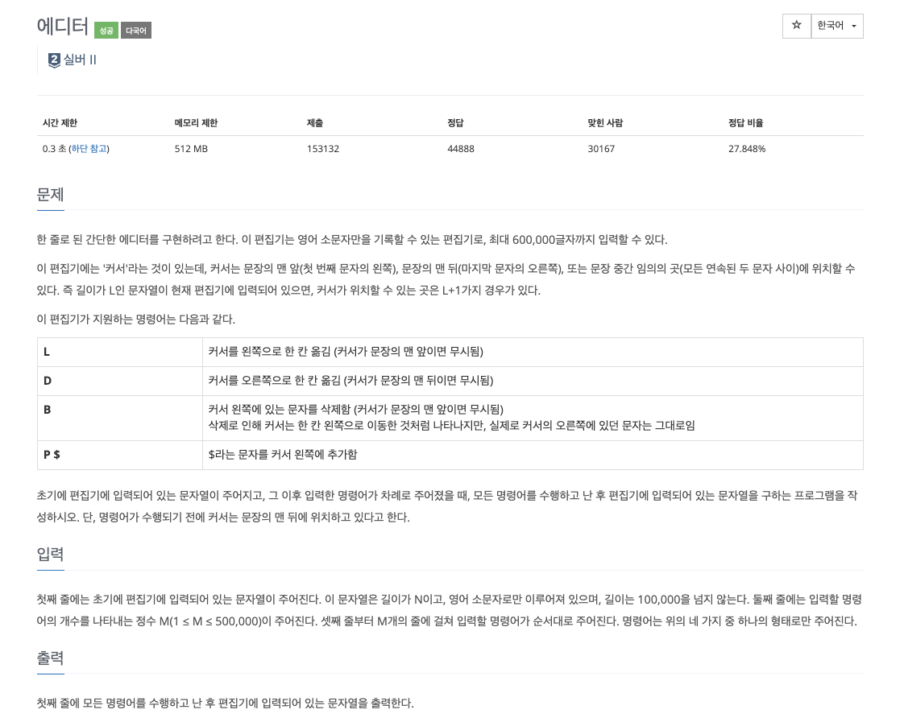

### **INTRO**
-----

#### **🔑 KEY POINT**

> **연결 리스트의 성질**<br>
> 1. k번째 원소를 확인/변경하기 위해 O(k)가 필요함
> 2. 임의의 위치에 원소를 추가/임의 위치의 원소 제거는 O(1)
> 3. 원소들이 메모리 상에 연속해있지 않아 Cache hit rate가 낮지만 할당이 디소 쉬움


#### **기능과 구현**

- 연결 리스트 구현 및 생성

    ```python
    # Node 구현
    class ListNode:
        def __init__(self, val=0, next=None):
            self.val = val
            self.next = next

    # Node 생성
    node = ListNode(1)

    # 연결 리스트 구현
    class LinkedList:
        def __init__(self, data):
            self.head = ListNode(data)
        
        def append(self, data):
            cur = self.head
            while cur.next is not None:
                cur = cur.next
            cur.next = ListNode(data)
    ```

- traverse 함수

    ```python
    def traverse(self):
        prev = None
        cur = self.head

        while cur is not None:
            nex = cur.next
            cur.next = prev

            prev = cur
            cur = nex
        
        self.head = prev
    ```

- insert 함수와 erase 함수

    ```python
    def get_node(self, index):
        count = 0
        node = self.head
        while count < index:
            count += 1
            node = node.next
        return node

    # insert 함수
    def add_node(self, index, value):
        new_node = ListNode(value)

        if index == 0:
            new_node.next = self.head
            self.head = new_node
            return
        
        node = self.get_node(index - 1)
        next_node = node.next
        node.next = new_node
        new_node.next = next_node

    # remove 함수
    def remove_node(self, index):
        if index == 0:
            self.head = self.head.next
            return
        node = self.get_node(index-1)
        node.next = node.next.next
    ```

**🔗 강의 링크**

[[실전 알고리즘] 0x04 - 연결 리스트](https://blog.encrypted.gg/932)


### **문제 풀이**
------

강의에서는 C++ 언어로 문제를 풀이하셨고 저는 파이썬으로 문제를 풀려고 합니다.

문제에 대한 설명 또한 강의자님의 설명을 그대로 가져온 것입니다.

#### **문제 1**



**My Solution**

```python
import sys
input = sys.stdin.readline

left = list(input().rstrip())
right= []

for _ in range(int(input())):
    command = list(input().split())
    if command[0] == 'L' and len(left) != 0:
        top = left.pop()
        right.append(top)
    elif command[0] == 'D' and len(right) != 0:
        top = right.pop()
        left.append(top)
    elif command[0] == 'B' and len(left) != 0 :
        left.pop()
    elif command[0] == 'P':
        left.append(command[1])

answer = left + right[::-1]
print(''.join(answer))
```

저는 처음 문제를 보고서 스택을 이용해서 구현을 했습니다. 

강의에서는 연결 리스트로 구현을 하였으며 강의 내용 처럼 연결 리스트로도 구현을 해보겠습니다.


**Lecture Solution**

```python
import sys
input = sys.stdin.readline

class ListNode:
    def __init__(self, val, next, prev):
        self.val = val
        self.prev = prev
        self.next = next

head = ListNode("head", None, None)
tail = ListNode("tail", None, None)

head.next = tail
tail.prev = head

cur = head

for c in list(input().rstrip()):
    new_node = ListNode(c, None, None)
    
    new_node.prev = cur
    new_node.next = tail
    
    cur.next = new_node
    tail.prev = new_node
    
    cur = new_node

cur = tail
    
for _ in range(int(input())):
    command = list(input().split())
    if command[0] == 'L':
        if cur.prev != head:
            cur = cur.prev
    elif command[0] == 'D':
        if cur != tail:
            cur = cur.next        
    elif command[0] == 'B':
        if cur.prev != head:
            cur.prev.prev.next = cur
            cur.prev = cur.prev.prev
    elif command[0] == 'P':
        new_node = ListNode(command[1], None, None)
        
        new_node.prev = cur.prev
        new_node.next = cur
        
        cur.prev.next = new_node
        cur.prev = new_node
        
cur = head.next

while cur.val != 'tail':
    print(cur.val, end='')
    cur = cur.next
```

강의 주제에 맞는 연결리스트로 구현한 코드 입니다. 연결 리스트로 구현한 결과 스택 풀이보다 성능 면에서 4배 정도 느리고 더 많은 메모리가 필요했습니다.

> 💡 ***In Python***
>
> Python에는 STL에 linked list가 없다. 따라서, linked list 문제를 풀 때는 직접 구현해야 하는데 이는 상당히 번거로운 과정이다. 
> 또한 linked list를 Python level에서 구현하게 되면, C로 구현되어 있는 STL 자료구조(e.g. deque)를 쓰는 것보다 오히려 비효율적일 수 있다.
>
> 따라서 최대한 linked list 없이 풀 수 있는 방법을 찾아보는 것이 좋다.


