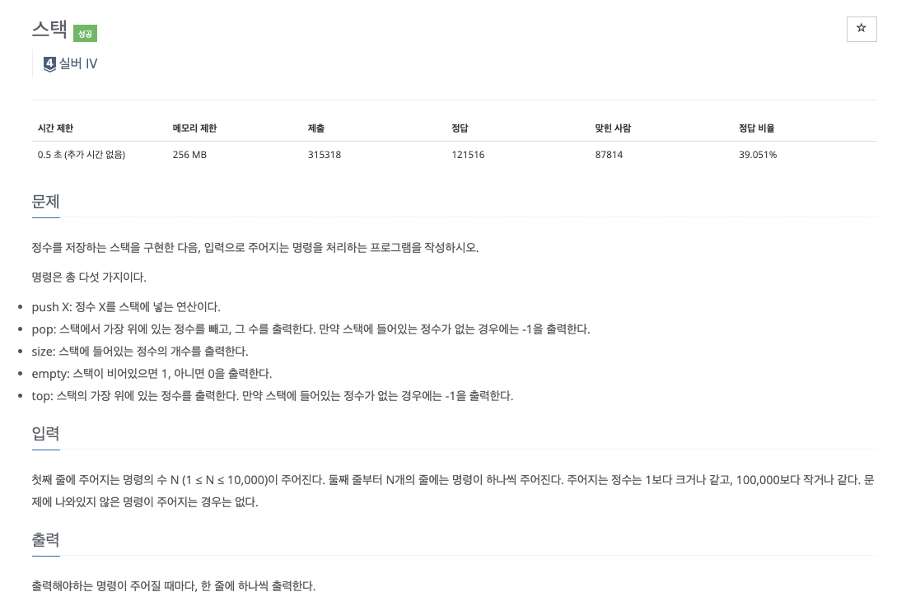

### **INTRO**
-----

#### **🔑 KEY POINT**

> **스택의 성질** 
> 1. 원소의 추가가 O(1)
> 2. 원소의 제거가 O(1)
> 3. 제일 상단의 원소 확인이 O(1)
> 4. 제일 상단이 아닌 나머지 원소들을 확인/변경이 원칙적으로 불가능
>
> **기능과 구현** 
> - 스택에 원소를 추가, O(1) : `stack.append()`
> - 스택에 원소를 제거, O(1) : `stack.pop()`
> - 제일 상단의 원소 반환, O(1) : `stack[-1]`
> - 스택이 비어있는지 확인 : `len(stack) == 0`

스택을 FILO(First In Last Out)라고 부르며 보통 원소가 추가되고 제거되는 곳을 top이라고 부른다.

**🔗 강의 링크**

[[실전 알고리즘] 0x05 - 스택](https://blog.encrypted.gg/933)

### 문제 풀이
--------

강의에서는 C++ 언어로 문제를 풀이하셨고 저는 파이썬으로 문제를 풀려고 합니다.

문제에 대한 설명 또한 강의자님의 설명을 그대로 가져온 것입니다.

#### **문제 1**

