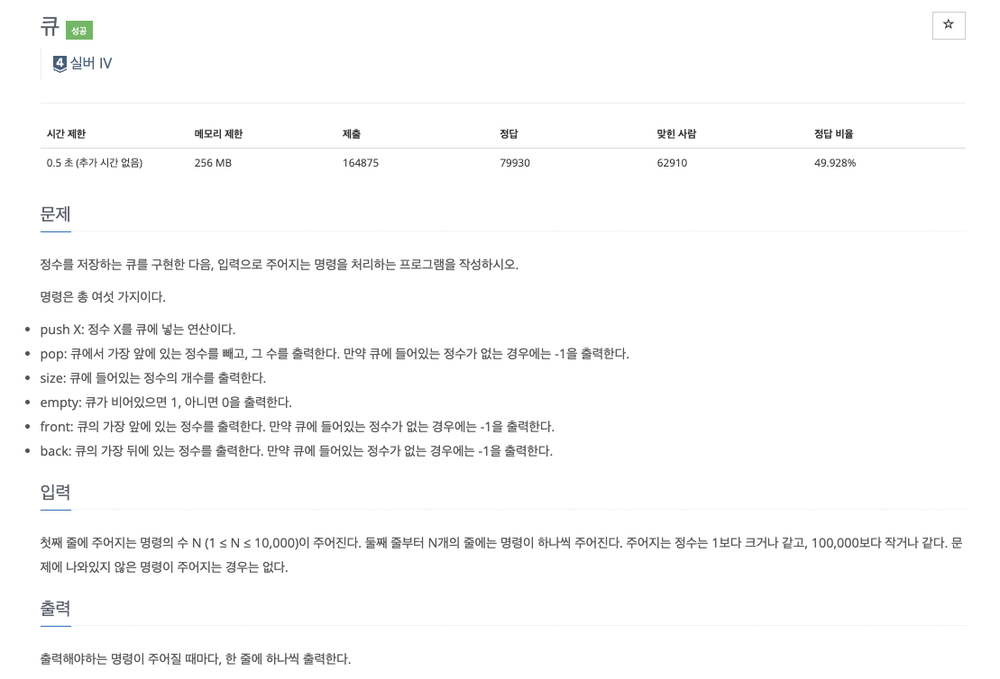

### **INTRO**
-----

#### **🔑 KEY POINT**

> **스택의 성질**<br>
> 1. 원소의 추가가 O(1)
> 2. 원소의 제거가 O(1)
> 3. 제일 상단의 원소 확인이 O(1)
> 4. 제일 앞/뒤가 아닌 나머지 원소들의 확인/변경이 원칙적 불가능
>
> **기능과 구현**<br>
> head는 가장 앞에 있는 원소의 인덱스이고 tail은 가장 뒤에 있는 원소의 인덱스 + 1입니다. 
> - 큐에 원소를 추가, O(1) : `queue.append()` and (tail + 1)
> - 큐에 원소를 제거, O(1) : `queue.pop(0)` or `del queue[0]` and (head + 1)
> - 큐의 크기 : tail - head
> 주로 큐는 배열로 구현한다(python에서는 큐 대신 `dequeue`를 사용)


큐을 FIFO(First In First Out)라고 부릅니다. 큐에서는 추가되는 곳을 rear, 즉 뒤쪽이라고 하고 제거되는 쪽을 front, 즉 앞쪽이라고 합니다.

큐는 스택과 다르게 배열로 구현할 때 삭제가 발생한 앞쪽에 쓸모없는 공간이 계속 생긴다. 이를 해결하기 위해 원형으로 만듦.

**🔗 강의 링크**

[[실전 알고리즘] 0x06 - 큐](https://blog.encrypted.gg/934)

### 문제 풀이
--------

강의에서는 C++ 언어로 문제를 풀이하셨고 저는 파이썬으로 문제를 풀려고 합니다.

문제에 대한 설명 또한 강의자님의 설명을 그대로 가져온 것입니다.

#### **문제 1**



```python
import sys
from collections import deque
input = sys.stdin.readline

queue = deque()

for _ in range(int(input())):
    command = input().split()
    if command[0] == 'push':
        queue.append(command[1])
    elif command[0] == 'pop':
        if not queue:
            print(-1)
        else:
            print(queue.popleft())
    elif command[0] == 'size':
        print(len(queue))
    elif command[0] == 'empty':
        if not queue:
            print(1)
        else:
            print(0)
    elif command[0] == 'front':
        if not queue:
            print(-1)
        else:
            print(queue[0])
    elif command[0] == 'back':
        if not queue:
            print(-1)
        else:
            print(queue[-1])
```

파이썬으로 구현한 코드입니다. 여기에서 `collections.deque`를 사용하였는데 `deque`에 대한 내용은 다음 챕터에서 다루겠습니다.