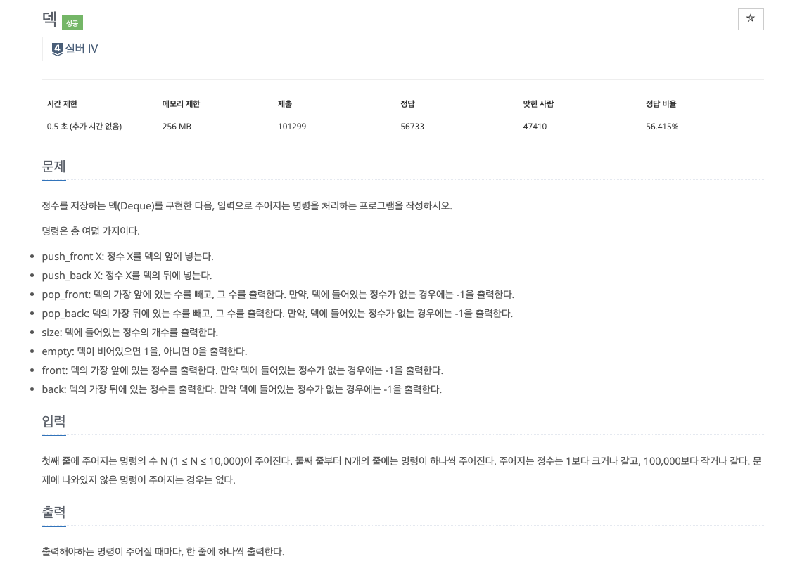

### **INTRO**
-----

#### **🔑 KEY POINT**

> **덱의 성질**<br>
> 1. 원소의 추가가 O(1)
> 2. 원소의 제거가 O(1)
> 3. 제일 상단의 원소 확인이 O(1)
> 4. 제일 앞/뒤가 아닌 나머지 원소들의 확인/변경이 원칙적 불가능
>
> **기능과 구현**<br>
> - 덱 앞쪽에 원소를 추가, O(1) : `deque.appendleft(x)` or `deque.extendleft(iterable)`
> - 덱 뒤쪽에 원소를 추가, O(1) : `deque.append(x)` or `deque.extend(iterable)`
> - 덱 앞쪽 원소를 제거, O(1) : `deque.popleft()`
> - 덱 뒤쪽의 원소를 제거, O(1) : `deque.pop()`
> - 덱의 원소를 k 만큼 회전, O(k) : `deque.rotate(k)`

`extend` 여러 요소를 순회하며 덱의 끝에 차례로 추가하지만 `append`의 차이점은 요소 하나를 덱의 끝에 추가한다.

- ex. `append` vs `extend`

    ```python
    lst2 = ['a', 'b', 'c', 'd']
    lst2.append('ef') # append() 
    lst.extend('ef') # extend()

    print("lst.extend('ef') >> ", lst)
    print("lst2.append('ef') >>", lst2)

    '''
    결과
    lst.extend('ef') >> ['a', 'b', 'c', 'd', 'e', 'f']
    lst2.append('ef') >> ['a', 'b', 'c', 'd', 'ef']
    '''
    ```

`rotate(n)`은 n이 음수이면 왼쪽으로 회전하고, 양수이면 오른쪽으로 회전한다.

- ex.

    ```python
    deq = collections.deque(['a', 'b', 'c', 'd', 'e'])
    deq.rotate(2)
    print('deq  >>', ' '.join(deq))

    deq1 = collections.deque(['a', 'b', 'c', 'd', 'e'])
    deq1.rotate(-2)
    print('deq1 >>', ' '.join(deq1))

    '''
    결과
    deq >> d e a b c
    deq1 >> c d e a b
    '''
    ```

**🔗 강의 링크**

[[실전 알고리즘] 0x07 - 덱](https://blog.encrypted.gg/935)

### 문제 풀이
--------

강의에서는 C++ 언어로 문제를 풀이하셨고 저는 파이썬으로 문제를 풀려고 합니다.

문제에 대한 설명 또한 강의자님의 설명을 그대로 가져온 것입니다.



**My Solution**

```python
import sys
from collections import deque
input = sys.stdin.readline

deq = deque()

for _ in range(int(input())):
    command = input().split()
    
    if command[0] == 'push_front':
        deq.appendleft(command[1])
    elif command[0] == 'push_back':
        deq.append(command[1])
    elif command[0] == 'pop_front':
        if deq:
            print(deq.popleft())
        else:
            print(-1)
    elif command[0] == 'pop_back':
        if deq:
            print(deq.pop())
        else:
            print(-1)
    elif command[0] == 'size':
        print(len(deq))
    elif command[0] == 'empty':
        if deq:
            print(0)
        else:
            print(1)
    elif command[0] == 'front':
        if deq:
            print(deq[0])
        else:
            print(-1)
    elif command[0] == 'back':
        if deq:
            print(deq[-1])
        else:
            print(-1)
```