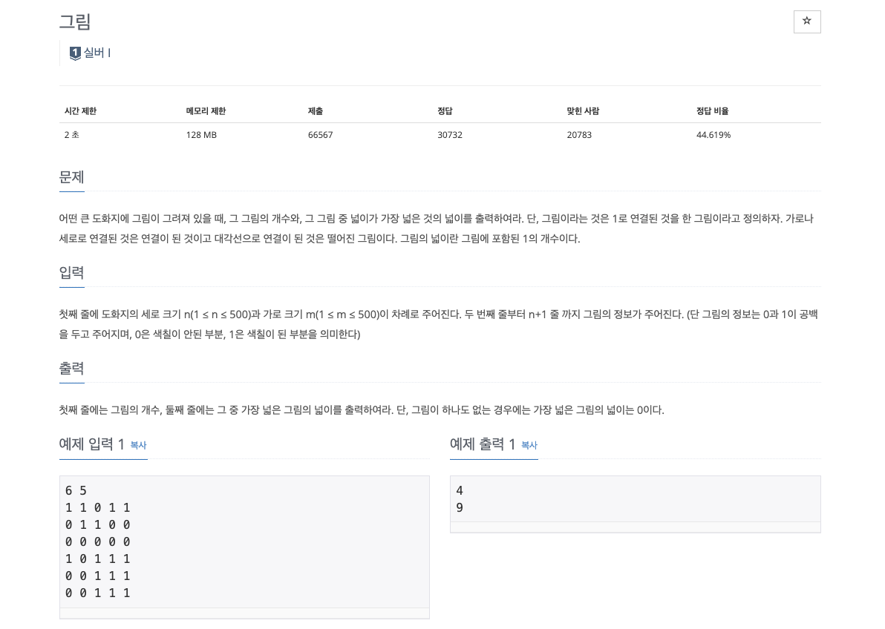
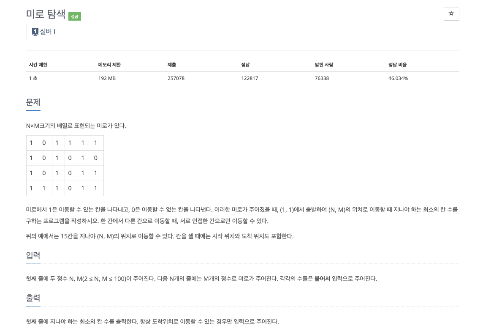
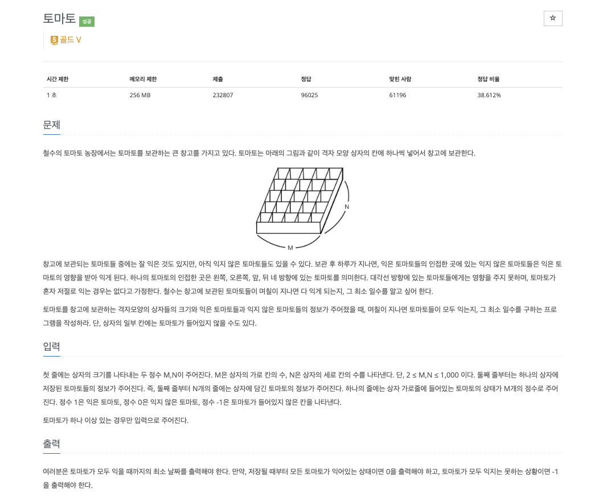
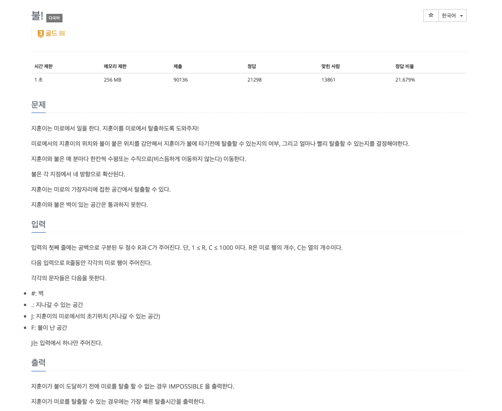
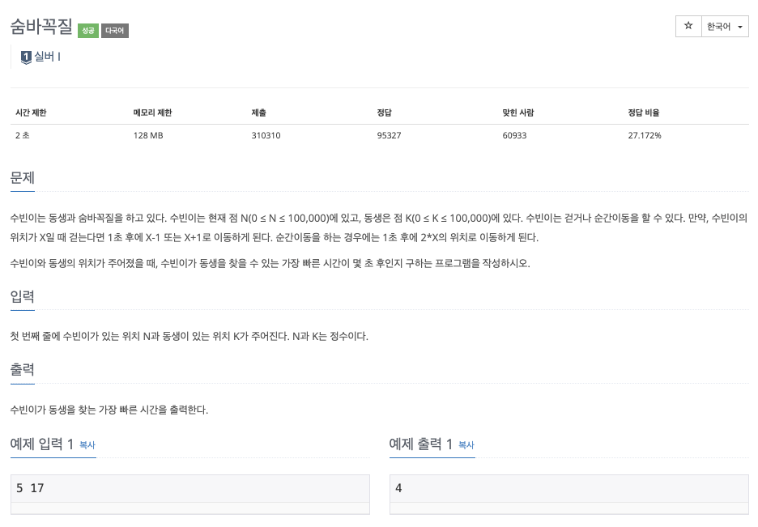

### **INTRO**
-----

#### **🔑 KEY POINT**

> **정의와 특징**<br>
> - 정의: 다차원 배열이나 그래프에서 시작 지점으로부터 **거리가 가까운 지점부터 우선적으로 방문**하는 알고리즘입니다.
> - 자료구조: 선입선출(FIFO) 구조인 `큐(Queue)`를 사용하여 구현한다.
> - 시간 복잡도: 모든 칸을 한 번씩 방문하므로 칸의 개수가 N개일 떄 시간복잡도는 $O(N)$이다.
>
> **문제 풀이 방법**<br>
> 1. 시작하는 칸을 큐에 넣고 방문 표시를 한다.
> 2. 큐가 빌 때까지 다음을 반복한다.:
>   - 큐에서 원소를 꺼내어 해당 칸의 상하좌우 인접한 칸을 확인한다.
>   - 인접한 칸이 범위 내에 있고, 처음 방문하며, 갈 수 있는 칸이라면: 
>       - 그 칸에 방문 표시를 하고 큐에 넣는다.
>
> **주요 응용**<br>
> - 거리 측정
> - 시작점이 여러 개인 경우
> - 시작점이 두 종류인 경우

**🔗 강의 링크**

[[실전 알고리즘]0x09강 - BFS](https://blog.encrypted.gg/941)

### 문제 풀이
--------

강의에서는 C++ 언어로 문제를 풀이하셨고 저는 파이썬으로 문제를 풀려고 합니다.

문제에 대한 설명 또한 강의자님의 설명을 그대로 가져온 것입니다.

#### **문제 1**



**My Solution**

```python
import sys
from collections import deque
input = sys.stdin.readline

dx = [1, -1, 0, 0]
dy = [0, 0, -1, 1]
queue = deque()
n, m = map(int, input().split())   # n이 y축 m이 x축

def bfs(arr, y, x):
    size = 0
    while queue:
        k = queue.popleft()
        ny, nx = k[0], k[1]
        size += 1
        for i in range(4):
            if (nx + dx[i] < m and nx + dx[i] >= 0) and (ny + dy[i] < n and ny + dy[i] >= 0):
                if arr[ny + dy[i]][nx + dx[i]] == '1':
                    queue.append((ny + dy[i], nx + dx[i]))
                    arr[ny + dy[i]][nx + dx[i]] = '0'
    return size
    
paintings = []
cnt, biggest = 0, 0

for _ in range(n):
    paintings.append(list(input().split()))
    
for i in range(n):
    for j in range(m):
        if paintings[i][j] == '1':  # i 가 y좌표 j 가 x 좌표
            queue.append((i, j)) 
            paintings[i][j] = '0'
            biggest = max(bfs(paintings, i, j), biggest)
            cnt += 1

print(cnt)
print(biggest)
```

> **💡 POINT**
> 
> - 코드에서 size를 측정하는 부분에서 **BFS에서 큐에 넣는 순간 방문 처리** 기억하자!!
> - matrix에서 y와 x를 잘 구분해서 코드 작성이 필요!

#### **문제 2**



**My Solution**

```python
# Authored by : 21011645
# https://www.acmicpc.net/problem/2178
import sys
from collections import deque
input = sys.stdin.readline


N, M = map(int, input().split())
dx = [1, -1, 0, 0]
dy = [0, 0, -1, 1]
queue = deque()

def bfs(arr):
    while queue:
        k = queue.popleft()
        ny, nx = k[0], k[1]
        for i in range(4):
            if (ny + dy[i] >= 0 and ny + dy[i] < N )and (nx + dx[i] >= 0 and nx + dx[i] < M):
                if arr[ny + dy[i]][nx + dx[i]] == '1':
                    queue.append((ny + dy[i], nx + dx[i]))
                    arr[ny + dy[i]][nx + dx[i]]  = int(arr[ny][nx]) + 1

miro = []

for _ in range(N):
    miro.append(list(input()))
    
for i in range(N):
    for j in range(M):
        if miro[i][j] != '0':
            queue.append((i, j))
            bfs(miro)
            
print(miro[N - 1][M - 1])
```

> ⚠️ 내 코드의 문제점<br>
> 
> - 시작점을 잘못 잡음 : 최단거리 BFS의 규칙은 **시작점은 “단 하나”**여야 한다
> - BFS를 여러 번 실행함
> - 거리와 방문을 동시에 제대로 관리하지 않음
> - BFS 최단거리 불변식 : 큐에서 먼저 나오는 노드는 항상 더 짧은 거리

**Update My Solution**

```python
import sys
from collections import deque
input = sys.stdin.readline


N, M = map(int, input().split())
dx = [1, -1, 0, 0]
dy = [0, 0, -1, 1]

miro = [list(input().rstrip()) for _ in range(N)]

queue = deque()

# 시작점을 하나로 잡음
queue.append((0, 0))    
miro[0][0] = 1

# 여러번 bfs를 돌지 않음
while queue:
    y, x = queue.popleft()
    for i in range(4):
        ny = y + dy[i]
        nx = x + dx[i]
        if 0 <= ny < N and 0 <= nx < M:
            if miro[ny][nx] == '1': # 방문 안함
                miro[ny][nx] = miro[y][x] + 1   # 거리 기록와 방문 처리 동시에 해결
                queue.append((ny, nx))

print(miro[N-1][M-1])
```

#### **문제 3**



**My Solution**

```python
import sys
from collections import deque
input = sys.stdin.readline

M, N = map(int, input().split())
dx = [1, -1, 0, 0]
dy = [0, 0, 1, -1]

tomatoes = [list(map(int, input().split())) for _ in range(N)]
queue = deque()

def bfs():
    while queue:
        y, x = queue.popleft()
        for i in range(4):
            ny = y + dy[i]
            nx = x + dx[i]
            if 0 <= ny < N and 0 <= nx < M:
                if tomatoes[ny][nx] == 0:
                    tomatoes[ny][nx] = tomatoes[y][x] + 1
                    queue.append((ny, nx))
    

for i in range(N):
    for j in range(M):
        if tomatoes[i][j] == 1:
            queue.append((i, j))

bfs()

days = 0

for i in range(N):
    for j in range(M):
        if tomatoes[i][j] == 0:
            print(-1)
            exit()
        days = max(days, tomatoes[i][j])


print(days - 1)
```

다중 시작점 BFS는 시작점들을 모두 queue에 삽입한 다음에 BFS를 진행하는 방향으로 알고리즘을 작성합니다.

> ⚠️ Matrix에 사칙 연산이 수반되는 경우 입력을 받을 때 애초부터 int로 입력을 받는 것이 바람직

#### **문제 4**



**My Solution**

```python
import sys
import copy
from collections import deque

input = sys.stdin.readline

DIRECTIONS = [(1, 0), (-1, 0), (0, 1), (0, -1)]


def bfs(
    r: int, c: int, maze: list[str], starts: list[tuple[int, int]]
) -> list[list[int]]:
    dist = [[-1] * c for _ in range(r)]
    queue = deque(starts)
    for x, y in starts:
        dist[x][y] = 0

    while queue:
        x, y = queue.popleft()
        for dx, dy in DIRECTIONS:
            nx, ny = x + dx, y + dy
            if not (0 <= nx < r and 0 <= ny < c):
                continue
            if maze[nx][ny] == "#" or dist[nx][ny] != -1:
                continue
            dist[nx][ny] = dist[x][y] + 1
            queue.append((nx, ny))

    return dist  # fire map


def jinhoo_bfs(
    r: int,
    c: int,
    maze: list[str],
    starts: list[tuple[int, int]],
    fire_map: list[list[int]],
):
    dist = [[-1] * c for _ in range(r)]
    queue = deque(starts)
    for x, y in starts:
        dist[x][y] = 0

    while queue:
        x, y = queue.popleft()
        for dx, dy in DIRECTIONS:
            nx, ny = x + dx, y + dy
            nt = dist[nx][ny] + 1
            if not (0 <= nx < r and 0 <= ny < c):
                return nt
            if maze[nx][ny] == "#" or dist[nx][ny] != -1:
                continue
            if fire_map[nx][ny] != -1 and fire_map[nx][ny] <= nt:
                continue

            dist[nx][ny] = nt
            queue.append((nx, ny))

    return None


def solve(r: int, c: int, maze: list[str]) -> str:
    fire_starts = []
    jinhoo_starts = tuple()

    for row_index, row in enumerate(maze):
        for col_index, cell in enumerate(row):
            if cell == "F":
                fire_starts.append((row_index, col_index))
            elif cell == "J":
                jinhoo_starts = (row_index, col_index)

    fire_map = bfs(r, c, fire_starts)
    min_time = jinhoo_bfs(r, c, maze, [jinhoo_starts], fire_map)

    return str(min_time) if min_time else "IMPOSSIBLE"


r, c = map(int, input().split())
maze = [input() for _ in range(r)]

answer: str = solve(r, c, maze)

print(answer)
```

> **💡 POINT**<br>
> - 두 객체가 함께 움직이는 문제는 두 객체의 탐색을 끝까지 마친 결과를 비교가 아니라 **이동 자체를 제약하는 방식으로 설계**하는 것이 핵심이다.
- 이때, 두 객체 중 이동에 영향을 받지 않는 객체의 경로를 탐색한 후에 이 탐색 결과로 다른 객체의 이동을 제약하는 방식으로 설계를 해야한다.

단, 두 종류의 BFS에서 BFS를 돌 때 어느 하나가 독립적이지 않고 서로에게 영향을 준다면 지금 보여드린 방법으로는 해결할 수 없으며, 그런 상황에서는 시간 순으로 A와 B를 동시에 진행시켜야 합니다. 

#### **문제 5**



**My Solution**

```python
import sys
from collections import deque

input = sys.stdin.readline
MAX = 100001

N, K = map(int, input().split())

dist = [-1] * MAX


def bfs():
	queue = deque([N])
    dist[N] = 0

    while queue:
        curr = queue.popleft()
        if curr == K:
            return dist[curr]

        for next in (curr - 1, curr + 1, curr * 2):
            if 0 <= next < MAX:
                if dist[next] == -1:
                    dist[next] = dist[curr] + 1
                    queue.append(next)


print(bfs())
```

> **💡 POINT**<br>
> - BFS는 2차원 격자 탐색뿐 아니라, 1차원 좌표 위의 상태 공간 탐색에도 적용할 수 있다.