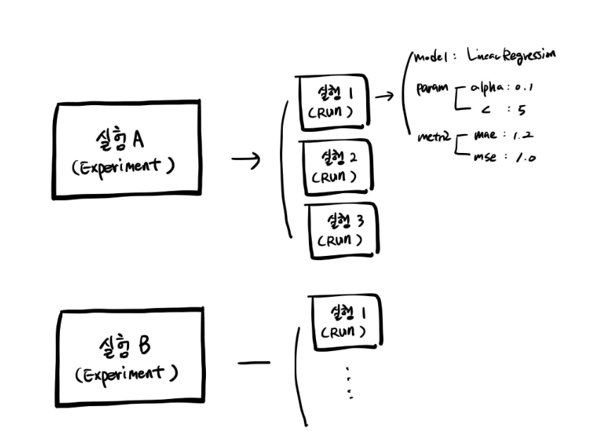
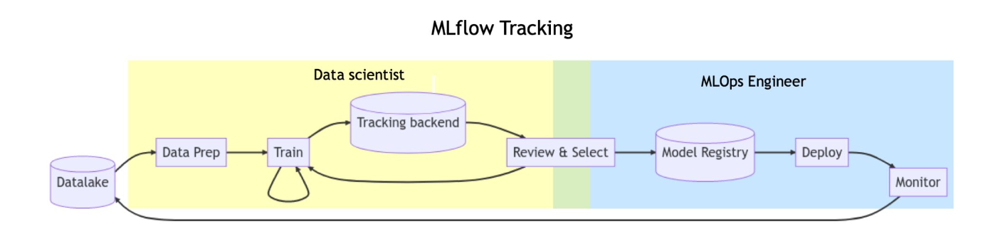

## 모델 관리
-----

모델 관리를 할 때 기본적으로 관리하는 부분은 다음과 같다.

- 모델 메타 데이터
    - 모델 메타 데이터는 모델이 언제 만들어졌고, 어떤 데이터를 사용해서 만들어졌는지를 저장한 데이터로 성능도 같이 저장한다.

- 모델 아티팩트
    - 모델 아티팩트 = 모델의 학습된 결과물. 모델 파일(pickle, joblib 등)

- Feature / Data
    - 모델을 위한 Feature, Data
    - Data도 버전에 따라 업데이트가 될 수 있음(레이블링 변경 등)

이를 잘 관리할 수 있는 도구 중 하나로 오픈 소스인 `MLflow`가 있다.

### MLflow

`MLflow`의 핵심 기능은 다음과 같다.

- Experiment Management & Tracking
    - 머신러닝 관련 **"실험"들을 관리**하고, 각 실험의 내용들을 **기록**할 수 있음
        - ex. 여러 사람이 **하나의 MLflow 서버 위에서 각자 자기 실험을 만들고 공유**할 수 있음
    - 실험을 정의하고, 실험을 실행할 수 있음(실행은 머신러닝 훈련 코드를 실행한 기록)
    - 각 실행에 사용한 소스 코드, 하이퍼 파라미터, Metric, 부산물(모델 Artifact, Chart Image) 등을 저장
- Model Registry
    - MLflow로 실행한 머신러닝 모델을 Model Registry(모델 저장소)에 등록할 수 있음
    - 모델 저장소에 모델이 저장될 때마다 해당 모델에 버전이 자동으로 올라감(Version 1 - > 2 -> 3...)
    - Model Registry에 등록된 모델은 다른 사람들에게 쉽게 공유 가능하고, 쉽게 활용할 수 있음
- Model Serving
    - Model Registry에 등록된 모델을 REST API 형태의 서버로 Serving 할 수 있음
    - Input = Model의 Input
    - Output = Model의 Output
    - 직접 Docker Image 만들지 않아도 생성할 수 있음
    - 다만, 잘 사용하지는 않음

#### MLflow Core Componenet

대표적인 MLflow의 구성요소는 3가지가 있다.

- Tracking
    - 머신러닝 코드 실행, 로깅을 위한 API
    - 파라미터, 코드 버전, Metric, Artifact 로깅
    - 웹 UI도 제공
    - MLflow Tracking을 사용해 여러 실험 결과를 쉽게 기록하고 비교할 수 있음
    - 팀에선 다른 사용자의 결과와 비교하며 협업
- Model Registry
    - 모델 관리를 위한 체계적인 접근 방식을 제공
    - 모델의 버전 관리
        - 태그, 별칭 지정, 버저닝, 계보를 포함한 모델의 전체 수명 주기를 관리
- Projects
    - 머신러닝 코드, Workflow, Artifact의 패키징을 표준화
    - 재현이 가능하도록 관련된 내용을 모두 포함하는 개념

#### MLflow Hello World: Experiment

MLflow에서 제일 먼저 Experiment를 생성한다. 하나의 Experiment는 진행하고 있는 머신러닝 프로젝트 단위로 구성된다.

정해진 Metric으로 모델을 평가하고 하나의 Experiment는 여러 Run(실행)을 가진다.

- Experiment 생성
    - `mlflow experiments create --experiment-name my-first-experiment`
    - `ls -al`을 사용해 작업 공간에 mlruns 폴더 생성
- Experiment 리스트 확인
    - `mlflow experiments search`

#### MLflow Hello World: Project

프로젝트(MLProject)는 **MLflow를 사용한 코드의 프로젝트 메터 정보를 저장**한다. 이때 프로젝트를 어떤 환경에서 어떻게 실행시킬 지 정의하며 패키지 모듈의 상단에 위치한다.

- MLProject
- python_env.yaml

#### MLflow Hello World: Run

하나의 Run은 코드를 1번 실행한 것을 의미하며 보통 Run은 모델 학습 코드를 실행한다. 보통 Run은 모델 학습 코드를 실행한다.

즉, **한번의 코드 실행 = 하나의 Run 생성** 한다고 말할 수 있으며 이 때, Run을 하면 여러가지 내용이 기록된다.

Run에서 로깅하는 것은 아래와 같은 것이 있다.

- Source : 실행한 Project의 이름
- Version : 실행 Hash
- Start & end time
- Parameters : 모델 파라미터
- Metircs : 모델의 평가 지표, Metric을 시각화할 수 있음
- Tags : 관련된 Tag
- Artifacts : 실행 과정에서 생기는 다양한 파일들(이미지, 모델 Pickle 등)

`mlflow run logistic_regression --experiment-name my-first-experiment`로 실행하며 이 때, python_env.yaml에 정의된 가상 환경을 생성하고 실행한다.

만약 가상환경을 생성을 원하지 않는다면 `--env-manager=local`을 추가하면 현재 Local에서 실행할 수 있다.

MLflow의 Experiment와 Run의 관계는 아래 그림과 같이 표현할 수 있다.

#### MLflow Autolog

로깅을 더 편하게 하기 위해서 `mlflow.autolog()`를 사용한다. 이는 mlflow가 지정하는 몇 가지를 자동으로 기록한다.

하지만 ,autulog는 모든 프레임워크에서 사용 가능한 것은 아니다.

- MLflow에서 지원해주는 프레임워크들이 존재
    - [autolog 지원 리스트](https://mlflow.org/docs/latest/ml/tracking/autolog/#automatic-logging)

- Dataset도 선택가능하게 되어있으나 추후에 API가 변동될 가능성도 존재한다.(Experimental)

#### MLflow Parameter

기존에는 `train.py`에 파라미터를 지정했으나 MLProject에서 Parameter 지정(MLProject) 할 수도 있다.

실행할 때는 **Run:-P 옵션으로 파라미터 미정** 으로 실핼하여 원하는 파라미터 값을 입력하여 모델을 실행시킬 수 있다.

- `mlflow run logistic_regression_with_autolog_and_params -P solver="saga" -P penalty="elasticnet" -P l1_ratio=0.03 --experiment-name my-first-experiment --env-manager=local`

결과가 다른 Run이 있다면 시각화할 수 있다. (Chart-Run 선택하고 Compare)

### MLflow를 통한 작업

MLFlow를 사용해 Data Scientist와 MLOps Engineer가 협업이 가능하다.

## 모델 평가
------

모델 평가는 크게 `OFFLINE`과 `ONLINE`으로 나눌 수 있다.

- `OFFLINE`
    - 단순함 / 과거 데이터를 기반 / 주기성 or 배치 / 훈련 후 정적인 모델 평가
- `ONLINE`
    - 복잡함 / 실시간 데이터에 기반 / 즉각적인 성능 평가 / 모델의 동적인 변화에 빠르게 대응

### OFFINE 모델 평가 

- Hold-out Validation : 데이터를 훈련 세트와 테스트 세트로 나누어 모델을 훈련하고 평가
    - 일정 비율의 데이터를 테스트에 예약하여 모델의 일반적인 성능을 평가
- K-fold cross Validation : 데이터를 K개의 부분 집합(폴드)으로 나누고, 각 폴드를 한번씩 테스트 세트로 사용
    - 나머지를 훈련 세트로 사용하여 모델을 K번 평가하는 기술
    - 모델의 일반적인 성능을 더 정확하게 평가할 때 활용

- Bootstrap resampling : 중복을 허용하여 원본 데이터셋에서 샘플을 랜덤하게 추출하여 여러 개의 부분 집합을 생성
    - 모델을 반복적으로 훈련 및 평가하여 일반화 성능을 추정
    - 데이터셋의 분산을 고려하면서 모델의 성능을 더 견고하게 평가

### ONLINE 모델 평가 

- AB Test : 같은 양의 트래픽을 두 개 이상의 버전에 전송하고 예측하고 결과를 비교 및 분석
    - 일반적인 AB 테스트는 통계적 유의미성을 얻기까지 시간이 매우 오래 걸려서 Multi-Armed Bandit과 같은 최적화 기법을 같이 쓰기도 함
    - A,B를 나눌 때 트래픽을 반반 또는 user_id 같은 값을 해싱해서 홀/짝으로 나누기도 함

    

- Canary Test : 새로운 버전의 모델로 트래픽이 들어가도 문제가 없는지 체크
    - 마찬가지로 결과물을 지속적으로 모니터링해서 큰 오차는 없는지, 결함은 없는 지 체크

    

    - ex. current system에 90%로 new system에 10%로 보냈을 때 결과물을 비교하고 문제가 없으면 new system에 보내는 양을 점진적으로 늘림

- Shadow Test : 프로덕션(=운영)과 같은 트래픽을 새로운 버전의 모델에 적용
    - 기존에 서빙된 모델에 영향을 최소화
    - 새로운 버전의 모델에 정상적으로 예측하는지 확인
    - 모든 트래픽은 현재시스템에 전송
    - 그림자처럼 같은 트래픽을 새로운버전에 복제해서 전송
    - 유저에게 직접 결과물이 전달되지 않음(=서빙되지않음) => 새 모델이 이슈가 있어도 안전
    - 하지만 트래픽 복제 전송을 위한 인프라 구성 필요

    

결과적으로 Offline과 Online 평가를 반복하면서 최적의 모델을 서빙할 수 있도록 지속적으로 개선해야한다.

