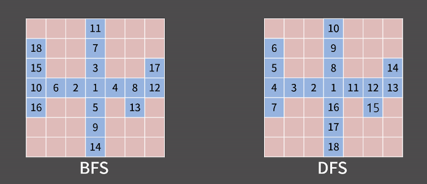
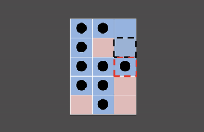

### **INTRO**
-----

#### **🔑 KEY POINT**

> **정의와 특징** 
> - 정의: 다차원 배열에서 **각 지점을 방문할 때 깊이를 우선으로 방문**하는 알고리즘입니다.
> - 자료구조: 선입후출(FILO) 구조인 `스택(Queue)`를 사용하여 구현한다.
> - 시간 복잡도: 모든 칸이 스택에 한 번씩 들어가므로 칸이 N개일 때 시간복잡도는 $O(N)$이다.
>
> **문제 풀이 방법** 
> 1. 시작하는 칸을 스택에 넣고 방문 표시를 한다.
> 2. 스택에서 원소를 꺼내어 그 칸과 상하좌우로 인접한 칸에 아래 과정을 진행:
>   - 해당 칸을 이전에 방문했다면 아무 것도 하지 않고, 처음으로 방문했다면 방문했다는 표시를 남기고 해당 칸을 스택에 삽입
> 3. 스택이 빌 때까지 2번 과정을 반복

**🔗 강의 링크**

[[실전 알고리즘]0x0A강 - DFS](https://blog.encrypted.gg/942)

### BFS vs DFS
----

BFS와 DFS를 살펴보면 BFS는 큐를 쓰고 DFS는 스택을 쓴다는 차이가 있지만 원소 하나를 빼내고 주변을 탐색하는다는 알고리즘의 흐름은 동일합니다.

하지만, 이 두 알고리즘은 **방문 순서**에서 큰 차이점이 있습니다. 

- BFS는 시작점에서 가까운 칸부터 방문을 하며 마치 동심원이 퍼져나가는 것처럼 볼 수 있다.
- DFS는 시작점에서 특정 방향이 정해지면 그 방향으로만 탐색을 진행하는 것을 알 수 있다.

BFS에서 성립했던 "현재 보는 칸으로부터 추가되는 인접한 칸은 거리가 현재 보는 칸보다 1만큼 더 떨어져있다" 는 성질이 DFS에서는 성립하지 않습니다.

위의 그림에서 BFS는 빨간색 칸은 거리가 4이고 검은색 칸은 거리가 3이므로 검은색 점선 칸에 먼저 도착하고 빨간색 칸을 다음에 도착하지만, DFS는 빨간색 칸을 먼저 도착하고 검은색 점선 칸을 다음에 도착한다.

즉, DFS는 시작시점에서 먼 지점에 먼저 도착할 수 있으므로 **먼저 방문한 칸이 더 가까운 칸이라는 보장이 없다**.

이러한 이유로 다차원 배열에서 굳이 DFS를 쓰지 않으며 가중치가 없는 최단 거리 측정에서는 DFS를 쓰지 않고 BFS를 써서 풀이합니다.
