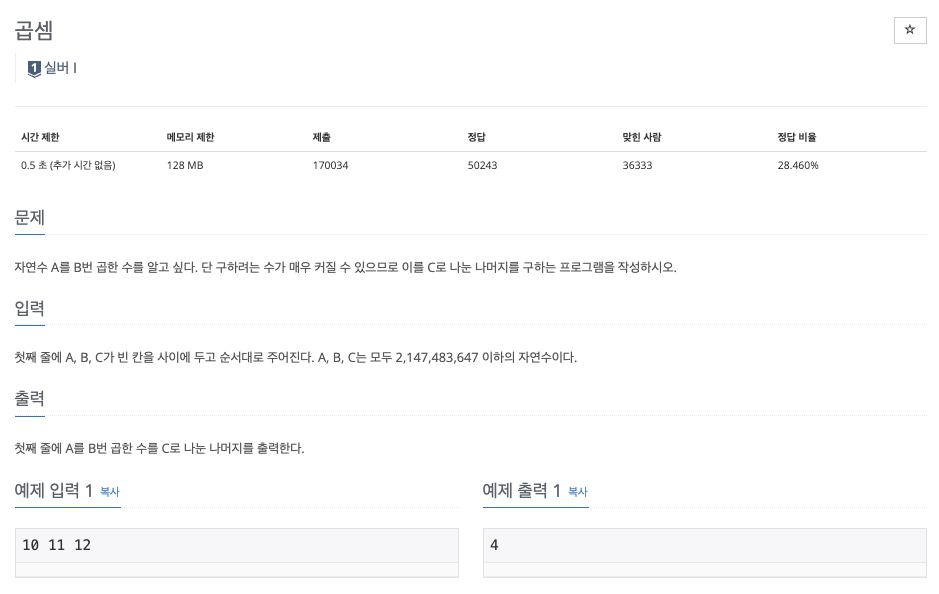
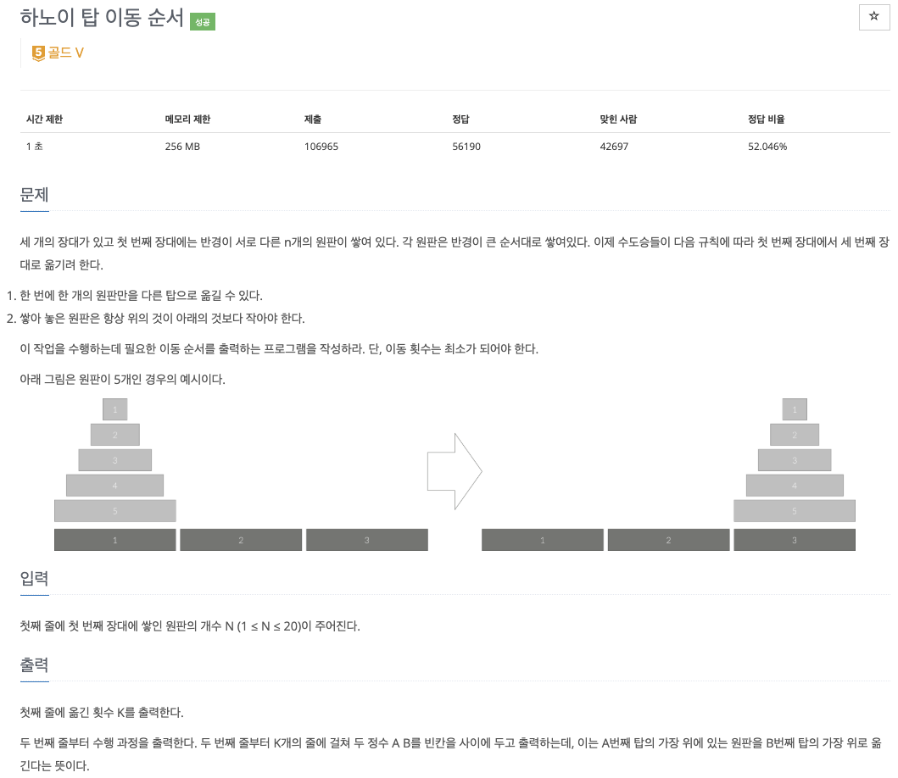
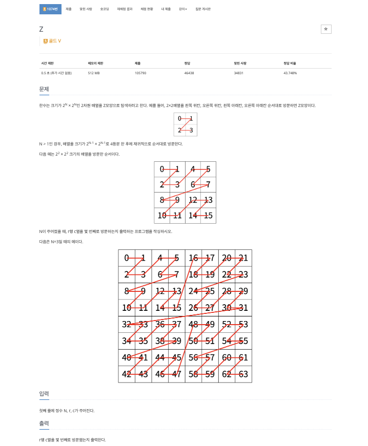

### **INTRO**
-----

#### **🔑 KEY POINT**

> - 재귀로 문제를 푼다는 것은 곧 **귀납적인 방식**으로 문제를 해결하는 것이다.
>   - `수학적 귀납법` : i = 1일 때 성립하고 i = k일 때 성립하면 i = k + 1일 때 성립한다가 참을 보여 해결하는 벙법
> - 재귀 함수의 조건은 특정 입력에 대해서는 자기 자신을 호출하지 않고 종료되어야 한다
> - 모든 입력은 `base condition`으로 수렴해야함

**🔗 강의 링크**

[[실전 알고리즘]0x0B강 - 재귀](https://blog.encrypted.gg/943)

#### 재귀 특징

1. 재귀 함수 작성
    - 함수의 인자로 어떤 것을 받고 어디까지 계산한 후 자기 자신에게 넘겨줄지 명확하게 정해야 함
    - 모든 재귀 함수는 반복문만으로 동일한 동작을 하는 함수를 만들 수 있음
    - 재귀는 반복문으로 구현했을 때에 비해 코드가 간결하지만 메모리/시간에서는 손해를 봄

2. 한 함수가 자기 자신을 여러 번 호출하게 되면 비효율적임
    - ex. n번째 피보나치 수열 반환 함수

        ```python
        def fibo(n):
            if n <= 1:
                return 1
            return fibo(n - 1) + fibo(n - 2)
        ```

        위의 재귀함수의 시간 복잡도는 $O(1.618^n)$이다. 이러한 시간복잡도가 나오는 이유를 fibo(6)의 예시를 통해 이해할 수 있습니다.

        

        위 그림을 보면 이미 호출된 함수가 여러 번 호출하는 경우가 빈번하게 발생하며 이렇게 이미 계산한 값을 다시 계산하는 일이 빈번하게 발생해서 시간복잡도가 커집니다.

        이는 나중에 배울 다이나믹 프로그래밍이라는 방법을 이용해 $O(n)$에 해결할 수 있습니다.

3. 재귀함수가 자기 자신을 부를 때 스택 영역에 계속 누적이 된다.

    - 스택 영역 : 메모리 구조에서의 스택 영역을 의미
    
    문제를 풀 때 메모리 제한이 있는데 이 때 1MB로 제한되는 경우도 있습니다. 만약 이렇게 메모리 제한이 작은 경우는 재귀 함수처럼 호출될 때 마다 정보가 스택(메모리)에 누적되는 방식으로는 풀 수 없으며, 이런 경우는 재귀 대신해 반복문을 통해 해결해야합니다.

    ❗️참고 : 스택 메모리에는 지역 변수도 포함


### 문제 풀이
--------

강의에서는 C++ 언어로 문제를 풀이하셨고 저는 파이썬으로 문제를 풀려고 합니다.

문제에 대한 설명 또한 강의자님의 설명을 그대로 가져온 것입니다.

#### **문제 1**



**My Solution**

```python
import sys

def sys_input() -> str:
    return sys.stdin.readline().rstrip()

def pow(a: int, b: int, c: int) -> int:
    if b == 0:
        return 1
    half = pow(a, b // 2, c)
    half = (half * half) % c
    
    if b % 2 == 0:
        return half
    return (half * a) % c

def main():
    A, B, C = map(int, sys_input().split())

    answer: int = pow(A, B, C)
    print(answer)

if __name__ == "__main__":
    main()
```

**귀납적 사고 과정**

- 1승을 계산할 수 있다.
- k승을 계산했으면 2k승과 2k+1승도 $O(1)$에 계산할 수 있다.
    - $a^n \times a^n = a^{2n}$

>**💡 정수론 - 모듈러 연산**
>
> 모듈러 연산에서는 다음 성질이 성립한다.
>
> $$(a \cdot b) mod n = ((a \ mod \ n)(b \ mod \ n)) \ mod \ n$$
>
> 이를 이용하면 $a^k \ mod \ n$을 직접 계산하지 않고,
>
> 만약 $a^m ≡ r (mod \ n)$ 이라면 
>
> $$a^{2m} ≡ r^{2} (mod \ n)$$
>
> 과 같이 지수를 절반으로 나누어 계산할 수 있다.


#### **문제 2**



**My Solution**

```python
import sys

POLES = {1, 2, 3}

def sys_input() -> str:
    return sys.stdin.readline().rstrip()

def save_path(src: int, dest: int, n: int, path: list[str]) -> None:
    if n == 0:
        return
    remain: int = (POLES - {src, dest}).pop()
    save_path(src, remain, n - 1, path)
    path.append(f"{src} {dest}")
    save_path(remain, dest, n - 1, path)

def hanoi(n: int) -> tuple[int, list[str]]:
    path = []
    save_path(1, 3, n, path)
    return len(path), path

def main() -> None:
    N = int(sys_input())

    hanoi(N)
    answer: tuple[int, list[str]] = hanoi(N)
    print(answer[0])
    for p in answer[1]:
        print(p)
    
if __name__ == "__main__":
    main()
```

#### **문제 3**



**My Solution**

```python
import sys

def sys_input() -> str:
    return sys.stdin.readline().rstrip()


def z_path(n: int, r: int, c: int) -> int:
    if n == 0:
        return 0

    half = 1 << n - 1
    val = z_path(n - 1, r % half, c % half)
    offset = 2 * (r // half) + (c // half)
    return offset * half * half + val


def main() -> None:
    N, r, c = map(int, sys_input().split())

    answer: int = z_path(N, r, c)
    print(answer)


if __name__ == "__main__":
    main()
```

> 💡 **비트 연산자** 
>
> `<<` 는 비트 왼쪽 시프트 연산자이다.  
> - 비트 왼쪽 시프트:  
>   $a \ll k = a \times 2^k$
>
> 따라서 `1 << (n - 1)` 는 `2 ** (n - 1)`, `pow(2, n - 1)` 과 동일하다.
>
> &rarr; 자세한 내용은 부록 C에서