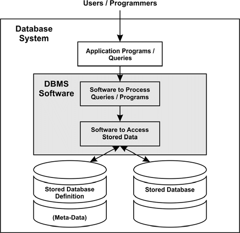
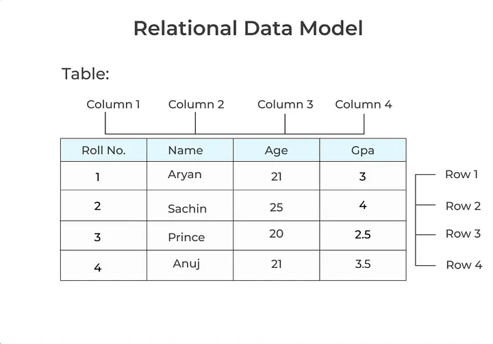
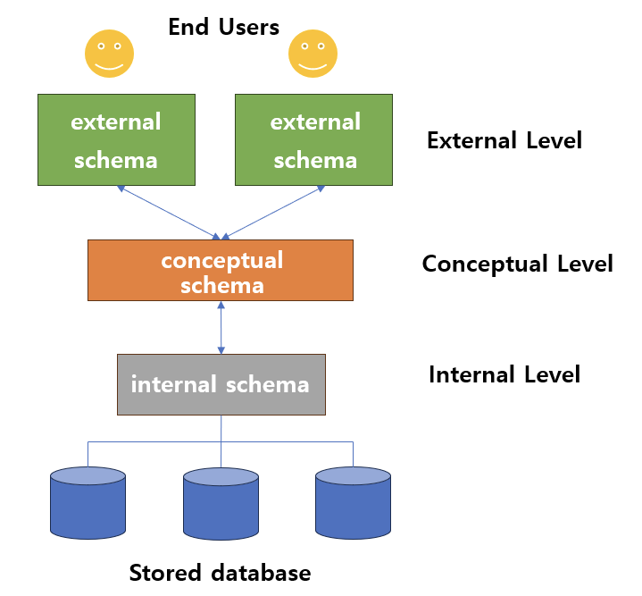

## Database & DBMS & DB system
------

- `Database(DB)` : 전자적으로 저장되고 사용되는 관련있는 데이터들의 조직화된 집힙을 말한다.

- `DBMS(database management systems)` : 사용자에게 DB를 정의하고 만들고 관리하는 기능을 제공하는 소프트웨어 시스템을 말한다.
    - ex. PostgreSQL, MySQL, ORACLE, SQLServer

- `metadata`: DB를 정의하다 보면 부가적으로 발생한 데이터를 말한다.
    - database를 정의하거나 기술하는 데이터로 catalog라고도 부름
    - ex. 데이터 유형, 구조, 제약 조건, 보안, 저장, 인덱스 사용자 그룹 등등
    - metadata 또한 DBMS를 통해 저장/관리 됨

- `Database system` : database + DBMS + 연관된 applications
    - 줄여서 database 라고도 부르기 때문에 순수하게 데이터 자체를 의미하는 datbase 인지를 판단해야함.

1. 프로그램에서 쿼리를 보내면 DB management system(DBMS software)이 쿼리를 분석하여 요청한 것을 파악
2. 요청을 처기하기 위해서 요청된 데이터가 어떤 형태로 되어있는지 등 부가적인 정보를 먼저 찾는다.
3. 요청 데이터의 meta-data를 바탕으로 실제 요청받은 데이터를 찾아서 데이터를 보낸다.

## Data model
-----

`Data models`은 DB의 구조를 기술하는데 사용될 수 있는 개념들이 모인 집합으로 **DB 구조를 추상화해서 표현할 수 있는 수단을 제공한다.**

- DB 구조: 데이터 유형, 데이터 관계(relationship), 제약 사항(constraints) 등

data model은 여러 종류가 있으며 추상화 수준과 DB 구조화 방식이 조금씩 다르며, DB에서 읽고 쓰기 위한 기본적인 동작들도 포함한다.

### Data model 종류

- `conceptual(or high-level) data models`
    - 일반 사용자들이 쉽게 이해할 수 있는 개념들로 이뤄진 모델
    - 추상화 수준이 가장 높음
    - 비즈니스 요구 사항을 추상화하여 기술할 때 사용
    - 대표적으로 `entity-relationship model` 이 있다.
    
    
    
- `logical(or representational) data models`
    - 이해하기 어렵지 않으면서도 디테일하게 DB를 구조화 할 수 있는 개념들을 제공
    - 데이터가 컴퓨터에 저장될 때의 구조와 크게 다르지 않게 DB 구조화를 가능하게 함
    - 특정 DBMS나 storage에 종속되지 않는 수준에서 DB를 구조화할 수 있는 모델
    - 가장 많이 사용하며 그 중 `relational data model`을 가장 많이 사용함

    

    - 그 외에도 object data model, object-relational data model 가 있음

- `physical(or low-level) data models`
    - 컴퓨터에 데이터가 어떻게 파일 형태로 저장되는지를 기술할 수 있는 수단을 제공
    - data format, data orderings, access path 등
    - access path: 데이터 검색을 빠르게 하기 위한 구조체(ex. index)

## Data Schema & State
----

`database schema`는 data model을 바탕으로 DB의 구조를 기술한 것으로 schema는 database를 설계할 때 정해지며 한 번 정해진 후에는 자주 바뀌지 않는다.

반면, database에 저장된 실제 데이터는 꽤 자주 바뀔 수 있다. 특정 시점에 database에 있는 데이터를 `database state` 혹은 `snapshot`이라고 한다. 이를 현재 database에 있는 instances의 집합이라고도 한다.

`three-schema architecture`는 database system을 구축하는 architecture 중 하나로 사용자 애플리케이션으로부터 물리적인 데이터베이스를 분리하여 데이터 독립성을 확보하기 위한 아키텍처이다.

이 구조는 다음 세가지 레벨로 나뉘며, 각 레벨마다  고유한 schema가 정의되어 있다.

- `external schemas at external level`
    - external view, user views라고도 불림
    - 특정 유저들이 필요로 하는 데이터만 표현
    - 그 외 알려줄 필요가 없는 데이터는 숨김
    - logical data model을 통해 표현
- `conceptual schemas at conceptual level`
    - 전체 database에 대한 구조를 기술
    - 물리적인 저장 구조에 관한 내용은 숨김
    - entities, data types, relationships, user operations ,constraints에 집중
    - logical data model을 통해 기술
- `internal schemas at interal level`
    - 물리적으로 데이터가 어떻게 저장되는지 physical data model을 통해 표현
    - data storage, data structure, access path 등 실체가 있는 내용 기술
    - 데이터가 존재하는 곳

즉, `three-schema architecture`는 각 레벨을 독립시켜서 어느 레벨에서의 변화가 상위 레벨에 영향을 주지 않기 위해 구현되었으며 대부분의 DBMS가 three level을 완벽하게 혹은 명시적으로 나누지는 않는다. 

> 단, 각각의 schema는 데이터베이스의 구조를 표현하는 것이지 실제 데이터는 internal level에 존재한다.

## Database language
------

- `DDL(data definition language)` : conceptual schema를 정의하기 위해 사용되는 언어
    - internal schema까지 정의할 수 있는 경우도 존재

- `SDL(storage definition language)` : internal schema를 정의하는 용도로 사용되는 언어
    - 요즘은 특히 relational DBMS에서는 SDL이 거의 없고 파라미터 등의 설정으로 대체

- `VDL(view definition language)` : external schemas를 정의하기 위해 사용되는 언어이지만 대부분의 DBMS에서는 DDL이 VDL 역할까지 수행

- `DML(data manipulation language)` : database에 있는 data를 활용하기 위한 언어로 data 추가, 삭제, 수정, 검색 등등의 기능을 제공하는 언어

오늘날의 DBMS는 DML, VDL, DDL이 따로 존재하기 보다는 통합된 언어로 존재한다.

대표적인 예가 relational database 사용되는 언어인 `SQL`이 있다.
