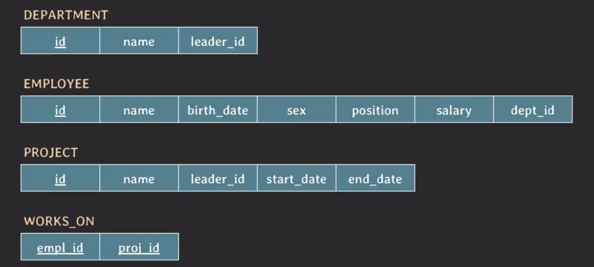
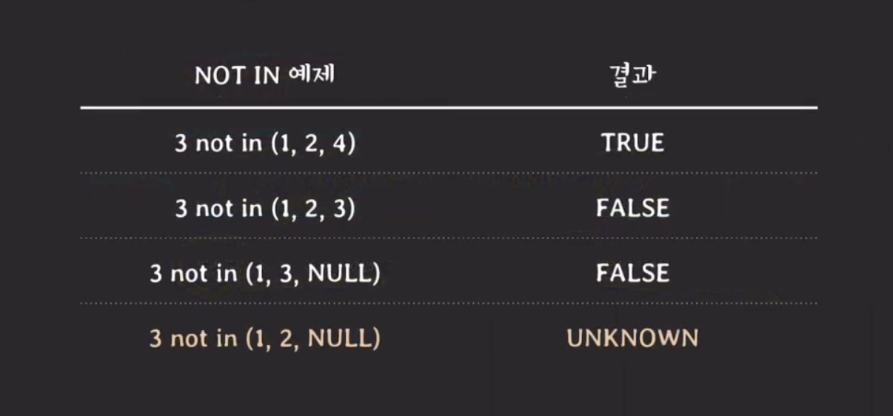

### 테이블 구조

우선 시작하기에 앞서 내용 이해에 필요한 테이블 구조입니다.



## NULL

---

SQL에서 NULL의 의미는 크게 3가지가 있다.

- unknown
- unavailable or withheld
- not applicable

이러한 이유로 SQL에서 NULL은 값이 없을 수도 있지만 아직 값이 공개되지 않기 떄문에 NULL 값에 대해서 `=` 과 `!=` 을 쓰지 않는다.

만약에 테이블의 특정 attribute의 값에 NULL이 들어있는지 없는지 알기 위해서는 `IS` 라는 키워드를 사용한다.

ex. 생일 정보가 NULL인 직원의 id를 가져오는 쿼리문

```sql
-- 틀린 쿼리문--
SELECT id FROM employee WHERE birth_date == NULL;

-- 올바른 쿼리문--
SELECT id FROM employee WHERE birth_date IS NULL;
```

## UNKNOWN

---

만약 SQL에서 NULL에 대해 `=` 나 `!=` 같은 비교 연산을 사용하면 어떤 결과가 나올까?

이런 경우에 SQL의 연산 결과 값은 `UNKNOWN` 이다.

- `UNKNOWN` : TRUE 일 수도 있고 FALSE 일 수도 있다는 의미

즉, SQL에서는 `three-valued logic` 을 가지고 이 의미는 3가지의 결과비교/논리 연산의 결과로 **TRUE, FALSE, UNKNOWN**을 가진다.


## WHERE 절과 Three-valued logic의 관계

WHERE절과 condition(s)의 관계는 아래와 같다.

- where절에 있는 condition(s)의 결과가 TRUE인 tuple(s)만 선택된다.
- 즉, 결과가 FALSE거나 **UNKNOWN**이면 tuple은 선택되지 않는다.

이 점을 특히 두번쨰 관계를 정확히 알아야 예상치 못한 동작이 발생했을 때 대처가 가능합니다.

## NOT IN 사용 시 주의 사항

---

`v NOT IN (v1, v2, v3)`는 `v != v1 AND v != v2 AND v!= v3` 라는 의미이다.

만약 v1, v2, v3에 NULL이 포함되어 있다면 어떤 결과가 나올까?



하나의 예시 쿼리문을 살펴보자.

```sql
SELECT D.id, D.name
    FROM department AS D
    WHERE D.id NOT IN (
        SELECT E.dept_id
        FROM employee E
        WHERE E.birth_date >= '2000-01-01'
    );
```

위의 코드에서 만약 D.id가 NULL인 값이 있다면 위 subquery가 UNKNOWN 이거나 FALSE 가 나올 것이고 이로 인해 아무 데이터도 반환하지 않는다.

만약에 이런 문제를 방지 하지 않기 위해서는 두가지 방법이 있다.

- employee table의 attribute인 department.id가 NULL값을 가지지 못하도록 처리
- `IS NOT NULL`을 추가

  ```sql
  SELECT D.id, D.name
      FROM department AS D
      WHERE D.id NOT IN (
          SELECT E.dept.id
          FROM employee E
          WHERE E.birth_date >= '2000-01-01'
              AND E.dept_id IS NOT NULL
      );
  ```

- `NOT EXISTS` 키워드 사용

  ```sql
  SELECT D.id, D.name
      FROM department AS D
      WHERE NOT EXISTS (
          SELECT *
          FROM employee E
          WHERE E.dept_id = D.id AND E.birth_date >= '2000-01-01'
      );
  ```
