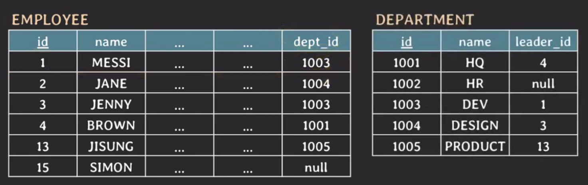

아래의 내용은 MySQL 기준으로 작성한 것입니다. 다른 RDBMS의 SQL 문법은 조금씩 다를 수 있습니다.

### 테이블 구조

우선 시작하기에 앞서 내용 이해에 필요한 테이블 구조입니다.


## JOIN

---

SQL에서 `JOIN`은 두 개 이상의 table들에 있는 데이터를 한 번에 조회하는 것을 의미하며 여러 종류의 JOIN이 존재한다.

대표적으로 `implicit join`과 `explicit join`이 존재한다.

## implicit join

---

`Implicit join`은 from 절에는 table들만 나열하고 **where절에 join condition을 명시**하는 방식이다.

- old-style join syntax
- where 절에 selection condition과 join condition이 같이 있기 때문에 가독성이 떨어진다.
- 복잡한 join 쿼리를 작성하다 보면 실수로 잘못된 쿼리를 작성할 가능성이 크다.

ex. ID가 1인 임직원이 속한 부서 이름은?



```sql
SELECT D.name
    FROM employee AS E, department AS D
    WHERE E.id = 1 and E.dept_id = D.id;
```

1. employee 테이블에서 employee.id가 1 인 튜플에서 dept_id 데이터를 선택
2. 선택된 dept_id와 동일한 id를 가진 department 테이블의 튜플에서 name 데이터를 선택

이 과정을 JOIN이라고 할 수 있다.

## explicit join

---

implicit join을 사용하면 복잡한 join 쿼리를 작성하다 보면 실수로 잘못된 쿼리를 작성할 가능성이 크다. 이를 해결하기 위해 이후에 join을 명시할 수 있는 문법이 추가된다. 이 방법이 바로 `explicit join` 이다.

ex. ID가 1인 임직원이 속한 부서 이름은?

```sql
SELECT D.name
    FROM employee AS E JOIN department AS D ON E.dept_id = D.id
    WHERE E.id = 1;
```

`explicit join` 내용을 정리하면 아래와 같다.

- `explicit join` : from 절에 `JOIN` 키워드와 함께 joined table들을 명시하는 방식
- from절에서 `ON` 뒤에 join condition이 명시된다.
- 가독성이 좋다.
- 복잡한 join 쿼리 작성 중에도 실수할 가능성이 적다.

## inner join

---

`inner join`은 두 table에서 join condition을 만족하는 tuple들로 result table을 만드는 join 이다.

- `FROM table1 [INNER] JOIN table2 ON join_condition`
- join condition에 사용 가능한 연산자(operator) : =, <, >, != 등등 여러 비교 연산자가 가능하다.
- join condition에서 null 값을 가지는 tuple은 result table에 포함되지 못한다.

```sql
SELECT *
    FROM employee E INNER JOIN department D ON E.dept_id = D.id;
```

## outer join

---

`outer join`은 두 table에서 join condition을 만족하지 않는 tuple 들로 result table에 포함하는 join이다.

- `FROM table1 LEFT [OUTER] JOIN table2 ON join_condition`
- `FROM table1 RIGHT [OUTER] JOIN table2 ON join_condition`
- `FROM table1 FULL [OUTER] JOIN table2 ON join_condition`
- join condition에 사용 가능한 연산자(operator) : =, <, >, != 등등 여러 비교 연산자가 가능하다.

```sql
--- employee 테이블에서 dept_id가 null인 튜플들만 포함 --
SELECT *
    FROM employee E LEFT OUTER JOIN department D ON E.dept_id = D.id;

--- department 테이블에서 id가 null인 튜플들만 포함 --
SELECT *
    FROM employee E RIGHT OUTER JOIN department D ON E.dept_id = D.id;

--- employee 테이블과 department 테이블에서 dept_id가 null인 튜플들 포함(MySQL에서는 지원 하지 않음) ---
SELECT *
    FROM employee E FULL OUTER JOIN department D ON E.dept_id = D.id;
```


## equi join

---

`equi join`은 join condition에서 `=(equality comparator)`를 사용하는 join 이다.

위의 예 모두 `=`를 사용했기 때문에 equi join에 해당한다.

다만 이 equi join에 대한 두 가지 시각이 있다.

- inner join, outer join 상관없어 = 를 사용한 join이라면 equi join으로 보는 경우
- inner join으로 한정해서 = 를 사용한 경우에 equi join으로 보는 경우

## USING

---

만약에 department 의 id의 이름이 dept_id로 바뀌면 어떻게 될까?

결과값은 동일하지만 JOIN 쿼리문 결과 테이블에서 attribute가 중복된다. 이때, 사용할 수 있는 키워드가 바로 `USING` 키워드 이다.

```sql
--- 다른 table에 동일한 attribute 이름이 존재할 때 ---
SELECT *
    FROM employee E INNER JOIN department D USING (dept_id);
```

위의 쿼리문의 결과는 테이블에서 dept_id가 중복되지 않고 하나만 존재하며 이 attribute는 테이블의 맨 앞으로 이동된다.

위의 내용을 정리하면 다음과 같다.

- 두 table이 equi join 할 때 join하는 attribute의 이름이 같다면, `USING`으로 간단하게 작성할 수 있다.
- 이 때 같은 이름의 attribute는 result table에서 한 번만 표시된다.
- `FROM table1 [INNER] JOIN table2 USING (attribute(s))`
- `FROM table1 LEFT [OUTER] JOIN table2 USING (attribute(s))`
- `FROM table1 RIGHT [OUTER] JOIN table2 USING (attribute(s))`
- `FROM table1 FULL [OUTER] JOIN table2 USING (attribute(s))`

## natural join

---

`natuarl join`은 같은 이름을 가지는 모든 attribute pair에 대해서 equi join을 수행하는 join 이므로 join condition을 따로 명시하지 않는다.

- `FROM table1 NATURAL [INNER] JOIN table2`
- `FROM table1 NATURAL LEFT [OUTER] JOIN table2`
- `FROM table1 NATURAL RIGHT [OUTER] JOIN table2`
- `FROM table1 NATURAL FULL [OUTER] JOIN table2`

USING에서 사용한 예시(id &rarr; dept_id)를 natural join으로 작성하면 다음과 같이 작성할 수 있다.

```sql
SELECT *
    FROM employee E NATURAL INNER JOIN department D;

--- USING 사용 ---
SELECT *
    FROM employee E INNER JOIN department D USING (dept_id, name);

--- ON 사용 ---
SELECT *
    FROM employee E INNER JOIN department D ON E.dept_id = D.id AND E.name = D.name;
```

그렇다면 이 쿼리문의 결과는 어떻게 될까?

답은 어떠한 테이블을 반환하지 않고 `Empty set`을 반환한다. 그 이유는 E.name과 D.name이 서로 다른 값을 가지기 때문이다.

## cross join

---

`cross join`은 두 table의 tuple pair로 만들 수 있는 모든 조합(=Cartesian product)을 result table로 반환한다.

- join condition이 없다.
- `implicit cross join` : FROM table1, table2
- `explicit cross join` : FROM table1 CROSS JOIN table2

결과값은 왼쪽에 있는 테이블의 한 튜플에 대해서 오른쪽에 있는 테이블의 모든 튜플과 조합을 만든다.

ex. employee 테이블 튜플 개수 : 5, department 테이블 튜플 개수 : 3 &rarr; 결과 테이블 튜플 개수 : 5 \* 3 = 15

> **cross join @ MySQL**
>
> - MySQL에서는 cross join = inner join = join 이다.
> - CROSS JOIN에 ON(or USING)을 같이 쓰면 inner join으로 동작한다.
> - INNER JOIN(or JOIN)이 ON(or USING) 앖이 사용되면 cross join으로 동작한다.
