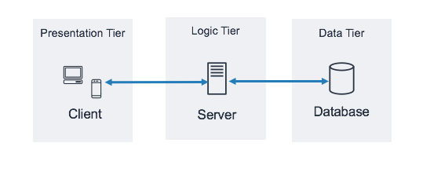
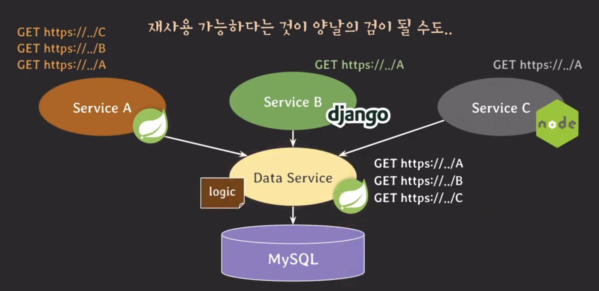

## 3-tier architecture 과 stored procedure

---

오늘날의 IT 회사들은 일반적으로 client-server architecture의 한 종류인 `three-tier architecture` 모델로 서비스를 개발한다.

- `Presentation tier` : 사용자에게 보여지는 부분을 담당하는 tier
  - 웹/앱
- `Logic tier` : 비즈니스 로직을 담당하는 tier
  - Java Spring, Python Django
  - 회원 가입/탈퇴, 상품 리스트업 알고리즘, 상품 검색 기능, 메시지 기능
- `Data tier` : 데이터를 저장하고 관리하고 제공하는 tier
  - MySQL, Oracle, SQL Server, PostgreSQL, MongoDB
  - 회원 정보, 상품 정보, 판매/구매 내역, 지역 정보

전 포스트의 주 내용인 `Stored procedure`는 RDBMS에 저장되고 사용되는 프로시저로 주된 사용 목적은 **비즈니스 로직** 구현이다. 이는 data tier에 비즈니스 로직이 존재할 수 있다는 것이다.

## stored procedure 장점

---

stored procedure의 장점은 다음과 같다.

1. application에 transparent 하다.
   - 비즈니스 로직이 application tier에 존재하면 로직 변경 시 애플리케이션을 순차적으로 재배포해야 한다.
     - ex. 4개의 인스턴스가 운영 중이라면, 하나씩 교체하는 방식으로 롤링 배포를 진행해야 한다.
   - 반면, Stored Procedure로 data tier에 로직이 존재하면 인터페이스(프로시저 이름, 파라미터)가 유지되는 한 DB의 로직만 수정하여 반영할 수 있다.

2. network traffic을 줄여서 응답 속도를 향상시킬 수 있다.
   - application에서 여러 SQL을 직접 실행하면 DB와 application 사이에 네트워크 요청이 반복적으로 발생한다.
   - 반면 Stored Procedure는 DB 내부에서 여러 SQL을 한 번에 처리하므로 네트워크 트래픽을 줄일 수 있다.

3. 여러 서비스에서 재사용 가능하다.
   - 여러 서비스가 동일한 로직을 사용할 경우 각 언어로 따로 구현해야 하는 비효율이 발생할 수 있다.
   - 반면 DB에 Stored Procedure로 구현하면 여러 서비스가 동일한 로직을 공통으로 사용할 수 있다.

4. 민감한 정보에 대한 접근을 제한할 수 있다.
   - 개발자가 DB에 직접 접근하는 것을 막고, 프로시저를 통해서만 DB에 접근하도록 할 수 있다.

## stored procedure 단점

---

stored procedure의 단점은 다음과 같다.

1. stored procedure를 쓰게 되면 유지 관리 보수 비용이 커진다.
   - 비즈니스 로직이 application tier와 data tier에 분산되면서 전체 구조를 파악하기 어려워질 수 있으며 버전 관리와 변경 관리가 복잡해질 수 있다.
   - 신규 기능을 추가하거나 기존 기능을 수정할 때, data tier와 application tier를 모두 수정해야 할 수도 있다.

2. DB 서버를 추가하는 것은 간단한 작업이 아니다.
   - 트래픽이 증가할 경우 DB 서버 확장은 데이터 복제 및 동기화가 필요해 대응이 어렵다.
   - 프로시저 이름이나 인터페이스가 변경되면 application 코드 수정 및 재배포가 필요하다.

3. stored procedure가 언제나 transparent인건 아니다.
   - 프로시저의 이름을 변경하고 싶을 떄는 date tier에서 이름이 변경된 프로시저를 등록하고 application tier에서 변경된 프로시저를 호출하도록 수정하고 다시 서버를 배포해야 한다. 그 이후에 data tier의 기존 프로시저를 지우는 작업을 진행해야한다.

4. transparent 하다고 무조건 좋은 것은 아니다.
   - DB 로직에 버그가 있을 경우 해당 프로시저를 호출하는 모든 트래픽에 문제가 발생할 수 있다.
   - 반면, 로직이 application tier에 존재한다면, 버그가 발생한 프로시저를 호출한 트래픽에서만 문제가 발생하고, 나머지 트래픽은 정상적으로 서비스를 이용할 수 있어 예상치 못한 문제의 영향을 최소화할 수 있다.

5. 재사용 가능하다는 것이 양날의 검이 될 수도 있다.
   - 특정 서비스가 Stored Procedure를 과도하게 호출하면 DB 서버에 부하가 집중되어 다른 서비스에도 영향을 줄 수 있다.
   - 이를 방지하기 위해 데이터 접근 계층에 Data Service 형태의 REST API를 두고, 애플리케이션이 직접 DB의 Stored Procedure를 호출하지 않도록 하는 방법을 사용할 수 있다.
     - 이 경우 특정 서비스에서 과도한 요청이 발생하면 해당 서비스만 제한하거나 제어할 수 있다.
     - 다만 이러한 구조에서는 비즈니스 로직 관리가 Data Service(Logic Tier)로 이동하게 된다.

   

6. 비즈니스 로직을 소스 코드에 두고도 응답 속도를 향상 시킬 수 있다.
   - SQL 문을 실행할 때 동시에 진행이 가능한 경우에는 동시에 호출함으로써 응답속도를 향상시킬 수 있다.
   - 만약 순차적으로 실행이 되어야하는 경우 cache를 통해서 응답 속도를 향상시킬 수 있다. 이런 경우는 DB 부하까지도 줄일 수 있다.

7. stored procedure가 민감한 정보에 대한 접근을 완벽히 제한할 순 없다.
   - 프로시저를 통해서도 민감한 정보에 접근할 수 있다.
   - DB 혹은 테이블 직접 접근을 막으면 개발 및 CS 업무의 신속함이 떨어진다.

> 보완 관련에 대해...
>
> - 담당자나 개발자에게만 DB 혹은 테이블 권한을 부여
> - 민감한 정보는 암호화해서 저장
> - 보안서약서 등을 통해 정책적으로 보완을 강화

그 외에도, procedure로는 복잡하고 유연한 코드를 작성하기 어려우며 오늘날의 프로그래밍 언어는 훨씬 다양하고 강력한 기능을 제공한다. 또한, procedure는 가독성이 떨어지며 디버깅을 하기도 어렵다.
