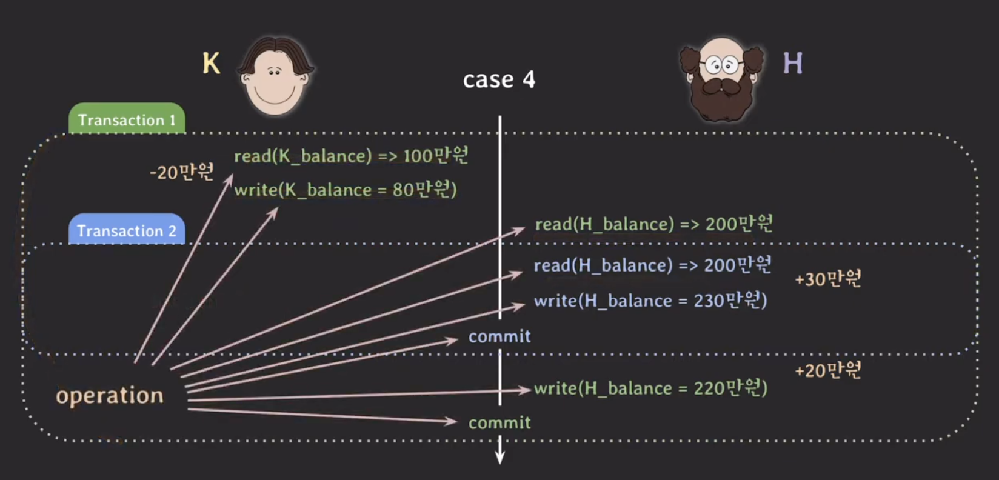
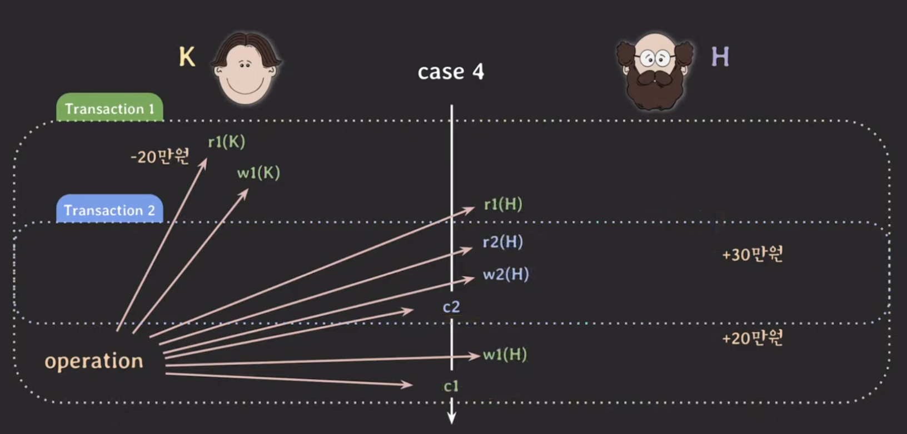
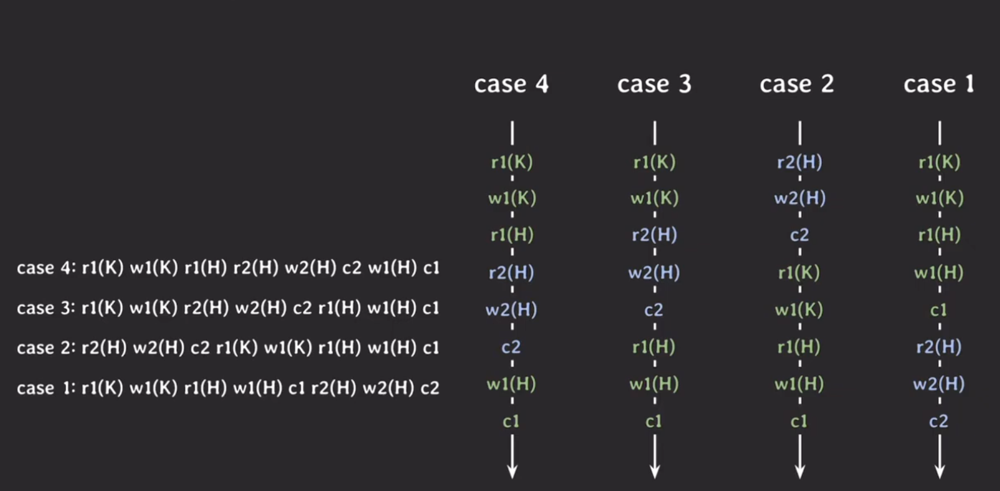

## Schedule

---

ex. K가 H에게 20만원을 이체할 때 H도 ATM에서 본인 계좌에 30만원을 입금한다.

위의 예시는 여러 형태의 실행이 가능하다.

1.  20만원 이체 트랜잭션 &rarr; 30만원 입금 트랜잭션

2.  30만원 입금 트랜잭션 &rarr; 20만원 이체 트랜잭션

3.  20만원 이체 트랜잭션 중 K계좌에서 20만원이 차감 &rarr; 30만원 트랜잭션 &rarr; 차감된 금액 20만원을 H계좌에 입금

4.  20만원 이체 트랜잭션 중 K계좌에서 20만원이 차감 + H 계좌 잔액 읽기 &rarr; 30만원 트랜잭션 &rarr; 차감된 금액 20만원을 H계좌에 입금

4 같은 경우 30만원 트랜잭션으로 H계좌가 +30만원이 되었다는 결과가 반영되지 않았기 떄문에 문제가 발생한다.

이런 경우를 `Lost update` 라고 부른다.

위의 예시에서 각각의 operation을 간략히 나타낼 수 있다.

> operation : 트랜잭션에서 실행하는 동작

위처럼 간소한 타임라인을 케이스마다 표현하면 다음과 같이 표현할 수 있다.

여러 transaction들이 동시에 실행될 때 각 transaction에 속한 operation들의 실행 순서를 `schedule` 이라고 한다.

각 transaction 내의 operations들의 순서는 바뀌지 않는다.

- sched.1 & sched.2 : transaction들이 겹치지 않고 한 번에 하나씩 실행되는 schedule로 이런 schedule을 `Serial schedule`이라고 부른다.
- sched.3 & sched.3 : transaction들이 겹쳐서(interleaving) 실행되는 schedule로 이런 schedule을 `Non-serial schedule`이라고 부른다.

### Serial schedule

Serial schedule는 한 번에 하나의 transaction만 실행되기 때문에 좋은 성능을 낼 수 없고 현실적으로 사용할 수 없는 방식이다.

### Non-serial schedule

반면에, Non-serial schedule은 transaction들이 겹쳐서 실행되기 때문에 동시성이 높아져서 같은 시간동안 더 많은 transaction들을 처리할 수 있다.

하지만 Non-serial schedule은 단점은 transaction들이 어떤 형태로 겹쳐서 실행되는지에 따라 이상한 결과(case 4)가 나올 수 있다.

이로 인해 non-serial schedule를 통해 성능은 높이고 이상한 결과가 나오지 않을 수 있는 방법이 필요했다. 이 문제 해결에 대한 아이디어가 serial schedule과 동일한 non-serial schedule을 실행하는 것이었다.

이때 **schedule이 동일하다** 의 의미가 무엇인지부터 정의하는 것이 필요했다.

## Serializability

---

> conflict of two operations
>
> 아래의 세 가지 조건을 모두 만족하면 conflict하다. 
>
> - 서로 다른 transaction 소속
> - 같은 데이터에 접근
> - 최소 하나는 write operation

conflict의 조건을 만족하는 경우는 sched.3에서 `r2(H) - w1(H)` 그리고 `w2(H) - r1(H)`의 경우가 있으며 이를 `read-write conflict` 라고 한다.

또한, `w2(H) - w1(H)` 도 있으며 이런 경우는 `write-write conflict` 라고 한다.

Conflict가 중요한 이유는 conflict operation의 순서가 바뀌면 결과도 바뀌기 때문이다.

Conflict를 통해 `Conflic equivalent`를 정의할 수 있다. 아래의 두 조건을 만족하면 conflict equivalent라고 할 수 있다.

1. 두 schedule은 같은 transaction들을 가진다.
2. 어떤(any) conflicting operations의 순서도 양쪽 schedule 모두 동일하다.

sched.3의 conflict operation의 순서와 serial schedule인 sched.2에서의 해당 operation의 실행 순서가 동일하다. 그러므로 sched.3는 sched.2와 conflict equivalent 하다.

이렇게 serial schedule과 conflict equivalent일 때 `Conflict Serializable` 이라고 할 수 있다.

Conflict Serializable을 구현하는 방법으로 여러 transaction을 동시에 실행해도 schedule이 conflict seriablizable하도록 보장하는 `프로토콜`을 적용한다.

## 최종 정리

---

위의 내용을 정리하자면 **어떠한 schedule이 serial schedule과 equivalent 하다면, 그 schedule은 serializable하다 or serializability 한 속성을 가진다**라고 말한다.

또한, **어떠한 schedule이 serial schedule과 conflict equivalent 하다면, 그 schedule은 conflict serializable하다 or conflict serializability 한 속성을 가진다**라고 말한다.

그리고 어떠한 schedule도 serializable하게 만드는 것이 바로 `concurrency control` 이다. 이와 밀접한 관련이 있는 트랜잭션의 속성이 바로 `Isolation` 이다.

이 Isolation을 완벽하게 추구하면 성능이 떨어지기 때문에 조금 완화시켜서 사용할 수 있도록 제공하는 과정에서 나온 개념이 `Isolation level` 이다.
