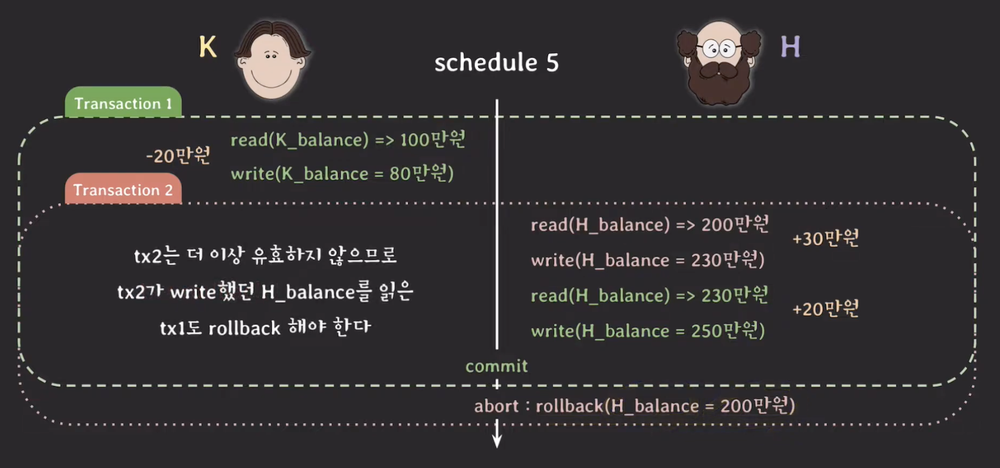
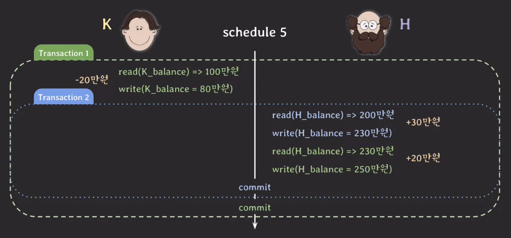
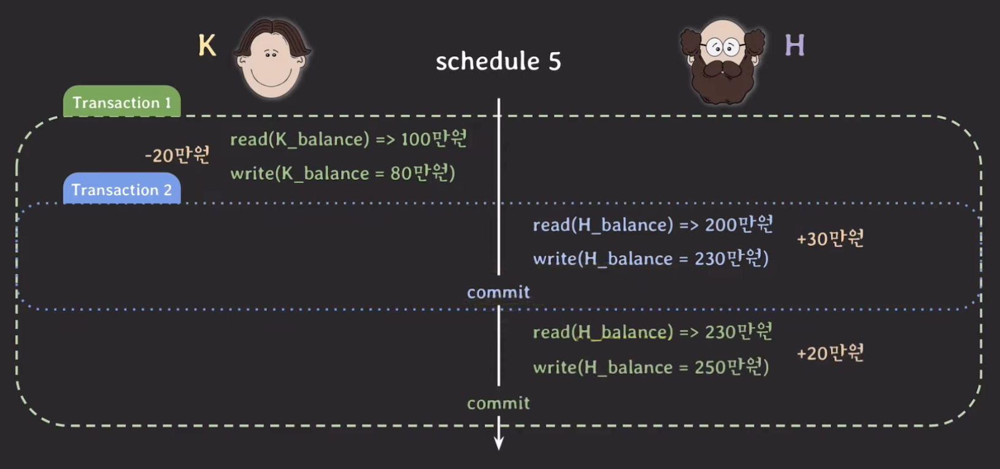
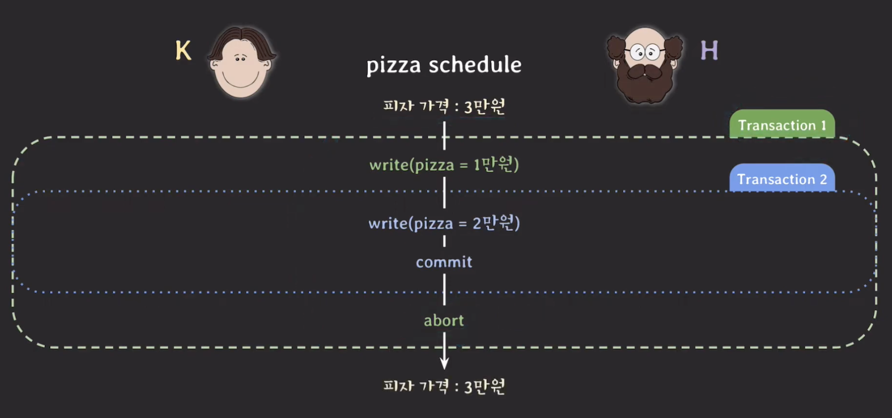
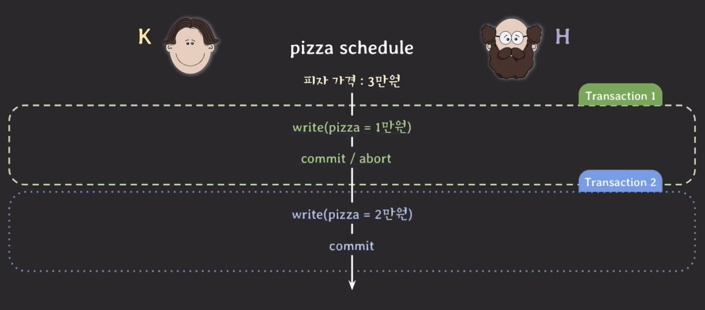
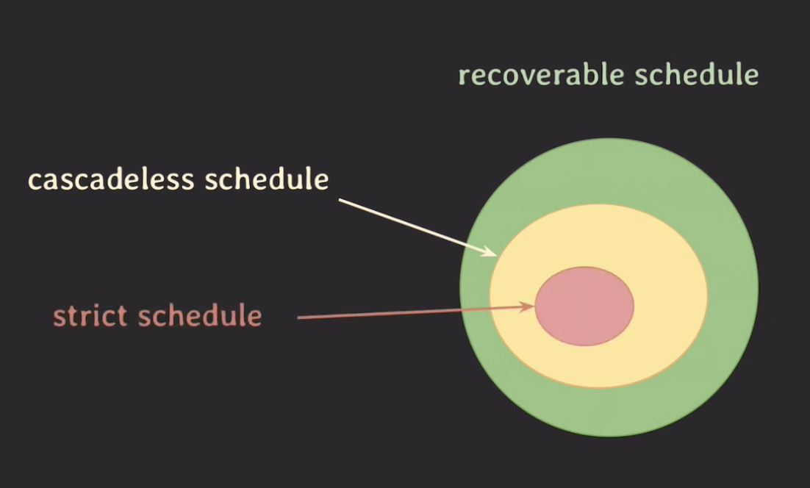

## Unrecoverable schedule

---

하나의 예시를 들어보자.

아래 그림처럼 Transaction 2에 문제가 생겨 rollback을 해야하면 어떤 문제가 생길까?

Transaction 1 또한 rollback을 해야하지만 이미 commit 된 상태이므로 durability 속성 때문에 rollback 할 수 없다.

그러면 schedule 내에서 commit 된 transaction이 rollback된 transaction이 write 했었던 데이터를 읽은 경우(t2에서 write된 230만원을 t1이 read)를 `unrecoverable schedule` 이라고 한다.

이는 rollback을 해도 이전 상태로 회복 불가능할 수 있기 때문에 이런 schedule은 DBMS가 허용되면 안된다.

## Recoverable schedule

---

위의 예시와 같은 상황이 발생하지 않기 위해서 `recoverable schedule`를 허용해야한다.

그러면 어떤 schedule이 recoverable하다고 의미할까?

Unrecoverable schedule이 되지 않기 위해서는 transaction 2를 commit한 다음에 transaction 1을 commit하는 것이다.

이 순서대로 하면 transaction 2 에 문제가 생겨 rollback을 해야할 때, transaction 1은 먼저 commit을 하지 않고 기다리고 둘 다 rollback을 통해서 문제가 발생하지 않도록 한다.

즉, schedule 내에서 그 어떤 transaction도 자신이 read한 데이터를 write한 transaction이 먼저 commit/rollbakc 전까지는 commit 하지 않는다.

이런 방식으로 작동하는 `recoverable schedule`은 rollback할 때 이전 상태로 온전히 돌아갈 수 있기 때문에 DBMS는 이런 schedule만 허용해야 한다.

## Cascadeless schedule

---

위의 예시에서 볼 수 있듯이 하나의 transaction이 rollback하면 의존성이 있는 다른 transaction도 rollback 해야 하는데 이를 `cascading rollback` 이라고 한다.

하지만, 이런 rollback은 여러 transaction의 rollback이 연쇄적으로 일어나면 처리하는 비용이 많이 든다.

비용을 줄이기 위해서 데이터를 write한 transaction이 commit/rollback 한 뒤에 데이터를 읽는 schedule만 허용을 하는 방법을 고안하였다.

이런 방식이면 transaction 2에 `write(H_balance=230만원)`에 의존하는 transaction 이 없기 때문에 문제없이 rollback할 수 있다.

이렇게 schedule 내에서 어떤 transaction도 **commit 되지 않은** transaction들이 write한 데이터는 읽지 않는 경우를 `cascadeless schedule` 이라고 한다.

## Strict schedule

---

cascadeless schedule 도 약간의 이슈가 있다. 하나의 예를 들어보자.

ex. H 사장님이 3만원이던 피자 가격을 2만 원으로 낮추려는데 K 직원도 동일한 피자의 가격을 실수로 1만 원으로 낮췄다.

이렇게 하면 transaction 2의 결과가 사라진다. 하지만, 위의 경우는 cascadeless schedule에서 벗어난 schedule은 아니다.

이러한 문제를 해결하기 위해서는 읽기만 제약하는 것이 아니라 쓰는 것도 제약해야한다.

즉, schedule 내에서 어떤 transaction도 **commit 되지 않은** transaction들이 write한 데이터는 **쓰지도 읽지도 않는** 스케줄이어야 하며 이를 `strict schedule` 이라고 부른다.

위의 그림처럼 실행되어야 문제가 생기지 않는다.

strict schedule은 rollback 할 때 recovery가 쉽다. transaction 이전 상태로 돌려놓기만 하면 된다.

## 최종 정리

---

위의 내용을 시각화하면 아래 그림과 같다.

즉, concurrency control은 `serializability & recoverability`를 제공하며 이와 관련된 속성이 바로 `Isolation` 이다.
