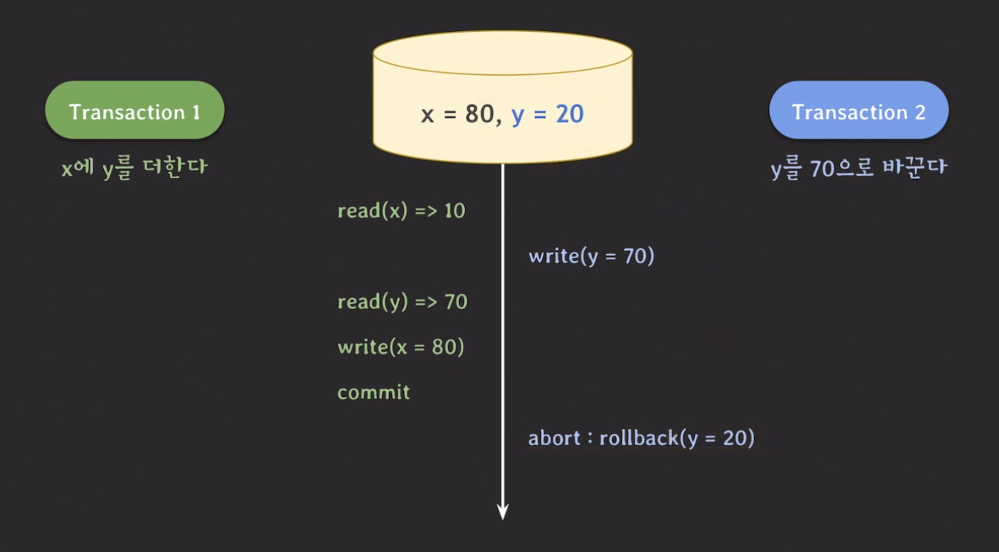
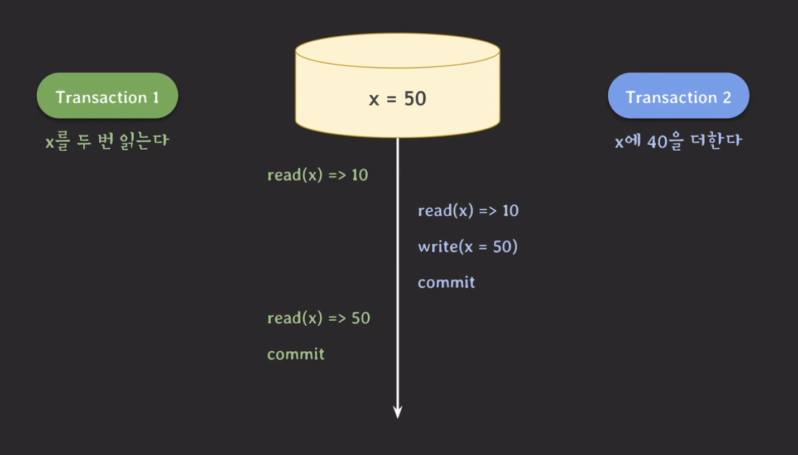
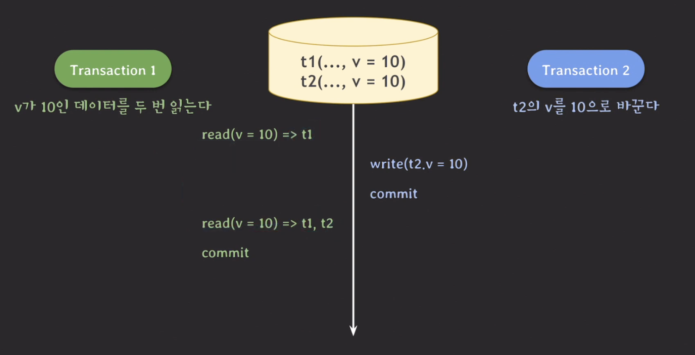
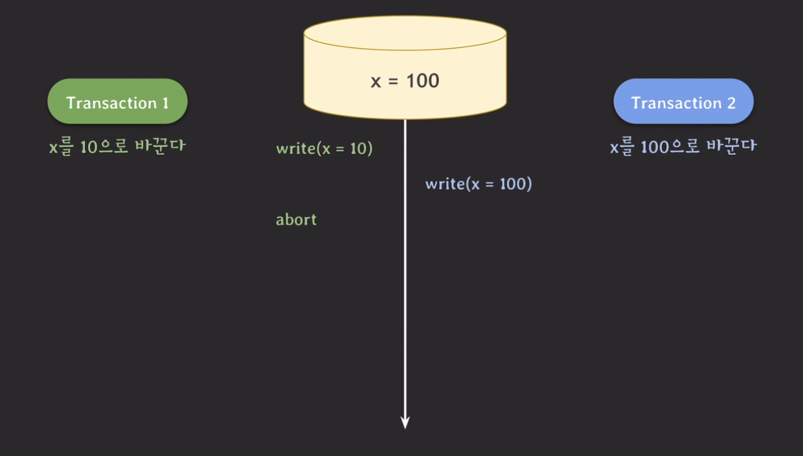
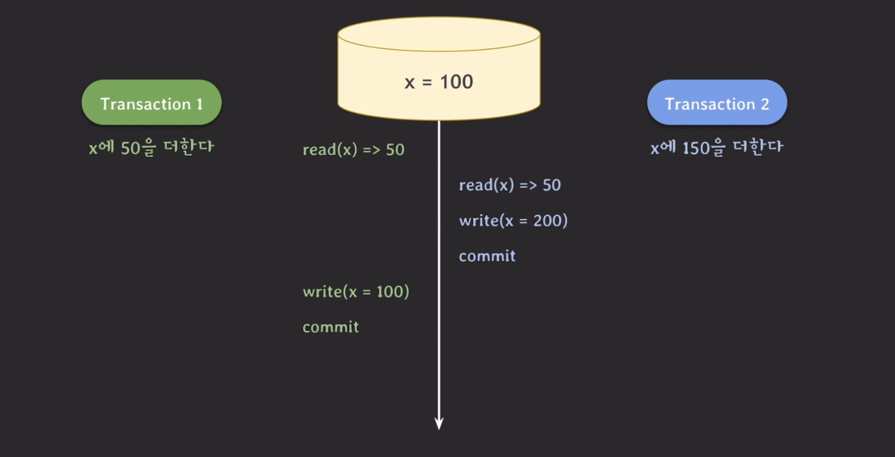
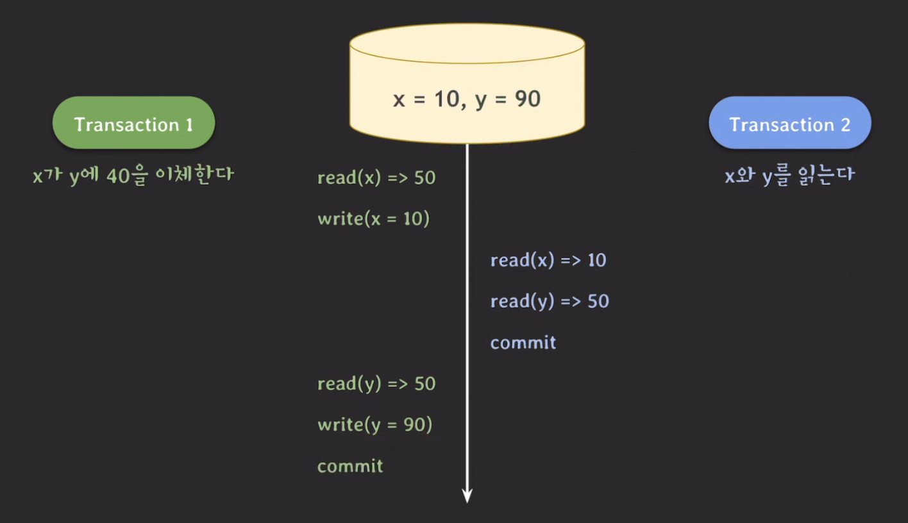
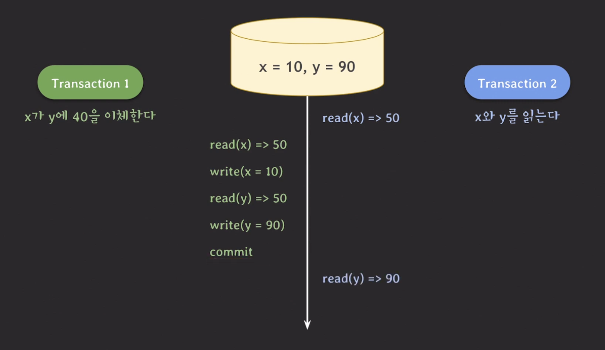
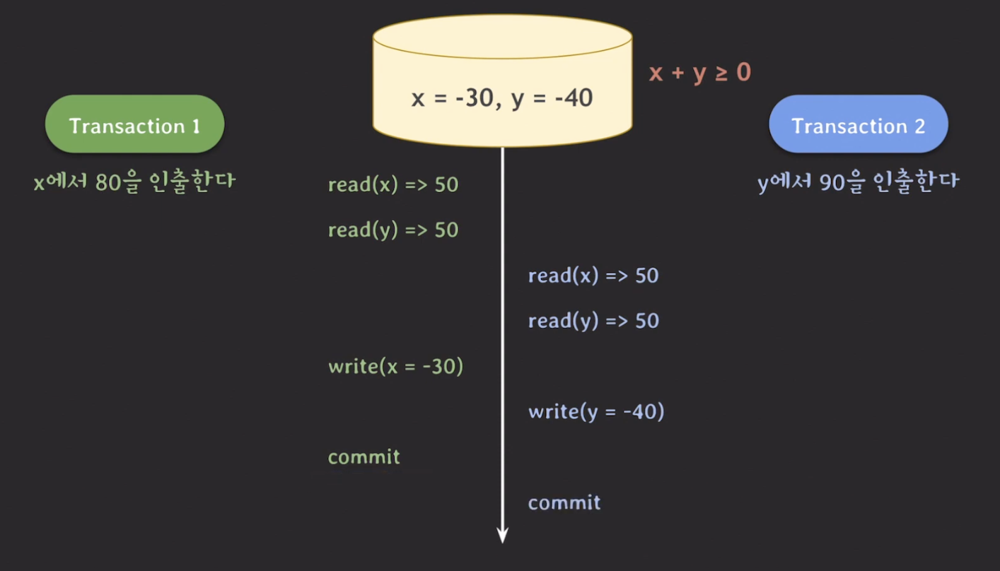
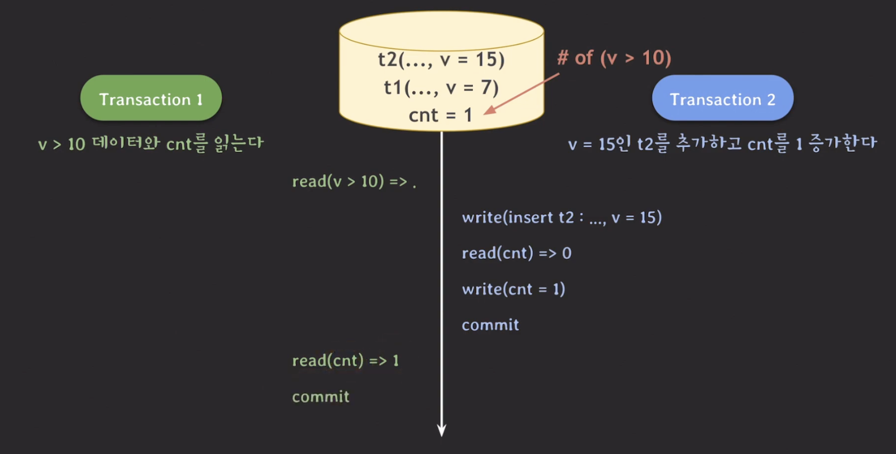
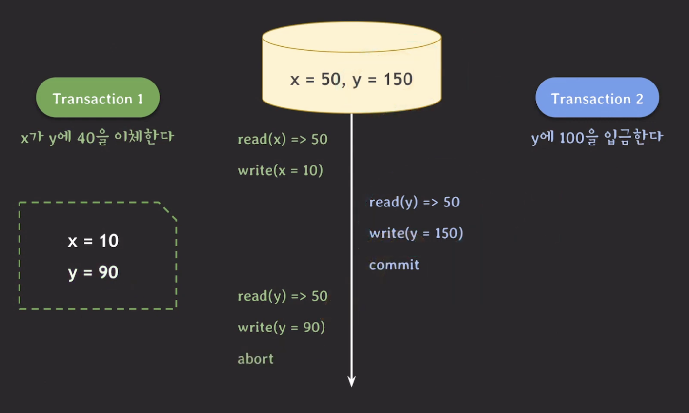

## Dirty read

---

하나의 예를 들어보자.

ex. x = 10, y = 20 이 있을 때 x에 y를 더하는 transaction 1과 y를 70으로 바꾸는 transaction 2를 수행한다.

위의 결과에서 x가 80인 이유는 rollback하기 이전의 y 값, 즉 유효하지 않는 y를 읽었기 때문에 나올 수 있던 결과다. 즉, 유효하지 않는 값이 반영된 x이기 때문에 x 또한 정상적인 값이라고 할 수 없다.

이렇게 commit 되지 않은 변호를 읽는 현상을 `dirty read`라고 한다.

## Non-reapeatable read

또 다른 예시를 들어보자.

ex. x = 50 일 때, x를 두 번 읽는 transaction 1과 x에 40을 더하는 transaction 2를 수행한다.

위의 결과는 x 값이 10, 50 으로 서로 다른 결과가 나온다. 이것은 transaction의 isolation 속성에 위배된다. 각각의 transaction이 독립적으로 실행되는 결과처럼 나와야한다.

이러한 현상을 `Non-repeatable read` 또는 `Fuzzy read` 라고 한다.

## Phantom read

---

또 다른 예시를 들어보자.

위의 예시에서도 같은 데이터를 읽었는데 다른 결과가 나왔다. 이처럼 같은 데이터를 읽었는데 없던 데이터가 생긴 현상을 `Phantom read` 라고 한다.

## Isolation level

---

위의 3가지 현상은 안 발생하는 것이 좋다. 하지만 이런 이상한 현상들이 모두 발생하지 않게 만들 수 있지만 그러면 제약사항이 많아져서 동시 처리 가능한 트랜잭션 수가 줄어들어 결국 DB의 전체 처리량(throughput)이 하락하게 된다.

이 문제를 해결하기 위해 도입한 방법이 `Isolation level` 이다.

| Isolation level  | Dirty read | Non-repeatable read | Phantom read |
| :--------------: | :--------: | :-----------------: | :----------: |
| Read uncommitted |     O      |          O          |      O       |
|  Read committed  |     X      |          O          |      O       |
| Repeatable read  |     X      |          X          |      O       |
|   Serializable   |     X      |          X          |      X       |

여러 레벨 중 Serializable은 위의 세 가지 현상 뿐만 아니라 아예 이상한 현상 자체가 발생하지 않는 level을 의미한다.

이렇게 isolation level을 통해 전체 처리량과 데이터의 일관성 사이에서 어느 정도 거래를 할 수 있다.

> **standard SQL 92 isolation level 비판**
>
> 위의 내용은 모두 standard SQL 92에 나온 내용들이다. 이에 관련해서 비판적인 시각이 있다.
>
> 1. 세 가지 이상 현상의 정의가 모호하다.
> 2. 이상 현상을 세 가지 외에도 더 있다.
> 3. 상업적인 DBMS에서 사용하는 방법을 반영해서 isolation level을 구분하지 않았다.

아래의 현상은 비판 내용에서 나온 추가적인 비판 내용이다.

## Dirty write

---

하나의 예시를 들어보자.

위의 그림에서 write(x = 1)을 하고 write(x = 100)를 한 후 commit를 한다. 그 이후에 transaction 1을 abort 하면 x의 값은 0이 되며 transaction 2의 결과또한 사라진다.

이렇게 commit가 안된 데이터를 write하는 현상을 `dirty write`라고 한다.

이 문제를 언급한 논문에서는 rollback 시 정상적인 recovery는 매우 중요하기 때문에 모든 isolation level에서 dirty write를 허용하면 안된다고 언급된다.

## Lost update

위의 그림 처럼 업데이트를 덮어쓰는 현상을 `lost update` 라고 한다.

## Dirty read 확장판

---

rollback이 발생하지 않는 하나의 예시를 들어보자.

위의 예시에서 최종 x=10, y=90으로 총합이 100이다. 이 과정에서 transaction 2를 실행하는 부분을 보면 `read(x) => 10 read(y) => 50`으로 총합이 60이다. 이처럼 데이터의 정합성이 깨지는 문제가 발생한다.

이처럼 abort가 발생하지 않아도 dirty read가 될 수 있다.

## Read skew

---

위의 예시에서 Transaction 2에서 x와 y를 읽은 값의 합이 140이 된다. 하지만, x와 y의 합은 100으로 항상 일정해야한다. 즉, 데이터의 정합성이 깨지는 문제가 발생한다.

이렇게 inconsistent read가 발생한 현상을 `read skew` 라고 한다.

## Write skew

---

$x + y \le 0$ 이라는 제약조건이 있다. 이떄, 두 트랜잭션의 commit 된 결과가 x = -30, y = -40 이면 제약조건에 위배된다.

이처럼 inconsistent한 데이터 쓰기가 발생한 현상을 `write skew` 라고 한다.

## Phantom read 확장판

---

transaction 1에서 read(cnt) => 1 이라고 나오는 것은 transaction 1의 조건을 만족시키는 것이 하나만 존재하기 때문에 나오는 결과이다. 하지만, 실제로는 만족하는 조건은 존재하지 않는다.

즉, 데이터 불일치가 발생한다. 이 또한 `phantom read` 라고 부른다.

## Snapshot isolation

---

상업적인 DBMS에서 사용되는 방법을 반영한 것이 `snapshot isolation` 이다. 이 isolation은 Concurrency Control 이 어떻게 동작할 지에 대한 구현을 바탕으로 정의하였다.

위의 예시에서 transaction 1이 transaction 2 보다 나중에 commit이 되기 때문에 abort가 발생한다. 또한, transaction 1에서 `write(y=90)` 인 이유는 transaction 1이 발생할 시점의 snapshot을 통해 y의 값을 읽었기 때문이다.

이러한 동작 방식을 `snapshot isolation` 이며, MVCC(multi version concurrency control)의 한 종류이다.

위의 내용을 정리하면 다음과 같다.

- transaction이 시작 시점의 데이터만 보임
- First-committer wins

## Isolation level in work

---

- MySQL : 표준 SQL을 따름
- Oracle: READ COMMITTED, SERIALIZABLE(Snapshot isolation level 로 동작)
- SQL server: READ UNCOMMITTED, READ COMMITTED, REPEATABLE READ, SERIALIZABLE, SNAPSHOT
- PostgreSQL: READ UNCOMMITTED, READ COMMITTED, REPEATABLE READ(Snapshot isolation level 로 동작), SERIALIZABLE

주요 RDBMS은 SQL 표준에 기반해서 isolation level을 정의한다. 하지만, 같은 이름의 isolation level이라도 동작 방식이 다를 수 있다.

개발자는 사용하는 RDBMS의 isolation level을 잘 파악해서 적절한 isolation level을 사용할 수 있도록 해야 한다.
