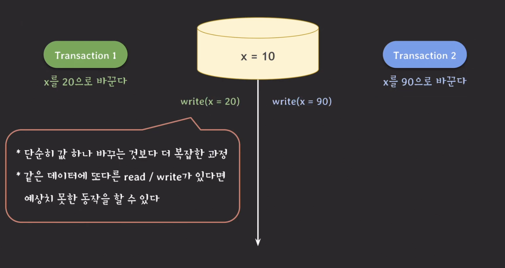
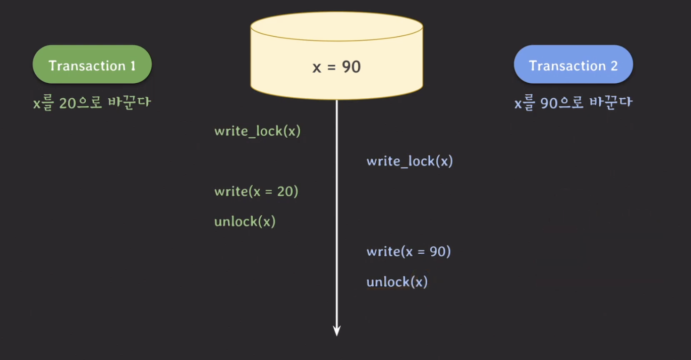
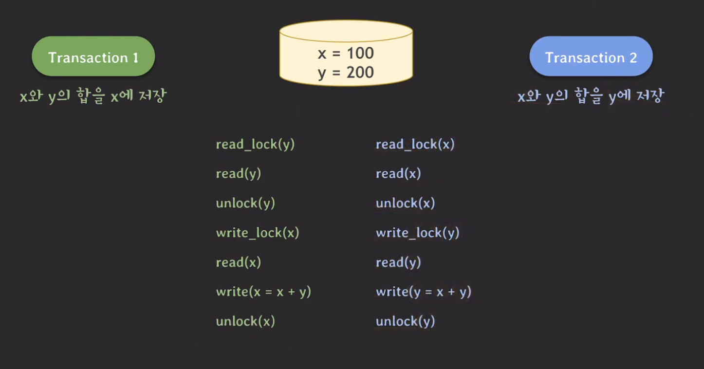
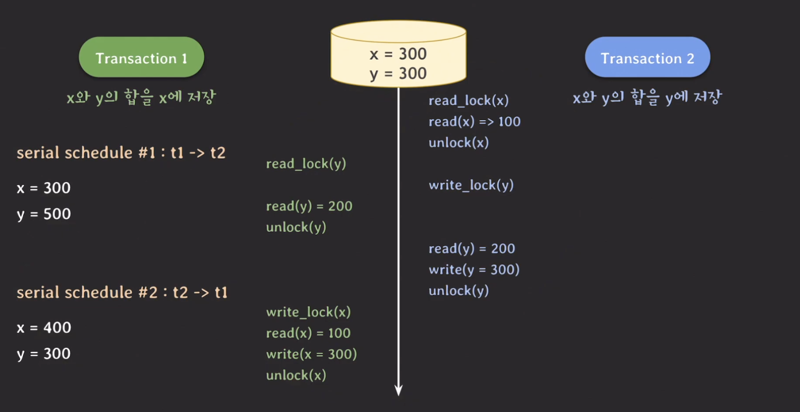
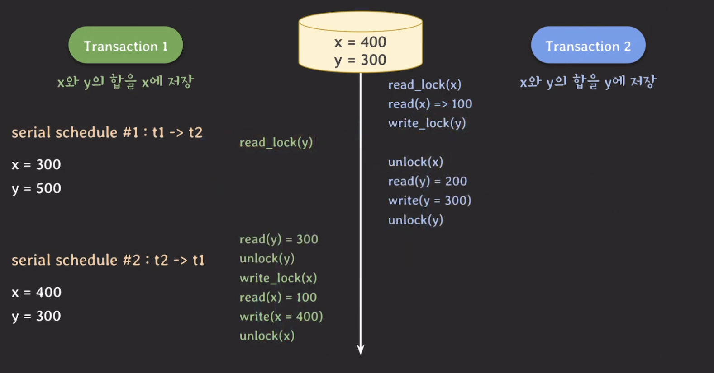
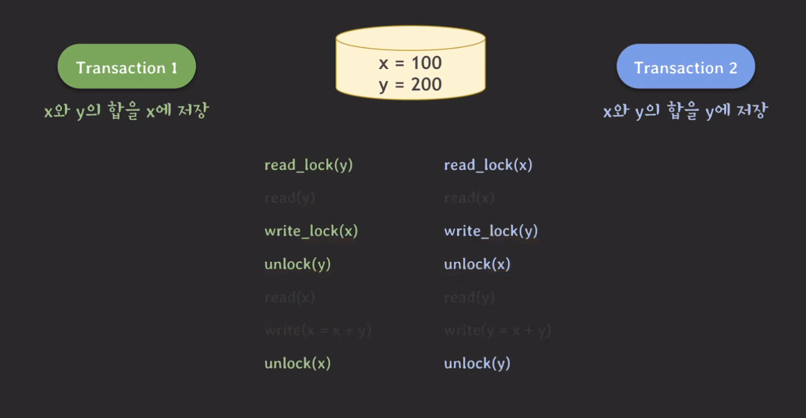
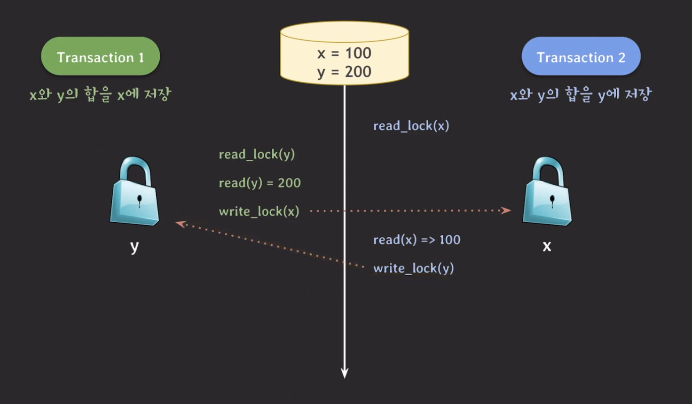
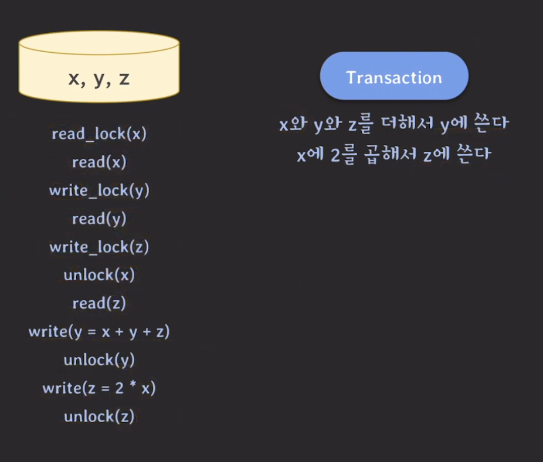
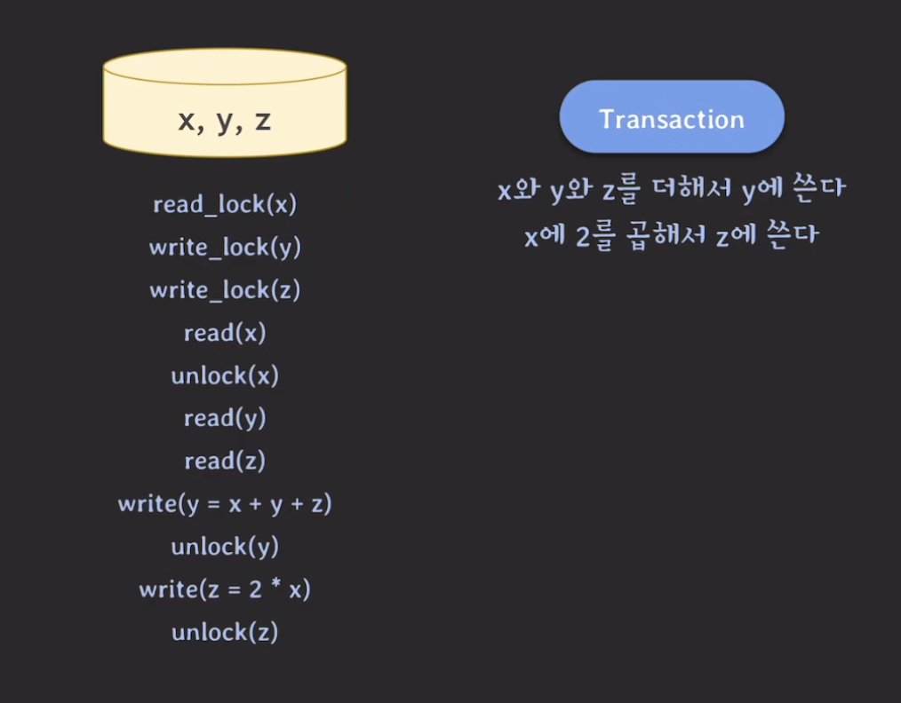
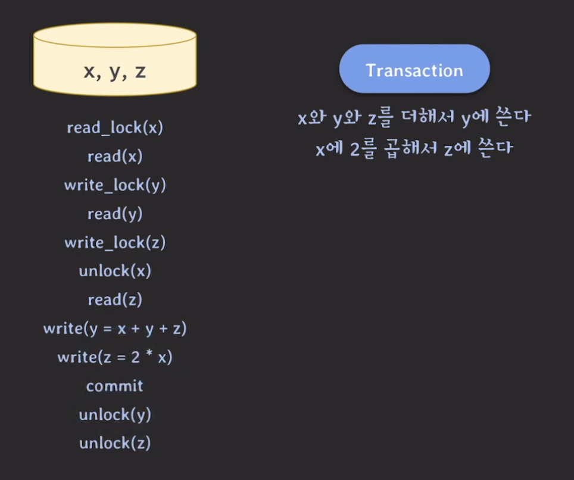

## Lock

---

하나의 예시를 살펴보자.

이러한 문제를 해결하는 방법으로 `lock` 이 있다. data마다 lock이 있는데 data를 변경하거나 읽기위해서는 lock을 취득해야하고 만약에 취득하지 못하면 lock을 취득할 때까지 기다려야한다.

위의 예시에 lock을 적용하면 다음과 같이 실행된다.

위의 내용을 정리해보면 다음과 같이 정리할 수 있다.

- `write_lock(exclusive lock)` : read/write(insert, modify, delete) 할 때 사용한다.
  - 다른 트랜잭션이 같은 데이터를 read/write 하는 것을 허용하지 않는다.
- `read_lock(shared lock)` : read할 때 사용한다.
  - 다른 트랜잭션이 같은 데이터를 read하는 것은 허용한다.
  - 만약 read lock 걸린 데이터에 write를 하려는 동작은 막는다.

위의 내용을 표로 정리하면 다음과 같다.

|            | read-lock | write-lock |
| :--------: | :-------: | :--------: |
| read-lock  |     O     |     X      |
| write-lock |     X     |     X      |

lock을 사용해도 문제가 생기는 문제가 있다. 하나의 예시를 들어보자.

만약 위의 예시가 serializing 을 따른다면 x, y의 결과값은 어떻게 될까?

- t1 -> t2 : x = 300, y = 500
- t2 -> t1 : x = 400, y = 300

그러면 이제 두 트랜잭션이 동시에 실행되면 어떠한 결과가 나올까?

위의 결과는 x = 300, y = 300 이 되며 serializing 한 스케줄과 결과값이 다르다는 것을 알 수 있다. 즉, 이 스케줄은 Nonserializable 한 스케줄이다.

위와 같은 결과가 나온 이유는 transaction 1에서 update된 200에서 300이 된 y의 값을 읽어서 x의 값을 업데이트 시켜야하는데 업데이트 되기 전의 값을 읽어서 잘못된 결과가 도출되었다.

이러한 결과가 나온 부분이 바로 `unlock(x) &rarr; read_lock(y) &rarr; write_lock(y)` 부분이다.

만약 `write_lock(y) &rarr; read_lock(y)` 으로 순서가 바뀌면 어떻게 될까?

위의 결과는 x = 400, y = 300 이 되며 serializing 한 스케줄과 동일한 결과가 나온다. 즉, 이 스케줄은 Serializable 한 스케줄이다.

또한 transaction 1의 순서에서도 `write_lock(x) &rarr; unlock(y)` 를 싫행해야한다. 이렇게 해야만 transaction 1 이 먼저 수행되도 문제가 생기지 않는다.

위의 내용에서 lock operation 만 따로 떼어놓고 보면 다음과 같다.

## 2PL

---

위의 그림에서 transaction에서 모든 locking operation이 최초의 unlock operation 보다 먼저 수행되고 있다. 이러한 규칙을 `2PL(Two-Phase Locking)` 이라고 한다.

- `Expanding phase(growing phase)` : lock을 취득하기만 하고 반환하지 않는 phase 이다.
  - 위의 그림에서는 read_lock과 write_lock만 있는 윗 부분을 의미
- `Shrinking phase(contracting phase)` : lock을 반환만 하고 취득하지는 않는 phase
  - 위의 그림에서는 unlock만 있는 아랫 부분을 의미

이 프로토콜은 serializable 한 스케줄을 보장이 되지만 어떠한 경우에는 특별한 상황이 발생할 수 있는데 이를 `deadlock` 이라고 한다.

하나의 예시를 들어보자.

위와 같은 deadlock을 해결하는 방법은 OS와 비슷하다.

### conservative 2PL

`conservative 2PL`은 모든 lock을 취득한 뒤 transaction을 시작하는 프로토콜을 말한다.

위의 그림은 일반적인 2PL 실행 예시이다. 이를 conservative 2PL로 바꾸면 아래의 그림처럼 바뀐다.

- deadlock-free
- 모든 lock을 다 취득해야하기 때문에 실용적이지 않다.

### strict 2PL

`strict 2PL`은 strict schedule을 보장하는 2PL이다.

> strict schedule: 어떤 데이터에 대해 write하는 트랜잭션이 있다면 그 트랜잭션이 commit/rollback 될 때까지 다른 트랜잭션이 그 데이터를 read/write 하지 못하도록 하는 schedule

- `recoverability` 보장
- write-lock을 commit/rollback 될 때 반환

### strong strict 2PL

strict 2PL에서 발전된 형태가 바로 `strong strict 2PL`로 `SS2PL` 또는 `rigorous 2PL`이라고도 불린다.

- strict schedule을 보장하는 2PL
- `recoverability` 보장
- read-lock/write-lock 모두 commit/rollback 될 때 반환
- S2PL 보다 구현이 쉽다.

단점은 lock을 오래 쥐고 있으므로 다른 트랜잭션이 lock을 취득하는데 시간이 오래걸리는 단점이 있다.

## 2PL의 한계

---

2PL은 트랜잭션의 Serializability을 보장하기 위한 아주 강력한 수단이지만, 구조적으로 다음과 같은 성능 저하 요소를 안고 있다.

read-read를 하는 경우만 제외하고는 한 쪽이 block이 되기 때문에 전체 처리량이 좋지 않다. 이를 개선하기 위해 read와 write가 서로를 block 하는 것이라도 해결을 해보려고 했다. 이 해결 방법이 바로 `MVCC` 이다.

오늘날의 DBMS는 Lock과 MVCC를 혼용해서 사용한다.
