## MVCC

---

`MVCC(Multi Version Concurrency Control)`는 Lock의 단점인 적은 트랜잭션의 처리량을 보완하기 위해서 고안된 기술이다.

|       | read | write |
| :---: | :--: | :---: |
| read  |  O   |   O   |
| write |  O   |   X   |

MVCC는 commit된 데이터만 읽는 특징을 가지고 있으며 recoverability를 위해 commit할 때 lock을 unlock한다.

아래의 예시를 살펴보자.

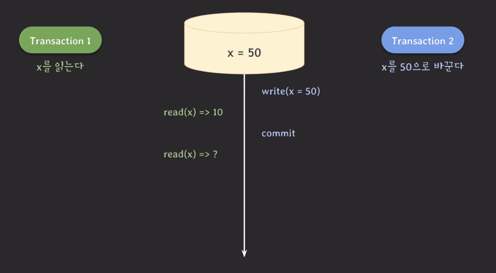

위의 그림에서 볼 수 있듯이 t1이 실행될 때 읽는 데이터가 50이 아니라 10을 읽는다. 이후 t2가 commit이 될 때 t2의 `write(x=50)` 에 걸린 lock을 unlock한다.

만약에 이후에 t1의 read가 실행된다면 어떤 값을 읽을까?

이 값은 트랜잭션의 isolation level에 따라 다르다.

- `read committed` : read하는 시간을 기준으로 그전에 commit된 데이터를 읽는다.
  - `read(x) => 50`로 읽으며 mysql와 postgresql 동일하게 동작
- `repeatable read` : 트랜잭션 시작 시간 기준으로 그전에 commit된 데이터를 읽는다.
  - `read(x) => 10`으로 읽으며 mysql와 postgresql 동일하게 동작
  - 이때, RDBMS에 따라 시작 시점의 정의가 다르다.

위의 내용을 정리하면 MVCC는 다음과 같이 정리할 수 있다.

- 데이터를 읽을 때 **특정 시점 기준**으로 가장 최근에 **commit된 데이터**를 읽는다.
  - mysql에서는 `consistent read`라고 한다.
- 데이터 변화(write) 이력을 관리한다.
- read와 write는 서로를 block하지 않는다.

그러면 다른 isolation level에서는 어떻게 동작할까?

- `serializable`
  - mysql : MVCC로 동작하기 보다는 lock으로 동작한다.
  - postgresql : SSI(Serializable Snpashot Isolation) 기법이 적용된 MVCC로 동작한다.
- `read uncommitted` : MVCC는 committed된 데이터를 읽기 때문에 이 level에서는 보통 MVCC가 적용되지 않는다.
  - mysql : MVCC가 적용되는 레벨을 read committed와 repeatable read가 해당
  - postgresql : read uncommited level이 존재하지만 read committed level처럼 동작한다.

## lost update in PostgreSQL

---

PostgreSQL에서 발생하는 문제를 살펴보자.

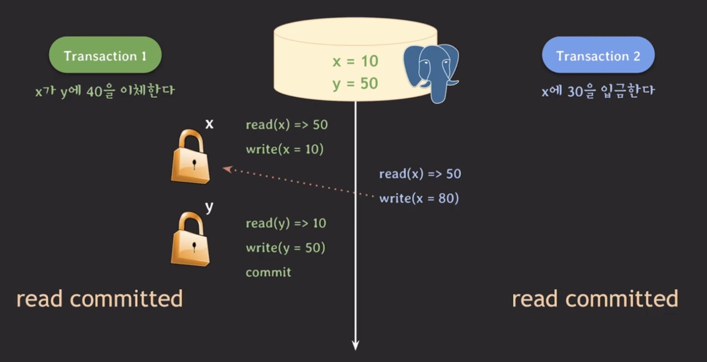

위에서 t1에서 write(x=10)에 lock 걸렸기 때문에 t2의 write(x=80) 이후의 작업은 진행되지 않고 있다.

t1이 commit이 되면 t1의 lock이 모두 해제되고 t2는 write lock을 획득한다. t2의 write(x=80)이 실행될 수 있으며 write(x=80)이 실행된다. t2가 commit하며 데이터 값에 반영한다.

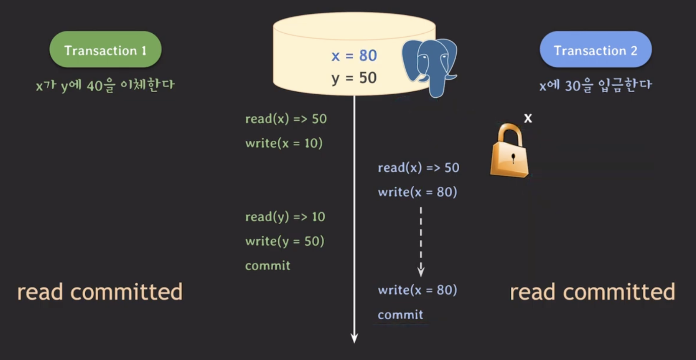

최종 결과는 x = 80, y = 50이다. 하지만 정확한 결과는 x = 40, y = 50 이어야 한다. 이러한 문제를 `lost update` 라고 한다.

이 문제를 해결하는 방법은 Transaction 2의 isolation level을 repeatabel read 로 변경하는 것이다.

- t2의 write(x = 80) 실행이 실패되고 `rollback` 된다.
- 같은 데이터에 먼저 update한 트랜잭션이 commit되면 나중 transaction은 rollback을 하는 규칙이 있으며 이를 `first-updater-win` 이라고 한다.

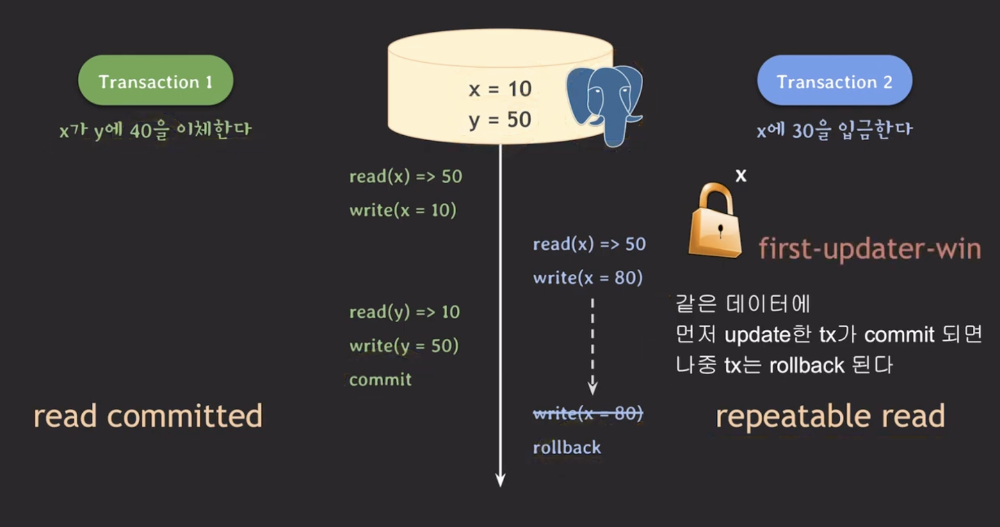

이 때, t2만 repeatable read로 변경하고 t1은 read committed로 설정해도 될까?

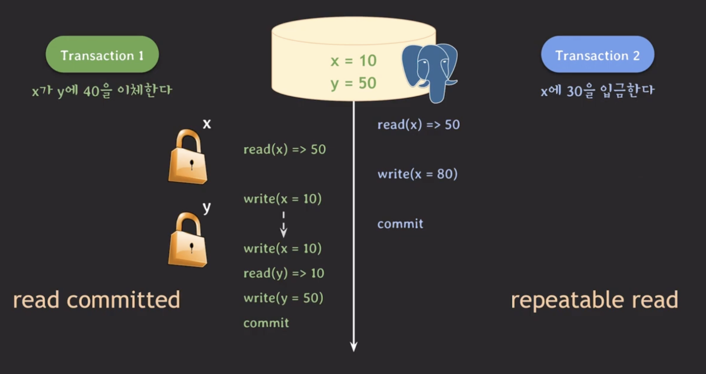

위 결과 또한 `lost update`가 발생했다. 즉, t1도 read committed로 충분하지 않은 것이다. t1도 t2와 동일하게 repeatable read로 바꾸면 아래와 같은 결과가 나온다.

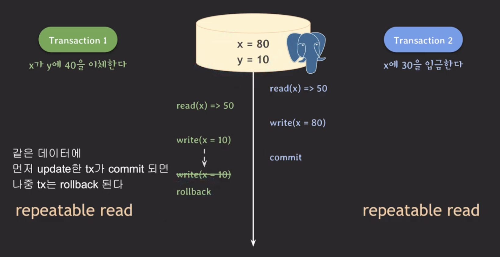

이를 통해, 한 트랜잭션의 isolation level만 챙기는 것이 아니라 연관있는 트랜잭션까지 고려해야한다.

## lost update in MySQL

---

그렇다면 MySQL의 MVCC는 lost update를 postgreSQL과 동일한 방법으로 해결할 수 있을까?

t1, t2가 모두 repeatable read로 설정된 상황에서 MySQL은 다음과 같이 동작한다.

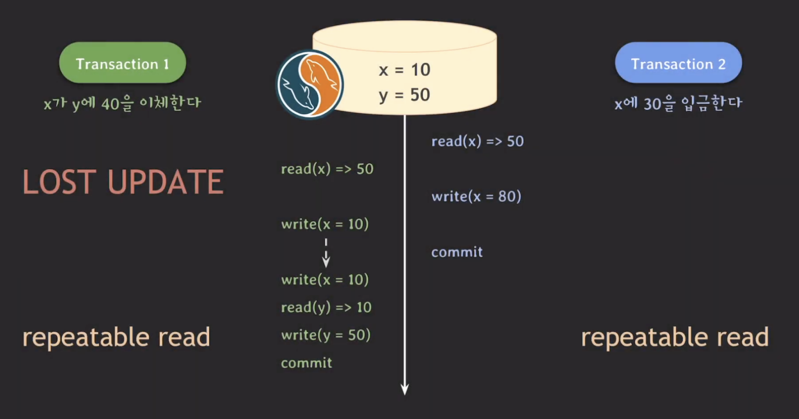

위의 결과를 보면 MySQL의 MVCC는 lost update를 repeatable read 만으로는 해결할 수 없다는 것을 알 수 있다.

MySQL에서는 `Locking read`라는 방법을 사용해서 해결한다. 이 방법은 개발자가 직접 쿼리문을 작성해서 락을 획득하는 방식이다.

> Locking read in MySQL : 가장 최근의 commit 된 데이터를 읽으며 `FOR UPDATE`와 `FOR SHARE` 두 종류가 있다.
>
> - `FOR UPDATE` : write lock(exclusive lock)을 획득
> - `FOR SHARE` : read lock(shared lock)을 획득
>
> ```sql
> SELECT balance
> FROM account
> WHERE id = 'x'
> FOR UPDATE;
> ```
>
> 위의 문법이 다른 RDBMS에도 존재하지만 동작 방식은 다르다.

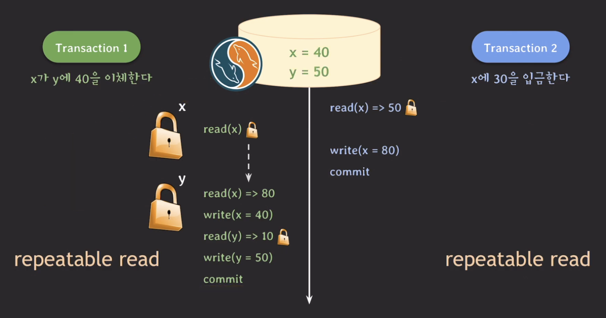

위의 그림에서 t1의 read(x)는 t1의 시작 당시의 x 값을 읽는 것이 아닌 가장 최근의 commit 된 데이터를 읽기 때문에 50이 아닌 80을 읽는다.

위의 두 트랜잭션은 repeatable read인데 이 isolation level에서도 해결되지 않는 문제가 있다.

## write skew

---

하나의 예제를 살펴보자.

ex. t1은 x와 y를 더해서 x에 쓰고 t2는 x와 y를 더해서 y에 쓴다. 이때, x = 10, y=10 이면 정상적인 결과는 x = 20, y = 30 또는 x = 30, y = 20 이다.

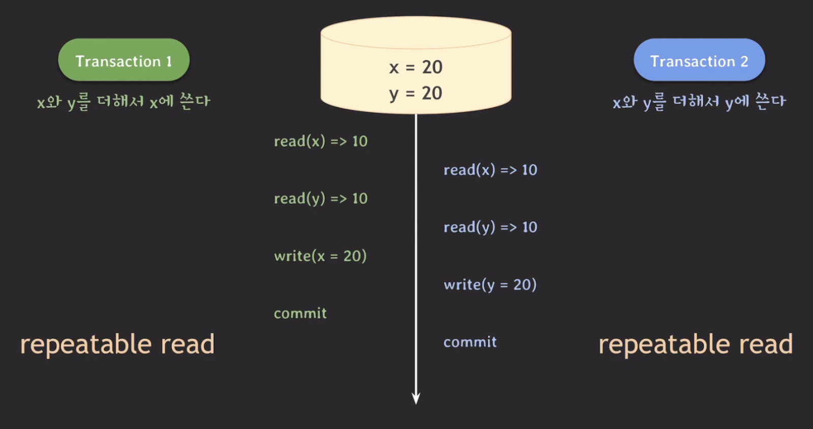

위의 결과에서 x와 y의 값은 각각 20으로 올바른 값이 아니다. 이러한 현상을 `write skew`라고 한다. 이 현상은 mysql, postgresql 모두 발생한다.

### write skew in MySQL

위의 문제를 해결하기 위해서 MySQL에서는 `Locking read`를 사용하여 문제를 해결할 수 있다.

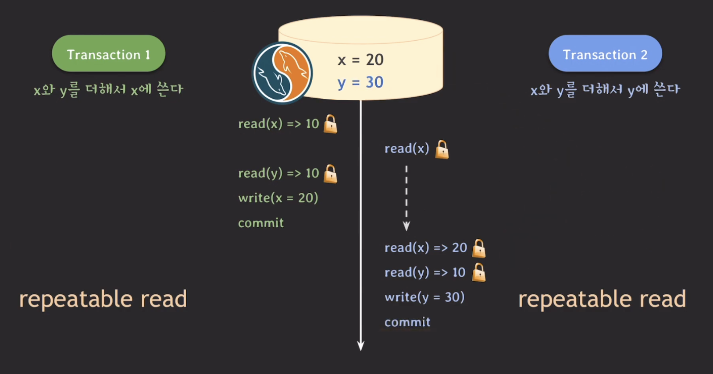

즉 repeatable read만으로는 write skew를 해결할 수 없으며 `Locking read`를 꼭 사용해야한다.

### write skew in PostgreSQL

PostgreSQL에서도 MySQL과 동일하게 `FOR UPDATE`와 `FOR SHARE`을 사용하여 해결할 수 있다. 다만, 동작 방식이 달라 결과가 조금 다르다.

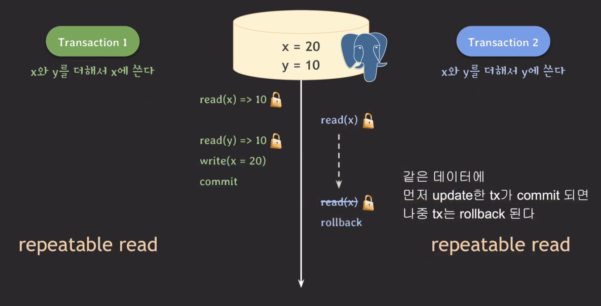

PostgreSQL에서는 결국 t1만 실행이 되고 t2는 rollback이 되어 실행되지 않는다. 결과적으로 데이터는 t1만 실행된 결과로 반영이 되며, 이후에 t2를 다시 실행을 해야 정상적으로 두 트랜잭션이 실행했을 때의 결과가 나온다.

이때, `SELECT ... FOR UPDATE`와 `SELECT ... FOR SHARE`이 repeatable read 레벨에서는 같은 데이터가 먼저 update한 트랜잭션이 commit 되면 나중 트랜잭션은 rollback 되는 규칙이 적용된다.

## Serializable in RDBMS

---

write skew 문제를 repeatable read 방식이 아닌 가장 강력한 isolation level인 `serializable`로 해결할 수 있다.

- MySQL
  - repeatable read와 유사
  - 트랜잭션의 모든 평범한 select 문은 암묵적으로 `select ... for share` 처럼 동작한다.
  - MVCC 가 아닌 LOCK 방식으로 동작한다고 말함

- PostgreSQL
  - SSI(serializable snapshot isolation)로 구현(MVCC 기반)
  - first-committer-winner
