## Insertion anomalies

---

DB를 잘못 설계하면 중복 데이터 문제가 발생할 수 있다.

ex. IT 회사의 데이터베이스를 구축하는데 다음과 같이 테이블을 만들었다고 가정해보자.

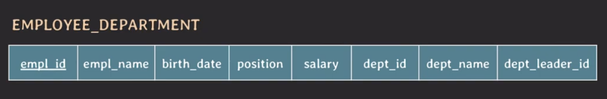

이렇게 설계된 테이블에 데이터를 write(insert, update, delete) 하게 되면 어떤 문제가 발생할 수 있을까?

이 테이블에 2개의 데이터를 넣어보자

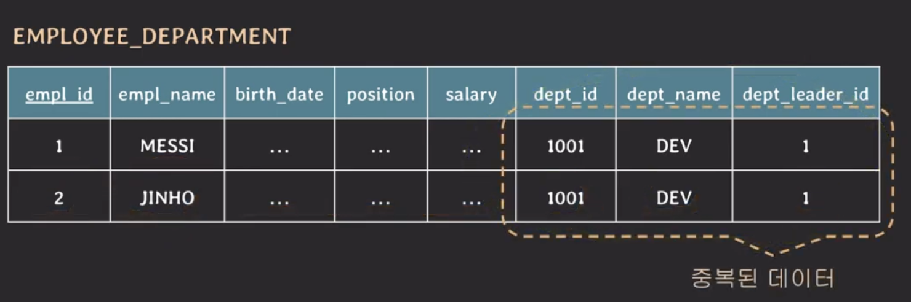

위의 테이블에서 `dept_id`, `dept_name`, `dept_leader_id`가 모두 같은 값을 가지는 것을 볼 수 있다. 이렇게 중복된 데이터가 발생하면 생길 수 있는 문제점은 다음과 같다.

- 저장 공간 낭비
- 실수로 인한 데이터 불일치 가능성 존재

위 테이블에 아직 부서 배치를 받지 못한 임직원을 추가하게 된다면 어떻게 입력을 해야할까?

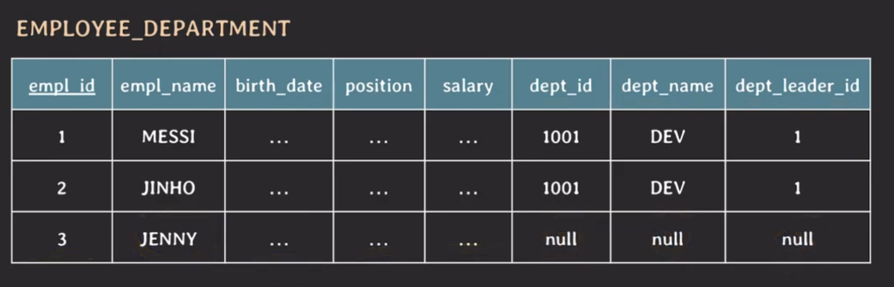

`dept_id`, `dept_name`, `dept_leader_id`가 모두 null 값을 가지게 된다. 하지만, null값을 많이 사용하는 것이 좋고 가급적으로 null 값을 적게 쓰는 것이 좋다.

임직원이 한 명도 없는 부서 정보를 입력하고 싶은 경우에는 어떻게 입력해야할까?

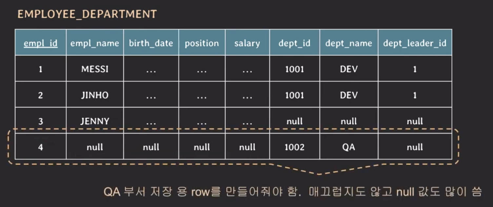

이러한 경우에는 `empl_name`, `birth_date`, `position`, `salary` 는 null값을 넣고 primary key 인 `empl_id` 같은 경우는 값을 넣어서 입력해야 한다. 이 또한 null 값을 많이 사용하는 문제가 있다.

또한 `empl_id`는 사실 key 특성 상 값을 무조건 넣어야 하는 속성이기 때문에 실제로 임직원이 존재하지 않음에도 값을 넣어야 하므로 매끄럽지 않다.

하지면 부서원이 존재하지 않는 부서에 첫 임직원이 들어왔다면 어떻게 될까?

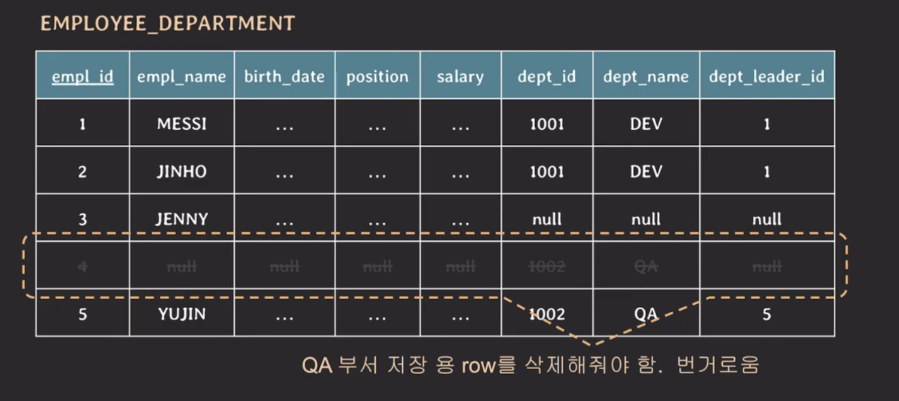

새로운 데이터가 들어오면 기존에 테이블에 저장되어 있는 데이터를 지우는 과정이 필요하다.

예시 테이블에 이러한 문제가 발생하는 이유는 하나의 테이블에 별개의 관심사가 존재하는 방식으로 테이블을 설계했기 때문이다.

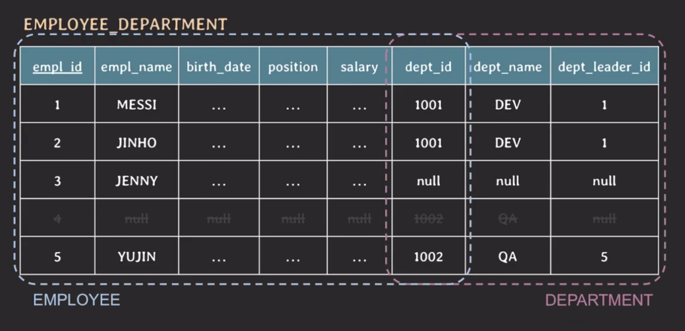

위의 테이블을 관심사로 분리하면 다음과 같이 설계할 수 있다.

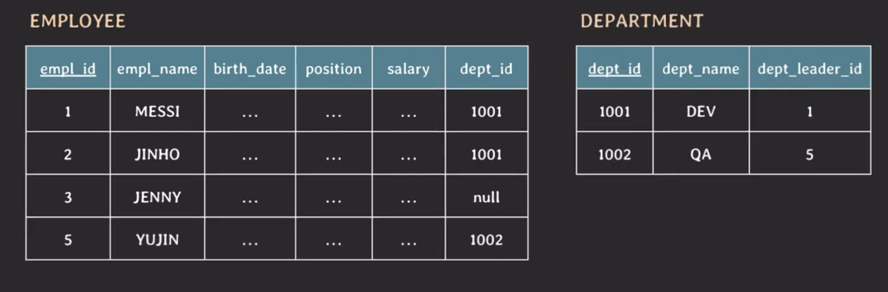

이렇게 하면 새로운 임직원을 추가할 때는 EMPLOYEE 테이블에 데이터를 추가하면 되고, 새로운 부서를 추가하면 DEPARTMENT 테이블에 데이터를 추가하면 된다.

## Deletion anomalies

---

잘못 설계된 테이블에서 데이터를 삭제할 때 발생할 수 있는 문제를 살펴보자.

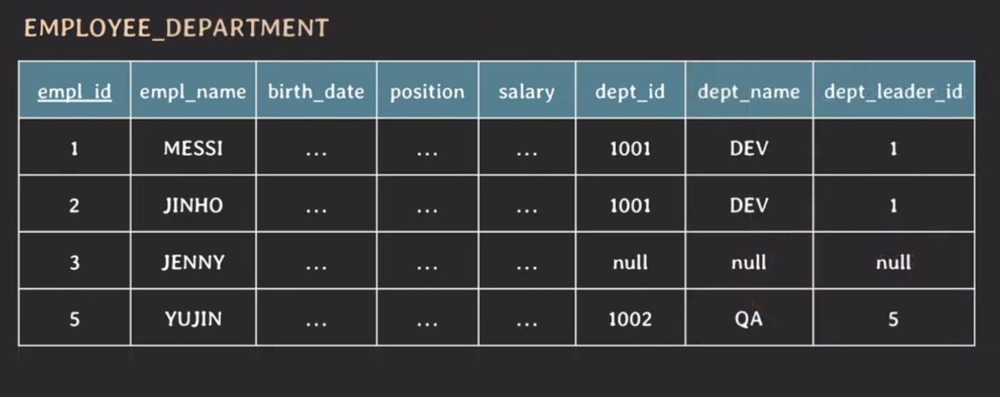

위의 테이블에서 YUJIN 정보를 삭제하면 어떻게 될까?

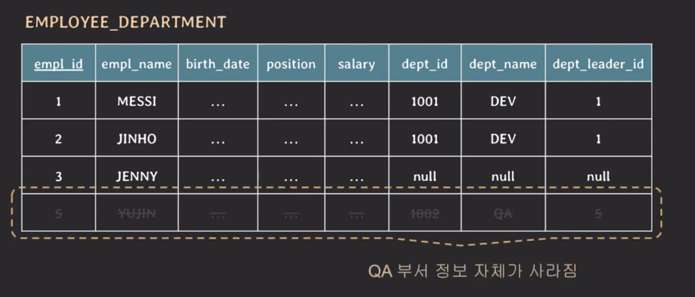

YUJIN은 유일한 QA 부서의 임직원이기 때문에 YUJIN 정보만 삭제되는 것이 아니라 QA 부서 정보 또한 삭제된다.

대안으로 YUJIN 정보만 null 값으로 대체할 수 있지만 이는 insertion anomalies에서 발생했던 문제와 동일한 문제가 발생할 수 있다.

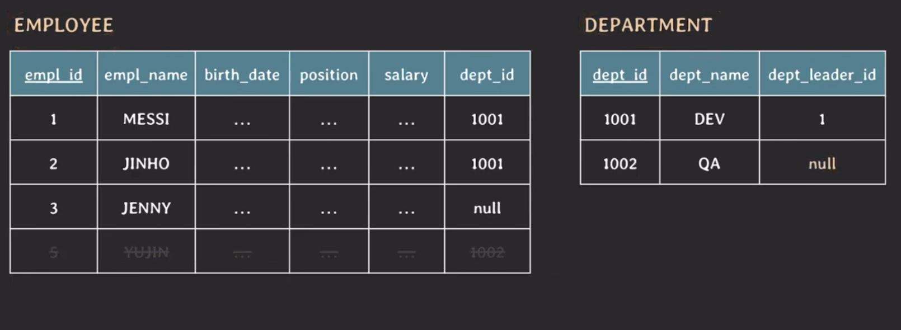

테이블을 관심사로 분리하여 설계하면 EMPLOYEE 테이블에서 YUJIN 정보를 삭제하더라도 DEPARTMENT 테이블에 데이터가 존재하기 때문에 QA 부서 정보는 삭제되지 않는다.

## Update anomalies

---

만약에 부서 이름이 DEV에서 DEV1으로 변경된 경우 어떻게 데이터를 업데이트될까?

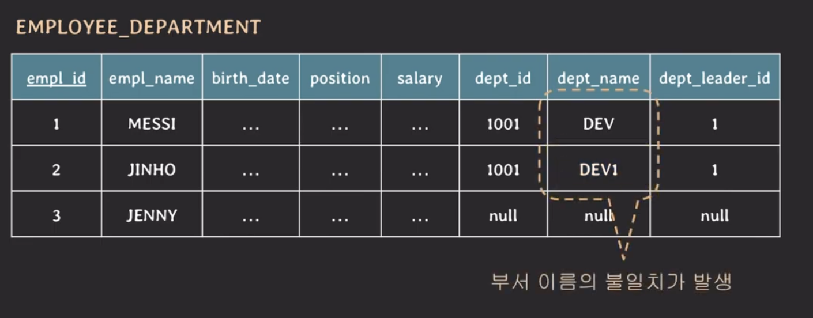

위의 테이블로 설계했을 떄는 DEV 부서에 속한 모든 임직원들을 찾아서 업데이트해야하고 누락된 경우도 있다.

하지만 관심사별로 나눠서 테이블을 설계하면 부서관련 데이터가 저장된 테이블만 업데이트하면 된다.

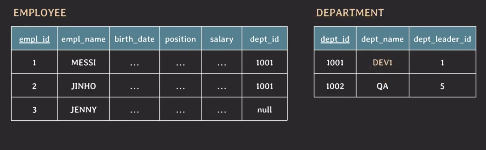

## Spurious Tuples

---

테이블을 잘못 설계하면 생길 수 있는 또 다른 문제로는 `Spurious Tuples`가 있다.

> `Spurious` : 가짜

Spurious Tuple이 생기는 하나의 예제를 들어보자.

ex. 사진 촬영 회사의 데이터베이스를 구축하는데 다음과 같은 테이블이 있다고 가정하자.

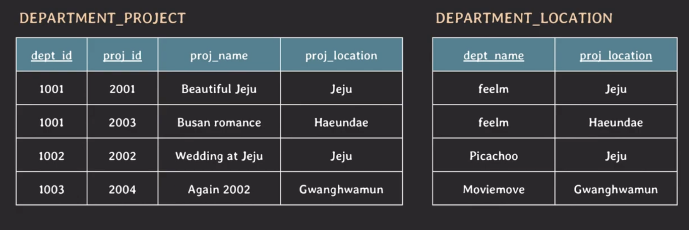

두 개의 테이블을 natural join 하면 다음과 같은 결과가 나온다.

- query : `select * from DEPARTMENT_PROJECT natural join DEPARTMENT_LOCATION;`

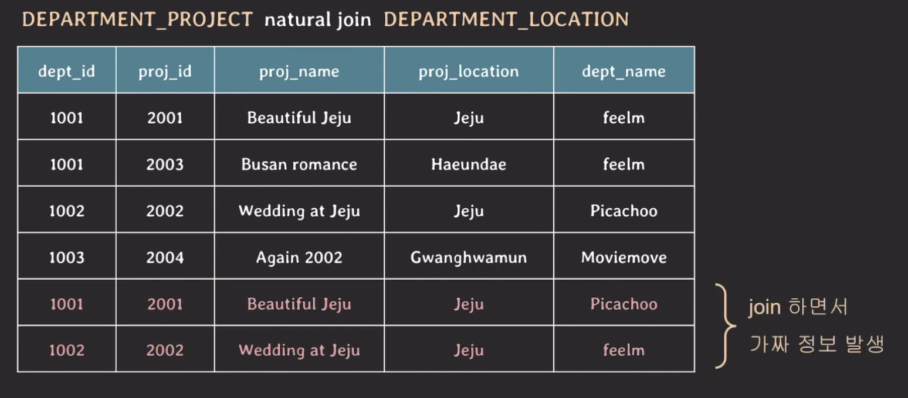

위 테이블의 결과 중에서 `dept_id`가 1001인 행과 1002인 튜플이 2개씩 존재한다. `dept_id`가 같은 튜플끼리 비교를 해보면 `dept_name`을 제외하고는 모두 같은 값을 가지고 있다.

이러한 가짜 튜플이 발생하는 이유는 `DEPARTMENT_LOCATION`에서 `proj_location`의 값이 Jeju인 튜플이 2개씩 존재해 join을 하는 과정에서 DEPARTMENT_PROJECT의 튜플과 2번씩 매칭이 되기 때문이다.

이러한 문제를 막기 위해서는 `DEPARTMENT(dept_id, dept_name)`, `PROJECT(proj_id, proj_name, proj_location)`, `DEPARTMENT_PROJECT(dept_id, proj_id)` 총 세 개의 테이블로 분리해야 한다.

## null 값이 많아짐으로 인한 문제점

---

- null 값이 있는 column으로 join하는 경우 상황에 따라 예상과 다른 결과 발생
- null 값이 있는 column에 aggregate function을 사용했을 때 주의 필요
  - count(\*) : null 값을 포함한 모든 행의 개수를 반환
  - count(column) : null 값을 제외한 column의 개수를 반환
- 불필요한 storage 낭비

## 바른 DB 스키마 설계 방법

---

1. 의미적으로 관련있는 속성들끼리 테이블을 구성
2. 중복 데이터를 최대한 허용하니 않도록 설계
3. join 수행 시 가짜 데이터가 생기지 않도록 설계
   - primary key 또는 foreign key를 적절히 활용
4. 되도록이면 null 값을 줄일 수 있는 방향으로 설계

> 성능 향상을 위해 일부러 테이블을 나누지 않는 경우도 존재!
