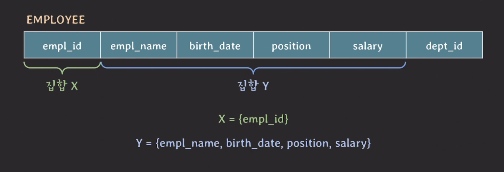
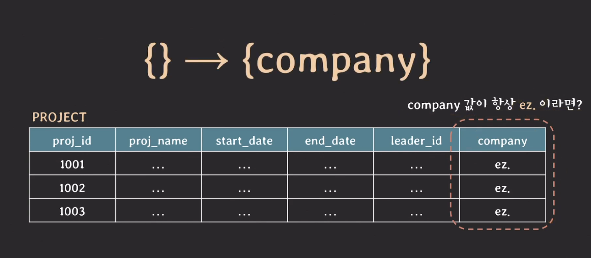

## Functional dependency

---

`Functional dependency`는 한 테이블에 있는 두 개의 attribute(s) 집합(set) 사이의 제약(a constraint)를 의미한다.

하나의 예시를 들어보자.

위 테이블은 임의의 tuple들의 X 값이 같다면 Y 값도 같다는 특징을 가지고 있다.

이처럼 X 값에 따라 Y 값이 유일하게(uniquely) 결정될 때

- X는 Y의 함수적으로 결정한다(functionally determine)
- Y가 X에 함수적으로 의존한다(functionally dependent)

라고 말할 수 있고, 두 집합 사이의 이러한 제약 관계를 `functional dependency(FD)`라고 부른다.

이를 기호로 표현하면 **X &rarr; Y**로 표현할 수 있다.

- 화살표의 왼쪽(X)를 left-hand side라고 하며 오른쪽(Y)는 right-hand side 이다.
- X &rarr; Y 가 성립한다고 Y &rarr X 가 성립하는 것은 아니다.

테이블을 스키마를 보고 **의미적으로 FD가 존재하는지 파악**해야하며, 테이블의 state를 보고 파악해서는 안된다.

> **{} &rarr; Y** 는 Y 값은 언제나 하나의 값만을 가진다는 의미이다.
>
> 

## Trivial functional dependency

---

X &rarr; Y 가 유효할 때, 만약 Y가 X의 부분 집합(subset)이라면, X &rarr; Y는 `trivial FD`이다.

- {a, b, c} &rarr; {c} 는 trivial FD이다.
- {a, b, c} &rarr; {a, b} 는 trivial FD이다.
- {a, b, c} &rarr; {a, b, c} 는 trivial FD이다.

## Non-trivial functional dependency

---

X &rarr; Y 가 유효할 때, 만약 Y가 X의 부분 집합(subset)이 아니라면, X &rarr; Y는 `non-trivial FD`이다.

- {a, b, c} &rarr; {b, c, d} 는 non-trivial FD이다.
- {a, b, c} &rarr; {d, e} 는 non-trivial FD이다.
  - 공통된 attributes가 하나도 존재하지 않음 &rarr; `completely non-trivial FD`

## Partial functional dependency

---

X &rarr; Y 가 유효할 때, 만약 Y를 결정하는 X의 proper subset이 존재한다면, X &rarr; Y는 `partial FD`이다.

- {empl_id, empl_name} &rarr; {birth_date} 가 유효할 때, {empl_id} &rarr; {birth_date} 이기 때문에, {empl_id, empl_name} &rarr; {birth_date}는 partial FD이다.

> `porper subset`
>
> 집합 X의 proper subset은 X의 부분 집합이지만 X와 동일하지는 않은 집합
> ex. X = {a, b, c}
> {a, c}, {a}, {}는 모두 X의 proper subset이다.
> 반면에 {a, b, c}는 X의 proper subset이 아니다.

## Full functional dependency

---

X &rarr; Y 가 유효할 때, 만약 Y를 결정하는 X의 proper subset이 존재하지 않는다면, X &rarr; Y는 `full FD`이다.

- {stu_id, class_id} &rarr; {grade} 가 유효할 때, {stu_id}, {class_id}, {} 중 어느 것도 {grade}를 결정하지 않기 때문에 {stu_id, class_id} &rarr; {grade}는 full FD이다.

참고 사항: FD과 관련된 추가적인 개념으로 Armstrong's axioms, Closure, minimal cover 등이 있다.
