## DB 정규화(normalization)

---

데이터베이스 정규화는 데이터베이스의 설계 과정에서 데이터 중복과 insertion, update, deletion anomaly를 최소화하기 위해 일련의 `normla forms(NF)`에 따라 relational DB를 구성하는 과정이다.

DB 정규화 과정은 다음과 같은 과정으로 진행된다.

처음부터 순차적으로 진행하며 normal form을 만족하지 못하면 만족하도록 테이블 구조를 조정한다. 또한 앞 단계를 만족해야 다음 단계를 진행할 수 있다.

- `1NF ~ BCNF` : FD와 key만으로 정의되는 normal fomrs
- 3NF까지 도달하면 정규화 됐다고 말하기도 함
- 보통 실무에서는 3NF 혹은 BCNF까지 진행(많이 해도 4NF정도까지만 진행)

## 정규화 과정

---

이제부터 정규화가 어떻게 진행되는지 한 번 살펴보자.

위와 같은 테이블이 있다고 가정해보자. 이 테이블은 다음과 같은 내용을 가지고 있다.

- 임직원의 월급 계좌를 관리하는 테이블
- 월급 계좌는 국민은행이나 우리은행 중 하나
- 한 임직원이 하나 이상의 월급 계좌를 등록하고 월급 비율(ratio)을 조정할 수 있다.
- 계좌마다 등급(class)이 있다. (국민: STAR &rarr; PRESTIGE &rarr; LOYAL, 우리: BRONZE &rarr; SIVER &rarr GOLD)
- 한 계좌는 하나 이상의 현금 카드와 연동될 수 있다.

### Key

이 테이블의 키에 대해서 살펴보자.

- super key : table에서 tuple들을 unique하게 식별할 수 있는 attributes set
- (candidate) key : account_id, {bank_name, account_num}
  - 어느 한 attribute라도 제거하면 unique하게 tuples를 식별할 수 없는 super key
- primary key : account_id
  - table에서 tuple들을 unique하게 식별하려고 선택된 (candidate) key
- prime attribute : account_id, bank_name, account_num
  - 임의의 key에 속하는 attribute
- non-prime attribute : class, ratio, empl_id, empl_name, card_id
  - 어떠한 key에도 속하지 않는 attribute

### Functional dependency

위의 내용을 가지고 FD를 파악해보자.

- {account_id} &rarr; {bank_name, account_num, class, ratio, empl_id, empl_name, card_id}
- {bank_name, account_num} &rarr; {account_id, class, ratio, empl_id, empl_name, card_id}
- {empl_id} &rarr; {empl_name}
- {class} &rarr; {bank_name}

이를 시각화하면 다음과 같다.

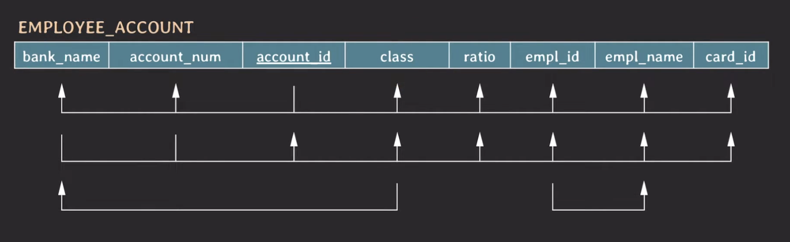

### 1NF

먼저 1NF 과정부터 살펴보자.

`1NF`를 만족하기 위해서는 attribute의 value는 **반드시 나눠질 수 없는 단일한 값**이어야 한다. 하지만, 위의 테이블 처럼 DB를 설계하면 문제가 발생한다.

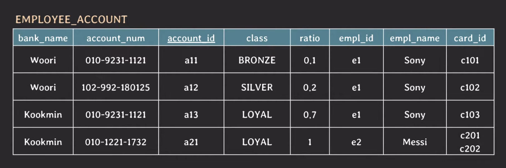

card_id가 {101, 102}로 나눠질 수 없는 단일한 값이 아니기 때문에 1NF를 만족시키지 않는다.

처리할 수 있는 방법은 여러 개이지만 그 중 가장 단순한 방법으로 1NF를 만족하도록 테이블을 분해해보자.

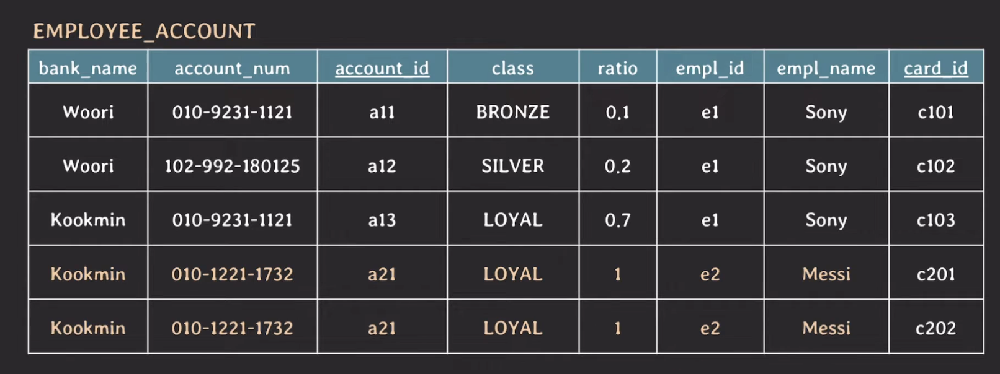

이러한 방식으로 진행하면 card_id를 {101, 102}로 분해하여 1NF를 만족하지만 primary key인 account_id가 중복되어 unique하게 식별이 불가능하다.

이를 해결하기 위해 primary key를 {account_id, card_id}로 변경하는 방식으로 문제를 해결할 수 있다.

하지만 위의 테이블에서 Messi 정보에서 중복된 데이터가 존재한다.

현재 테이블의 (candidate) key는 {account_id, card_id}와 {bank_name, account_name, card_id} 이고 non-prime attribute는 class, ratio, empl_id, empl_name 이다.

non-prime attribute는 당연히 primary key인 {account_id, card_id}에 의존을 한다. 하지만, non-prime attribute는 card_id 없이 account_id 만으로도 unique하게 결정이 될 수 있다.

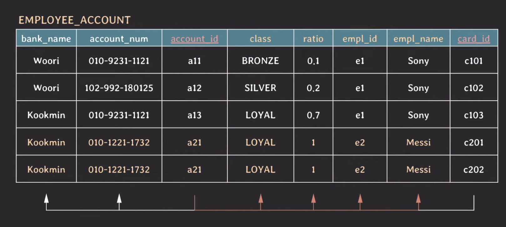

즉, 모든 non-prime attribute들이 {account_id, card_id}에 `partialy dependent` 하다. 이러한 이유로 중복된 데이터가 존재하는 것이다.

마찬가지로 {bank_name, account_name}으로도 non-prime attribute들이 unique하게 결정될 수 있다.

이 문제를 해결하기 위해서 등장한 것이 `2NF` 이다.

### 2NF

`2NF`는 모든 non-prime attribute는 모든 key에 `fully functionally dependent` 해야한다.

이를 만족시키기 위해서 기존의 테이블에서 `card_id`를 제거하고 `card_id`와 기존 테이블과 연결할 수 있는 key로 `account_id`를 포함한 테이블로 분해할 수 있다.

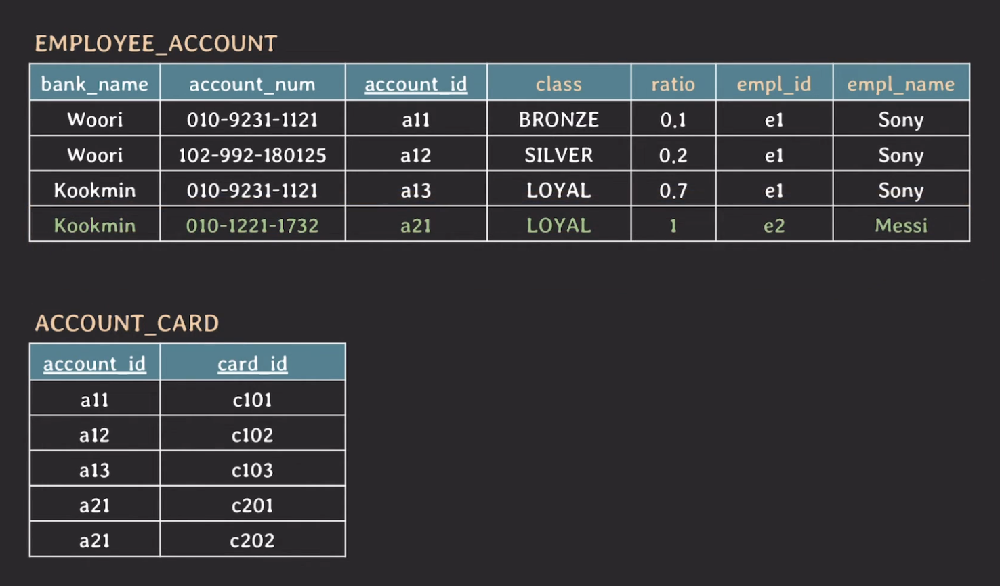

위의 `EMPLOYEE_ACCOUNT` 테이블의 (candiate) key는 {account_id}와 {bank_name, account_name}이고 non-prime attribute는 class, ratio, empl_id, empl_name 이다.

(candidate) key에 대해서 non-prime attribute는 fully dependent 하므로 이 테이블은 2NF를 만족한다.

### 3NF

2NF를 만족하는 테이블에서도 여전히 `empl_id`와 `empl_name`에 중복된 데이터가 존재한다.

`EMPLOYEE_ACCOUNT` 테이블의 FD를 시각화하면 아래 그림과 같다.

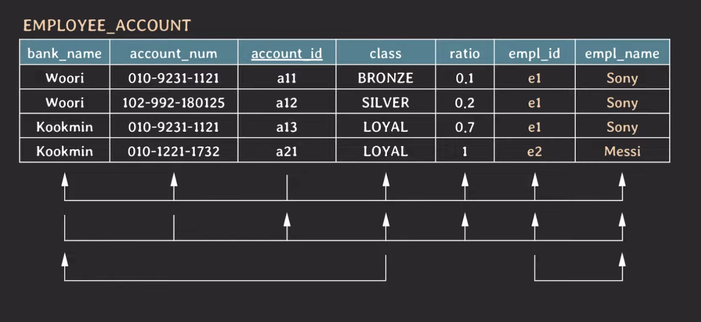

- {empl_id} &rarr; {empl_name}
- {account_id} -> {empl_id}
- {bank_name, account_num} &rarr; {empl_id}

위의 FD를 통해 {account_id} &rarr; {empl_name}, {bank_name, account_num} &rarr; {empl_name} 이 성립한다는 것을 알 수 있다.

이렇게 연결을 통해서 유도된 FD를 `transitive FD`라고 한다.

즉, X &rarr; Y, Y &rarr; Z 가 성립할 때, Y 또는 Z가 어떠한 key의 부분 집합이 아니라면 X &rarr; Z 가 성립하는 것이 transitive FD하다.

> 📍 "Y 또는 Z가 어떠한 key의 부분 집합이 아니라면" 조건에 걸리는 case
>
> - {account_id} &rarr; {class}, {class} &rarr; {bank_name}
>   - Y = {class}, Z = {bank_name}
>   - Z가 {bank_name, account_num}의 부분집합이기 때문에 transitive FD가 성립 X

이렇게 연결을 통해서 FD가 성립하기 때문에 중복된 데이터가 발생한다. 이러한 중복 데이터를 없애기 위해서 등장하는 것이 `3NF` 이다.

`3NF`는 모든 non-prime attribute는 어떤 key에도 transitively dependent 하면 안된다. 다른 말로 non-prime attribute와 non-prime attribute 사이에는 FD가 있으면 안된다.

그러므로 empl_id &rarr; empl_name 은 non-prime attribute 사이에 존재하는 FD이기 때문에 3NF를 위반하고 있으므로 이 FD를 제거해야 한다.

제거하기 위해서 `EMPLOYEE` 테이블을 새로 만들고 이 테이블에 `empl_name`과 `EMPLOYEE_ACCOUNT`와 연결할 수 있는 key인 `empl_id`를 포함하여 분해할 수 있다.

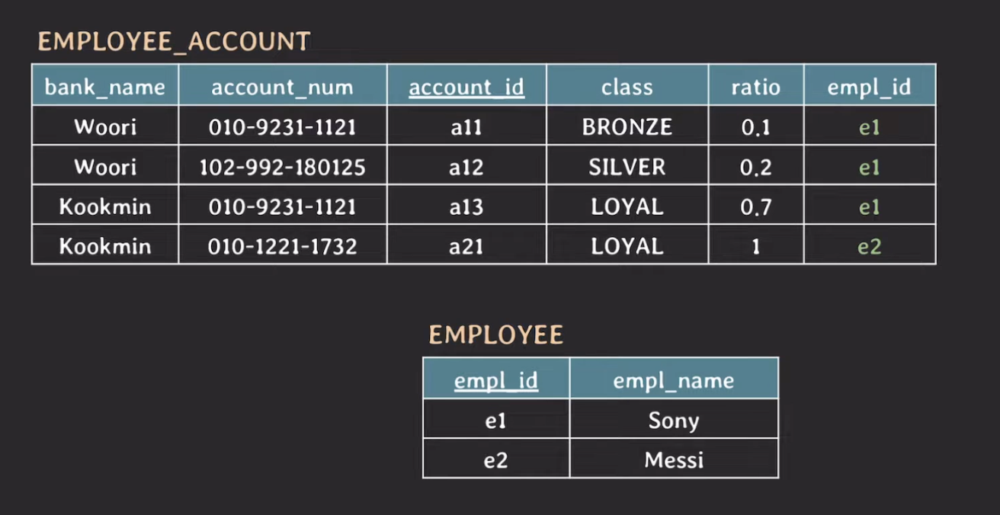

- `empl_id`는 `EMPLOYEE` 테이블의 primary key가 된다.

이 과정을 거치면 총 3개의 테이블이 생성되며 이 테이블들은 모두 3NF를 만족하므로 **정규화(normalized) 됐다** 라고 말할 수 있다.

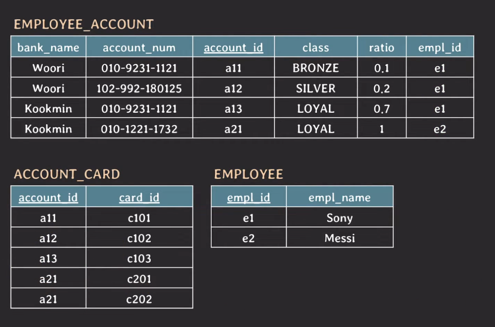

### BCNF

3NF 이후 과정인 `BCNF`에 대해서 한 번 살펴보자.

아래 테이블은 `EMPLOYEE_ACCOUNT` 테이블로 3NF까지 만족한다. 하지만, 이 테이블의 `class`와 `bank_name` 에서도 중복된 데이터가 존재한다.

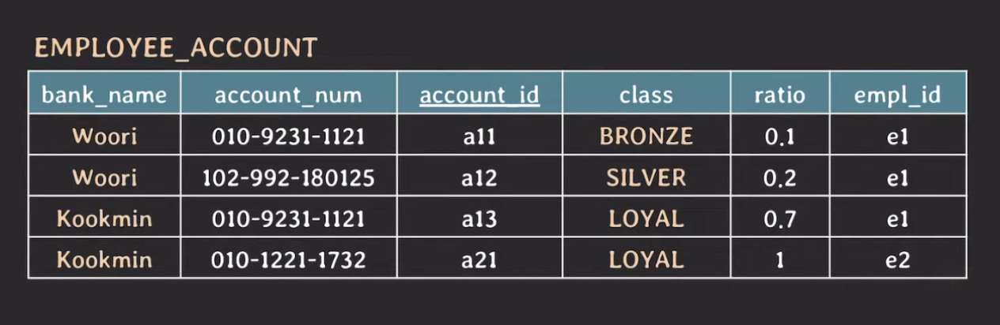

이때, 국만은행 계좌 등급과 우리은행 계좌 등급의 이름이 겹치는 것이 없기 때문에 `class`만 보고도 `bank_name`을 알 수 있다. 즉, {class} &rarr; {bank_name} 이 성립한다.

FD가 존재한다면 중복이 발생하는 attribute를 계속 들고 있을 필요가 있을까?

이와 관련된 내용을 담고 있는 것이 `BCNF` 이다.

`BCNF`는 모든 유효한 non-trivial FD X &rarr; Y는 X가 super key여야 한다.

위 테이블에서는 class만으로 튜플을 unique하게 식별할 수 없기 때문에 super key가 아니다. 그러므로 {class} &rarr; {bank_name}은 BCNF를 위반한다.

> `non-trivial FD` : Y가 X의 부분 집합이 아닌 FD

BCNF를 위반하는 FD를 제거하기 위해서 테이블을 분해해야한다.

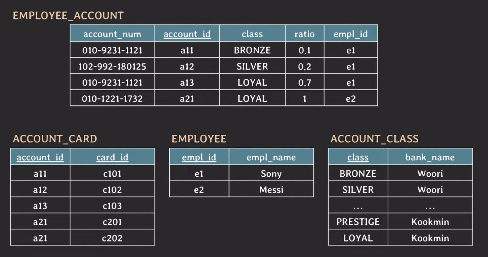

최종적으로 4개의 테이블이 생성되었고 이 테이블들은 모두 BCNF를 만족하므로 정규화 됐다 라고 말할 수 있다.

## 2NF 참고 사항

---

2NF는 key가 composite key(2개 이상으로 이루어진 key)가 아니라면 2NF는 자동적으로 만족할까?

대부분의 경우는 만족한다. 하지만 예외적인 상황이 있다.

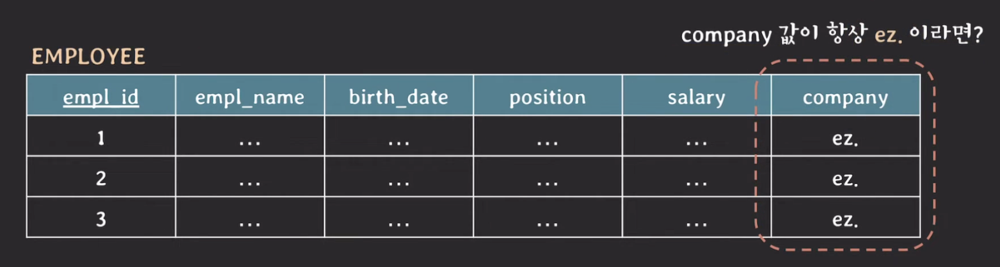

이 테이블에서 FD를 파악해보자.

- {empl_id} &rarr; {empl_name, birth_date, position, salary, company}
- {} -> {company}

{}는 {empl_id}에 부분 집합이고 company는 non-prime attribute 이다. 즉, company는 partialy dependent 하기 때문에 2NF를 위반한다.

2NF를 만족하기 위해서는 두 테이블로 나눠야한다. 최종 결과는 아래 그림과 같다.

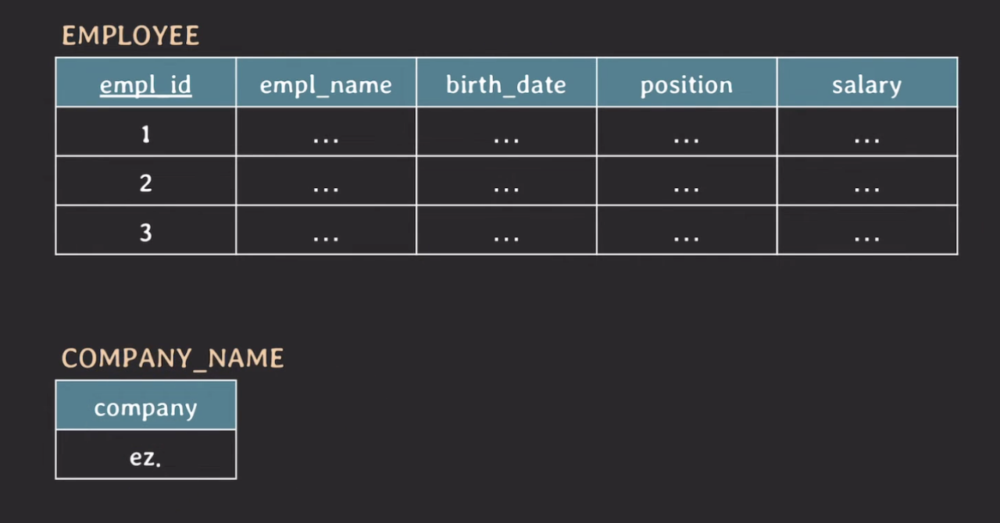

## Denormalization

---

위와 같이 정규화된 테이블은 중복된 데이터가 없어서 좋지만, 굳이 여러 테이블을 join해서 데이터를 가져와야하는 번거로움이 있다. 또한, 성능도 떨어진다.

이렇게 테이블을 쪼개지 않고 하나의 테이블로 합치는 것을 `denormalization`이라고 한다.

> 📍 DB를 설계할 때 가장 중요한 것은 DB를 설계할 때 과도한 조인과 중복 데이터 최소화 사이에서 적정 수준을 잘 선택할 필요가 있다.
