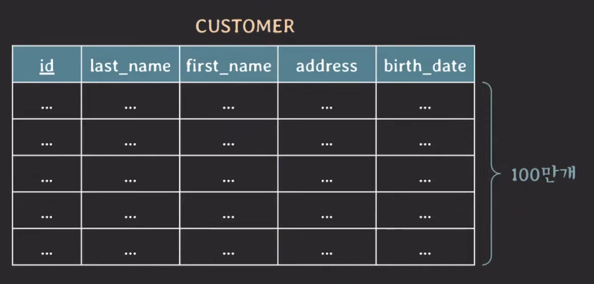
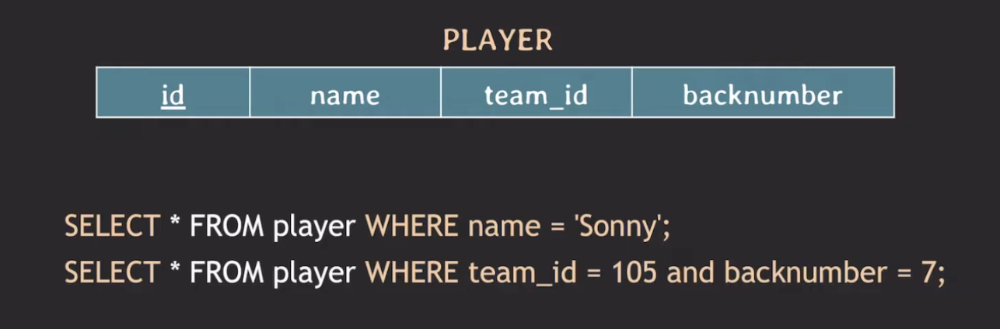
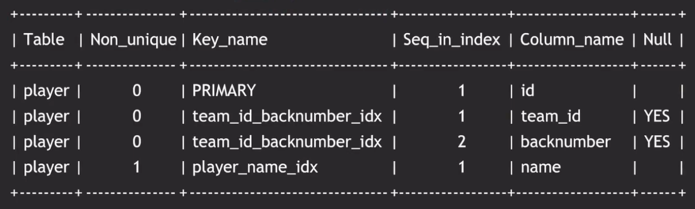
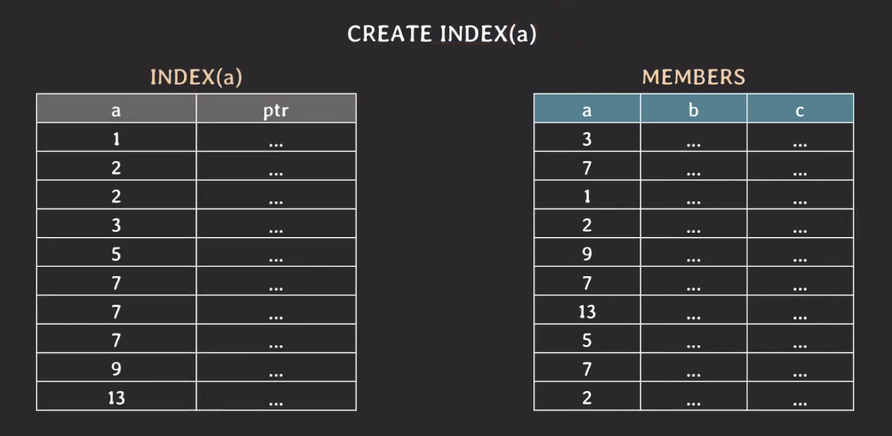
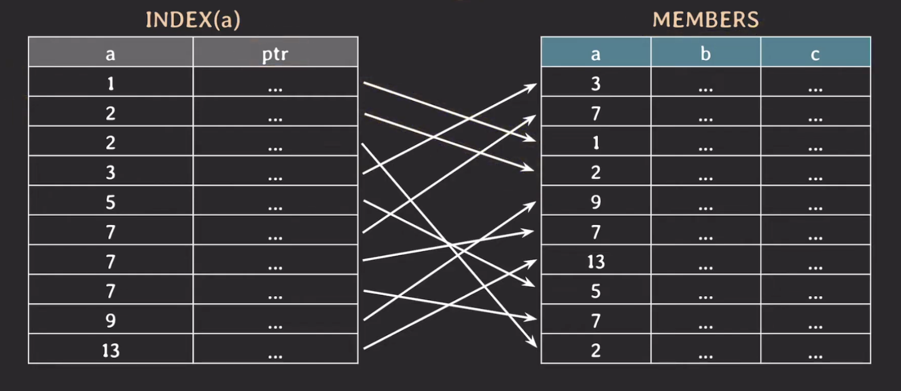
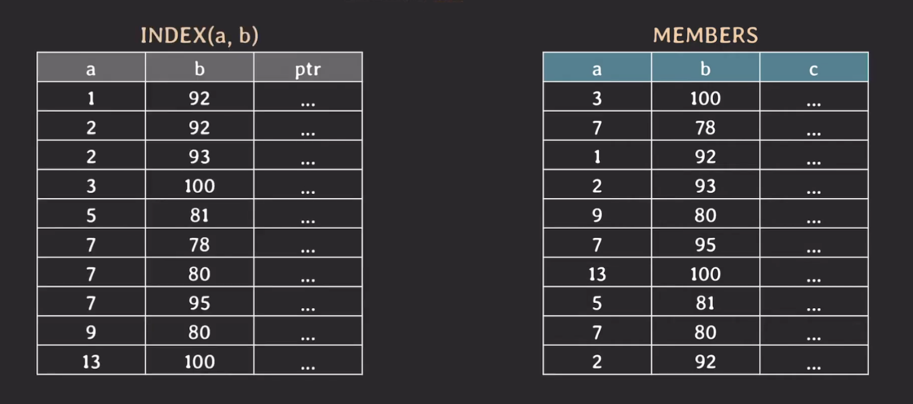
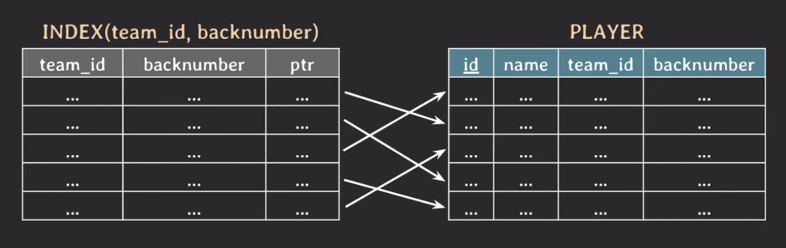

아래의 내용은 MySQL 기준으로 설명하였으며 다른 RDBMS와 차이가 있을 수 있습니다. 또한 optimizer에 따라 인덱스 사용 여부가 달라질 수 있습니다.

## Index

---

하나의 예를 들어보자.



```sql
SELECT *
FROM customer
WHERE first_name = 'Minsoo';
```

위와 같은 쿼리를 실행할 때 `first_name`에 index가 걸려있지 않다면?

full scan(=table scan)으로 찾아야 하며 이때 시간 복잡도는 `O(N)` 이다.

index(B-tree based index)가 걸려있다면 `O(logN)`으로 훨씬 발리 찾을 수 있다.

이 예시를 통해 DB에서 Index를 쓰는 이유는 조건을 만족하는 튜플(들)을 빠르게 조회거나 빠르게 정렬(order by)하거나 그룹핑(group by) 하기 위해서다.

하나의 쿼리문을 예시로 들어보자.

```sql
SELECT * FROM customer WHERE first_name = 'Minsoo';
DELETE FROM logs WHERE log_datetime < '2022-01-01';
UPDATE employee SET salary = salary * 1.5 WHERE dept_id = 1001;
SELECT * FROM employee E JOIN department D ON E.det_id = D.id;
```

위 쿼리문에서 `WHERE` 절(조건문)과 `JOIN` 에서 `ON`의 조건문 모두 Index를 사용한다.

### Index 생성



위의 상황에서 index를 생성하는 방법을 알아보자.

- 첫번째 쿼리문 : `name`은 중복이 허용됨
  - `CREATE INDEX player_name_idx ON player(name);`
- 두번째 쿼리문 : `team_id and backnumber` 은 중복 허용이 안됨
  - `CREATE UNIQUE INDEX team_id_backnumber_idx ON player team_id, backnumber);`

처음 테이블을 생성할 때 index를 걸어줄 수도 있다.

```sql
CREATE TABLE player (
    id  INT PRIMARY KEY,
    name VARCHAR(20) NOT NULL,
    team_id INT,
    backnumber INT,
    INDEX player_name_idx(name),
    UNIQUE INDEX team_id_backnumber_idx(team_id, backnumber)
);
```

두 컬럼을 묶어서 index를 생성한 것을 `multicolumn index` 또는 `composite index`라고도 한다.

또한, 대부분의 RDBMS는 primary key에는 index가 자동 생성된다.

특정 테이블에 걸려있는 index를 확인하고 싶다면 아래와 같이 쿼리를 실행하면 된다.

```sql
SHOW INDEX FROM player;
```

위 쿼리를 실행하면 다음과 같은 결과가 나온다.



## B-tree 기반 index

---

하나의 예시를 들어보자.



오른쪽 테이블의 `a`라는 컬럼에 대해 B-tree 기반 index를 걸어주면 왼쪽과 같이 생성된다. 이 index는 `a` 대한 값들을 정렬이 된 형태로 저장된다. 또한 pointer(ptr)이라는 데이터를 가진다.

`pointer(ptr)`은 실제 테이블의 각각의 튜플을 연결하는 역할을 한다.

이러한 상황에서 `WHERE a = 9;`을 찾고자 한다.



`INDEX(a)`를 사용하면 `a`에 대한 값들을 정렬이 된 형태로 저장되어 있기 때문에 `a = 9`인 튜플을 binary search를 통해 빠르게 찾을 수 있다.

**탐색 과정**

1. 1 ~ 13 범위에서 가장 가운데 겂은 a = 5 부터 탐색을 시작한다.
2. 5보다 크므로 6 ~ 13 범위에서 가장 가운데은 a = 7 부터 탐색을 시작한다.
3. 찾고자 하는 값이 7보다 크므로 9 ~ 13 범위에서 a = 9를 탐색한다.
4. 찾고자 하는 값을 찾았으므로 이 데이터의 포인터를 이용해 데이터를 찾는다.
5. 만약 그 아래(또는 위)에 동일한 값이 있을 수도 있기 때문에 바로 아래의 데이터도 확인을 하는 과정을 거쳐야한다.

index가 하나의 컬럼에 대해 걸려있는 것이 아니라 2개 이상 걸려있을 경우는 어떻게 index가 생성이 되고 탐색이 진행될까?



위와 같이 index가 생성될 때는 왼쪽을 기준으로 정렬이 되고 그 다음 오른쪽을 기준으로 정렬이 되는 방식으로 진행된다.

여기서 `WHERE a = 7 AND b = 95` 쿼리를 실행하면 다음과 같이 진행한다.

`a = 7`인 과정은 위의 과정과 같다. 그 다음은 `b = 95`를 찾기 위해서는 `a = 7`인 데이터 범위 중에서 똑같이 이진 탐색을 수행하면서 `b = 95`인 데이터를 찾는다.

> 만약, 위의 index로 `b = 95` 쿼리를 실행하면 어떻게 될까?
>
> 이 같은 경우는 index를 사용하지 않고 full scan을 수행하는 것이 더 빠르다. 위의 index는 `a`를 기준으로 정렬이 되어있고 그 다음 `b`를 기준으로 정렬이 되어있기 때문에 `b`에 대한 index만으로는 빠르게 데이터를 찾을 수 없다.

좋은 성능을 내기 위해서는 쿼리문에 따라 사용하는 index를 잘 선택해야하며 만약, 특정 쿼리문이 사용하는 index를 사용하는지 알기 위해서는 쿼리문 앞에 `EXPLAIN`을 붙여주면 된다.

RDBMS의 optimizer가 쿼리문을 분석하여 가장 효율적인 index를 선택하기 때문에 일일이 index를 선택할 필요는 없다.

간혹 optimizer가 잘못된 index를 선택하는 경우가 있는데 이때는 쿼리문에 `USE INDEX` 또는 `FORCE INDEX`를 사용하여 강제로 index를 선택할 수 있다.

```sql
SELECT * FROM player USE INDEX (backnumber_idx) WHERE backnumber = 7;
```

- `USE INDEX` : 권장 사항
- `FORCE INDEX` : 반드시 사용
- `IGNORE INDEX` : index 중 사용하지 않았으면 하는 index를 지정

### Index의 단점

Index를 사용하면 쿼리문의 성능은 좋아지지만 너무 많아지면 오히려 성능이 저하될 수 있다.

- table에 write(insert, update, delete)할 때마다 index도 함께 수정해야 한다.
  - 오버헤드 발생할 수 있음
- index를 위한 저장 공간이 필요하다.

그러므로 불필요한 index를 만들지 않아야 한다.

## Covering index

---

아래와 같은 테이블과 인덱스가 있다고 가정하자.



이 떄, `SELECT team_id, backnumber FROM player WHERE team_id = 5;` 를 실행할 때, `INDEX(team_id, backnumber)` 만 사용하고 `PLAYER` 테이블까지 찾아가서 정보를 가져올 필요가 없다.

이처럼 조회하는 attribute(s)를 index가 모두 cover하는 index를 `Covering index`라고 하며 조회 성능이 더 빠르다.

## Hash index

---

B-tree 말고 Hash index도 있다. Hash index는 Hash table을 사용하여 index를 구현한다.

- 시간 복잡도 O(1)의 성능
- rehashing에 대한 부담
- equality 비규만 가능, range 비교 불가능
- multicolumn index의 경우 전체 attributes에 대한 조회만 가능

## Full scan이 더 좋은 경우

---

- table에 데이터가 조금 있을 때(몇 십, 몇 백건 정도?)
- 조회하려는 데이터가 테이블의 상당 부분을 차지할 때
  - optimizer가 판단

> 📍 참고 사항
>
> - order by나 group by에도 index가 사용될 수 있다.
> - foreign key에는 index가 자동으로 생성되지 않을 수 있다(join 관련).
> - 이미 데이터가 몇 백만 건 이상 있는 테이블에 인덱스를 생성하는 경우 시간이 몇 분 이상 소요될 수 있고 DB 성능에 안좋은 영향을 줄 수 있다.
