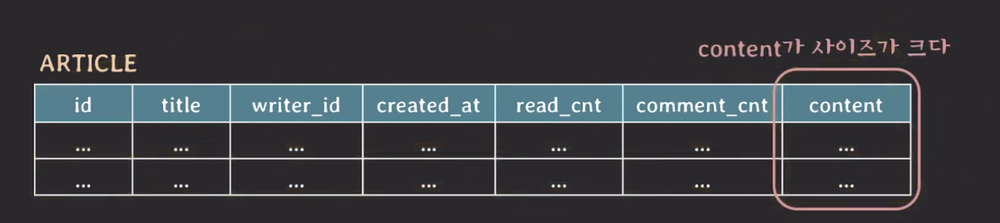
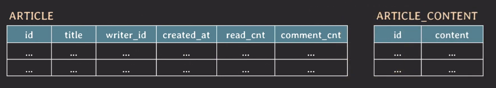
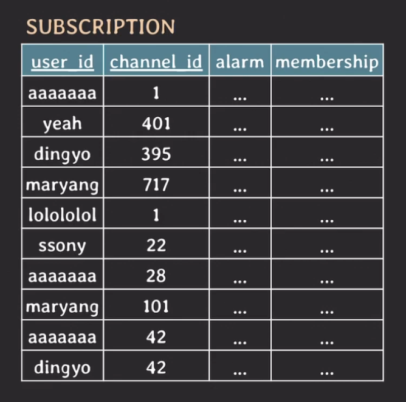
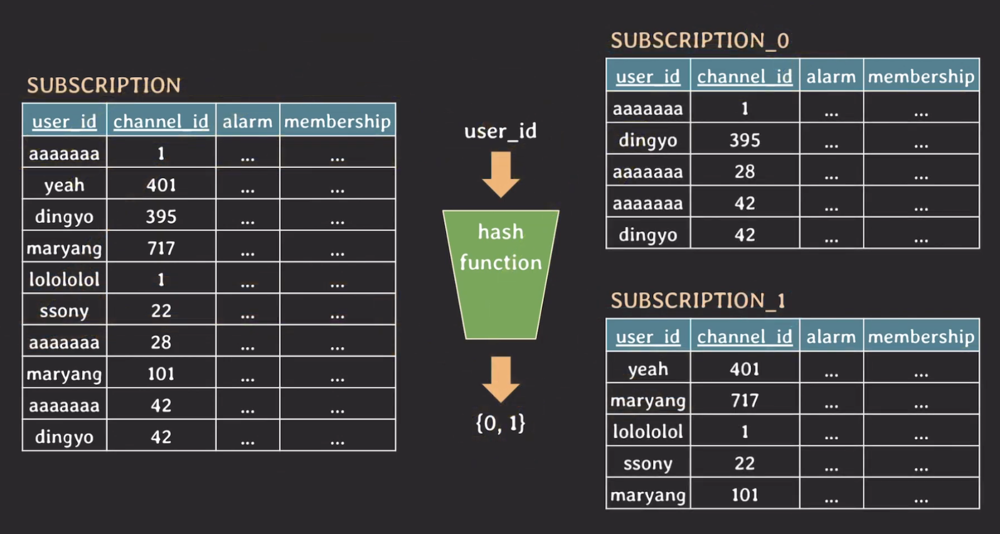
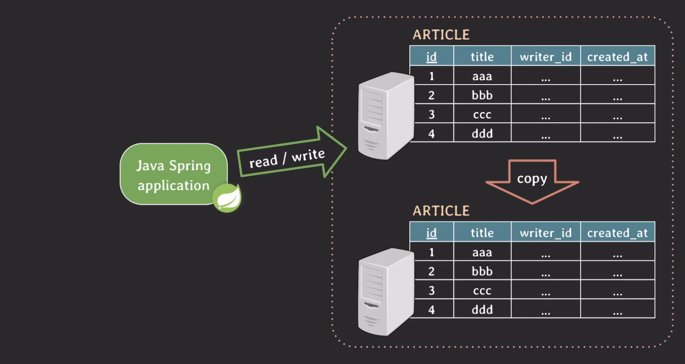

## Partitioning

---

`Partitioning`은 database table을 더 작은 table들로 나누는 것을 말한다. partitioning 종류는 크게 2가지로 나눈다.

- `vertical partitioning` : column을 기준으로 table을 나누는 방식
- `horizontal partitioning` : row를 기준으로 table을 나누는 방식

이전에 배운 normalization 또한 컬럼을 기준으로 table을 나누기 때문에 vertical partitioning에 속한다고 볼 수 있다.

### vertical partitioning

하나의 예시를 들어보자.



위와 같은 테이블이 있을 때 개발자가 `content`를 제외한 다른 컬럼 정보를 담고있는 article 리스트를 화면에 보여주기 위해 아래와 같은 쿼리를 실행해야한다.

```sql
SELECT id, title, writer_id, created_at, read_cnt, comment_cnt
FROM article
WHERE ...
```

이때 동작 과정은 SSD에서 데이터를 메모리에 올린 후에 원하는 attributes만 필터링해서 가져온다. 이 말은 사용하지 않는 content를 메모리에 올려야 해 I/O에 대한 부담이 많이 가는 문제점이 있다. 특히 `content` 같은 경우는 사이즈가 크기 떄문에 더더욱 그렇다.

이 문제를 vertical partitioning을 통해서 해결할 수 있다.



이렇게 정규화가 된 경우에도 vertical partitioning을 적용해 테이블을 나눠 성능을 개선할 수 있다.

### horizontal partitioning

`horizontal partitioning`은 row를 기준으로 table을 나누는 방식으로 테이블의 스키마가 동일하게 유지된다.



위와 같은 테이블이 존재할 때 만약 user가 N이고 channel이 M이면 테이블이 가질 수 있는 최대 row의 개수는 N \* M개이다.

이 예시를 통해 테이블의 크기가 커질수록 인덱스의 크기도 커진다. 이 말은 즉슨 테이블에 읽기/쓰기가 있을 떄마다 인덱스에서 처리되는 시간도 조금씩 늘어난다.

이렇게 한 테이블에 데이터가 너무 많을 떄 해결할 수 있는 방법이 바로 horizontal partitioning이고 그 중 `hash` 기반 방법이 가장 많이 사용된다.



`user_id`를 기준으로 partitioning을 하며 `user_id`를 hash function으로 넣었을 때 나오는 값에 따라 어떤 테이블에 저장할 지 결정된다. 이때, `user_id`를 `partition key`라고 한다.

데이터를 조회할 때 `user_id`로 조건을 필터링하는 경우에는 hash function을 사용할 수 있지만 그 외의 컬럼으로 조건을 필터링하는 경우에는 hash function을 사용할 수 없다.

그러므로, 가장 많이 사용될 패턴에 따라 partition key를 정하는 것이 중요하며 또한 데이터가 균등하게 분배될 수 있도록 hash function을 잘 정의하는 것도 중요하다.

> **📍 hash-based horizontal partitioning의 주의사항**
>
> hash-based horizontal partitioning은 한 번 partition이 나눠져서 사용되면 이후에 partition을 추가하기 까다롭다.

## Sharding

---

`Sharding`은 horizontal partitioning처럼 동작하지만 각 partition이 독립된 DB 서버에 저장된다.


- `horizontal partitioning` : 모든 partition들을 같은 DB 서버에 저장하기 때문에 백엔드 서버로부터 요청이 밀려오면 DB 서버에 부하가 몰리는 문제가 발생
- `Sharding` : 각 partition이 독립된 DB 서버에 저장하면 요청에 따라 적절한 DB 서버에 요청을 보내 부하를 분산

sharding에서는 partition key를 shard key라고 부르며 각 partition을 shard라고 부른다.

## Replication

---

백엔드 서버에서 read/write 요청을 보내면 DB 서버는 요청을 처리하고 응답을 보낸다. 만약 DB 서버에 장애가 발생하면 데이터에 접근하지 못한다.

이러한 문제를 방지하기 위해서 사용하는 기술이 `replication`이다.

replication은 DB 서버에 있는 데이터를 똑같이 copy를 해 다른 DB에 저장한다. copy된 DB는 원본 DB의 데이터가 변경되면 똑같이 변경된다.



- `master/primary/leader` : 원본 DB
- `slave/secondary/replica` : 복제된 DB

이 방식을 장점은 만약 DB 서버에 장애가 발생하면 복제된 DB를 사용하면 되기 때문에 데이터에 접근하지 못하는 문제를 방지할 수 있는 `high availability`를 구현할 수 있다. 또한 read 요청을 복제된 DB로 보내면 DB 서버의 부하를 분산시킬 수 있다.
