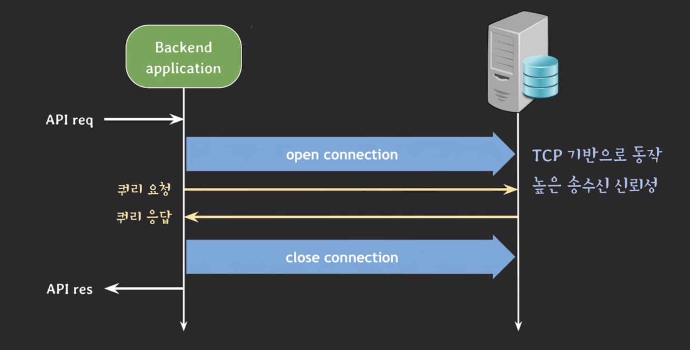
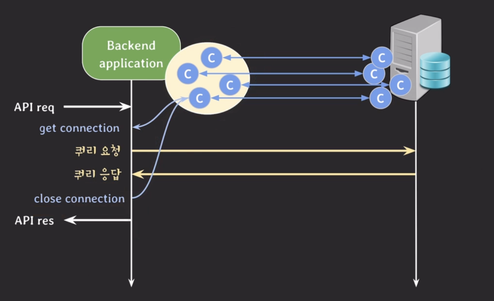
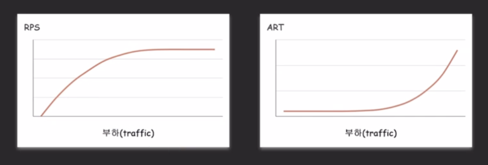

백엔드 서버와 DB 서버가 통신을 할 때 TCP 기반으로 동작한다. TCP의 특징으로 높은 신뢰성으로 데이터를 송수신할 수 있다. TCP는 연결 지향적인 특징이 있어 open connection, close connection이 필요하다.

이때, open connection과 close connection 과정에서 시간이 소요된다. 백엔드 관점에서 매번 connection을 열고 닫는 시간적인 비용이 발생한다. 이러한 과정이 많이 발생하면 서비스 성능에 좋지 않다.

이러한 문제를 해결하기 위한 기술이 `DB Connection Pool`이다.

## DB Connection Pool(DBCP)

---

`DBCP`는 백엔드 서버와 DB 서버가 API 요청을 받기 전에 미리 여러 connection을 미리 생성해놓고 필요할 때마다 connection을 빌려주고 반납받는 기술이다.

이 떄 여러 connection을 `database connection pool(DBCP)`이라고 부른다.

- get connection : connection을 빌려오는 과정
- close connection : connection을 반납하는 과정
  - connection이 바로 끊어지는 것이 아니라 pool에 반납

이렇게 connection을 재사용하는 방식을 사용하면 기존 방식에서 발생하는 시간적인 비용을 줄일 수 있다.

### DBCP 설정 방법

아래 내용은 MySQL + HikariCP를 기준으로 작성되었습니다.

DB connection은 backend server와 DB 서버 사이의 연결을 의미하기 때문에 backend server와 DB 서버 가각에서의 설정(configuration) 방법을 잘 알고 있어야 한다.

- DB 서버 설정(MySQL)
  - `max_connections` : client와 맺을 수 있는 최대 connection의 수
  - `wait_timeout` : connection이 inactive 할 때 다시 요청이 오기까지 얼마의 시간을 기다린 뒤에 close할 것인지를 결정
    - 비정상적인 connection 종료, connection 다 쓰고 반환이 안됨, 네트워크 단절 등등이 발생했을 떄 DB 서버는 이를 인지하지 못하고 connection을 맺고 있는 상태로 유지하지 않도록 설정
    - 시간 내에 요청이 도착하면 0으로 초기화
- backend server 설정(HikariCP)
  - `minimumIdle` : pool에서 유지하는 최소한의 idle connection 수
    - 기본 값은 maximumPoolSize와 동일(=pool size 고정)
  - `maximumPoolSize` : pool이 가질 수 있는 최대 connection 수
    - idle과 active(in-use) connection 합쳐서 최대 수
  - idle connection 수가 minimumIdle보다 작고, 전체 connection 수도 maximumPoolSize보다 작다면 신속하게 추가로 connection을 만든다.
  - `maxLifetime` : pool에서 connection의 최대 수명
    - maxLifetime을 넘기면 idle일 경우 pool에서 바로 제거, active인 경우 pool로 반환된 후 제거 후 새로운 connection을 생성(maximumPoolSize 이내에서)
    - pool로 반환이 안되는 maxLifetime 동작 안함
    - DB의 connection time limit보다 몇 초 짧게 설정해야한다.
  - `connectionTimeout` : connection을 빌려올 때 대기하는 최대 시간

## Connection 수 추정 방법

---

하나의 예시를 들어보자.

- primary DB
  - max_connections : 30
- backend server
  - maximumPoolSize: 5

적절한 connection 수를 찾기 위한 과정은 다음과 같다.

- 모니터링 환경 구축(서버 리소스, 서버 스레드 수, DBCP 등등)
- 백엔드 시스템 부하 테스트
  - ex. nGrinder

부하 테스트 시스템에서 request per second와 avg response time 확인한다.

위의 그래프에서 RPS(처리량)이 더 이상 증가하지 않고 완만해지는데, ART(처리 속도)가 급격하게 늘어나는 지점이 발생했다.

이 구간은 시스템에 병목이 발생하기 시작한 지점으로 아래와 같은 상황을 고려해볼 수 있다.

- DB 자체가 병목인지 확인 : CPU / Memory / Disk I/O 사용률이 높은 경우
  - read 분산 &rarr; secondary 추가
  - 반복 조회 최적화 &rarr; cache layer
  - 데이터 분산 &rarr; sharding 등을 통해 문제를 해결
- DB와 backend 리소스가 정상인 경우 : Connection Pool 또는 Thred 병목
  - thread per request 모델 : active thread 수 확인
  - DBCP의 activte connection 수 확인 &rarr; maximumPoolSize가 너무 작으면 size를 늘려서 테스트
  - DB의 max_connections와 각 backend server의 maximumPoolSize를 고려
    - 총 connection 수가 충분한데도 문제가 없다면 → max_connections를 점진적으로 늘리며 적정 값 탐색
- 백엔드 서버 수를 고려한 설정
  - 전체 connection 수 = (서버 수) × (maximumPoolSize)
  - 이를 기반으로 DBCP의 max pool size를 결정

> **📍 참고 사항**
>
> 여러 종류의 DBCP가 존재하며 현재 사용 중인 DBCP의 사용법을 잘 숙지하는 것이 중요 
> 참고: [Commons DBCP 이해하기](https://d2.naver.com/helloworld/5102792)
