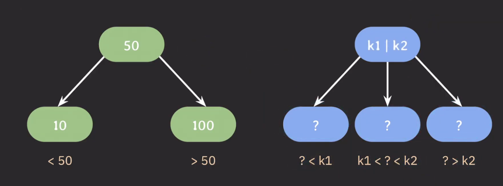

## B-tree의 개념

---

이진 탐색 트리(BST) 모든 노드의 왼쪽 서브 트리는 해당 노드의 값보다 작은 값들만 가지고 모든 노드의 오른쪽 서브 트리는 해당 노드의 값보다 큰 값들만 가진다.

만약 자식 노드를 두 개가 아닌 세 개 가지게 만들려면 어떻게 해야할까?

방법은 각 자식 노드의 범위를 정해두는 것이다. 이 때 부모 노드는 값의 범위를 정해주기 위해 두 개의 값을 가진다.

이를 일반화하면 자식 노드의 최대 개수를 늘리기 위해서 부모 노드에 key를 하나 이상 저장하며 이 key들을 오름차순으로 정렬해두면 된다. 이 정렬된 순서에 따라 자녀 노드들의 key 값의 범위가 결정된다.

`B-tree`는 자식 노드의 최대 개수를 상황에 맞게 유연하게 설정할 수 있는 트리 구조이다. 또한, 최대 몇 개의 자식 노드를 가질 것인지가 B-tree를 사용할 때 중요한 파라미터이다.

- `M` : 각 노드의 최대 자식 노드 수
  - 최대 M개의 자식을 가질 수 있는 B-tree를 M차 B-tree라 부른다.
- `M-1` : 각 노드의 최대 key 수
- `[M/2]` : 각 노드의 최소 자식 노드 수
  - `[]`는 올림을 의미

**위의 조건들은 root node, leaf node는 제외한다.**

B-tree 특징으로 대표적인 것은 아래와 같다.

- internal 노드의 key 수가 x 개라면 자녀 노드의 수는 언제나 x + 1 개다.
- 노드가 최소 하나의 key는 가지기 때문에 몇 차 B-tree인지와 상관없이 internal 노드는 최소 두 개의 자식을 가진다.
- M이 정해지면 root 노드를 제외하고 internal 노드는 최소 [M/2] 개의 자식 노드를 가질 수 있게 된다.

## B-tree 데이터 삽입

---

B-tree 데이터 삽입 과정은 아래와 같은 규칙을 따른다.

- 추가는 항상 leaf 노드에 한다.
- 노드가 넘치면 가운데(median) key를 기준으로 좌우 key들은 분할하고 가운데 key는 부모 노드로 승진한다.
  - 노드가 넘친다는 의미는 key의 개수가 M개를 초과한다는 의미이다.

이 과정을 시각화하면 아래와 같다.

위 트리와 같은 B-tree는 다음과 같은 특징을 갖는다.

- 모든 leaf 노드들은 같은 레벨에 있다.
  - balanced tree
- 검색 avg/worst case 모두 $O(log N)$ 이다.
