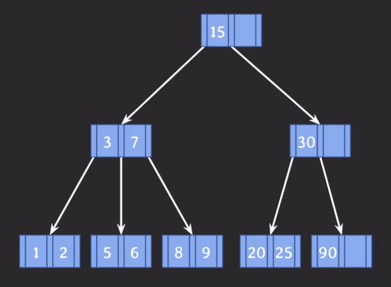
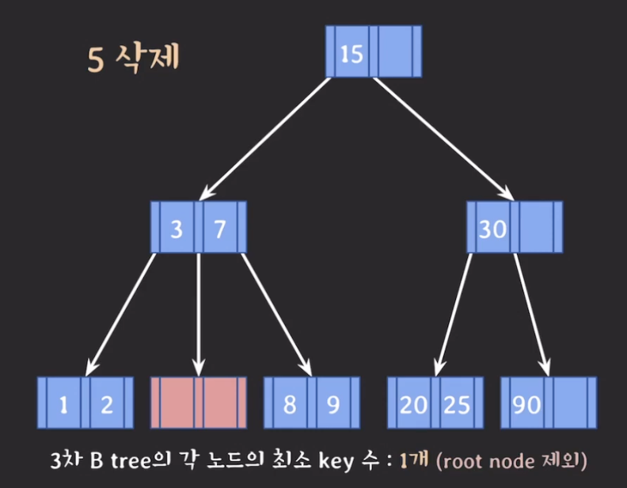
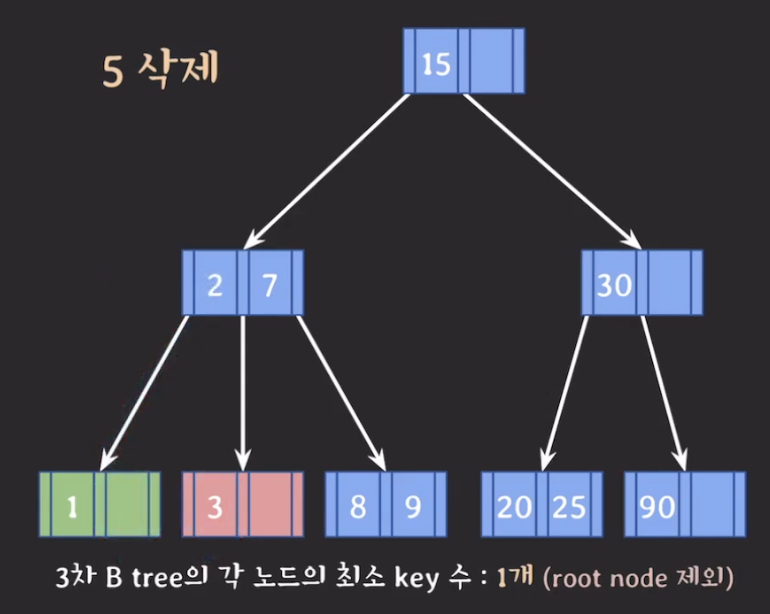
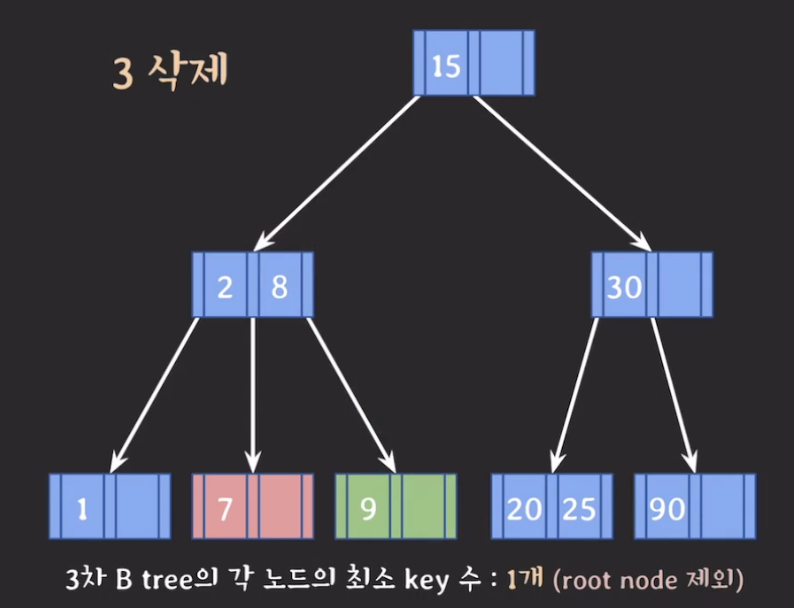
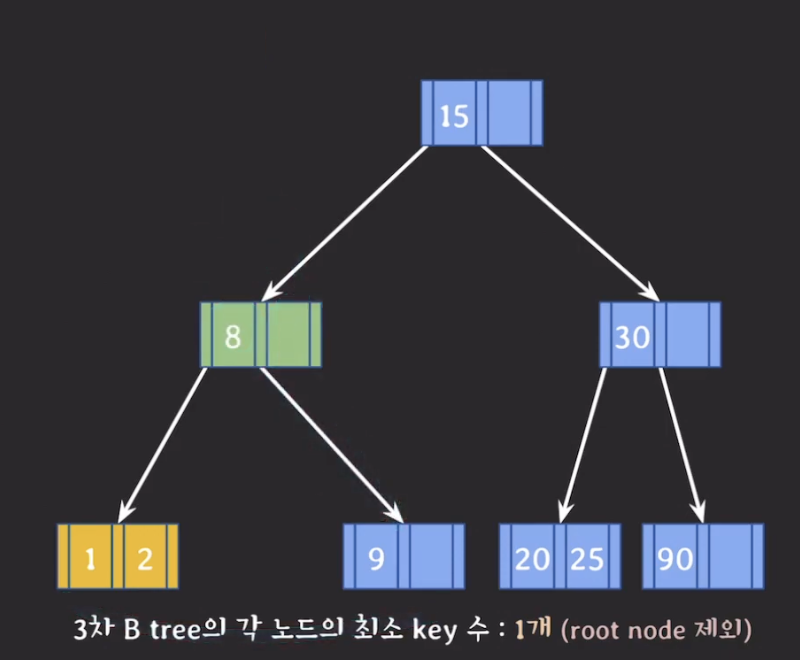
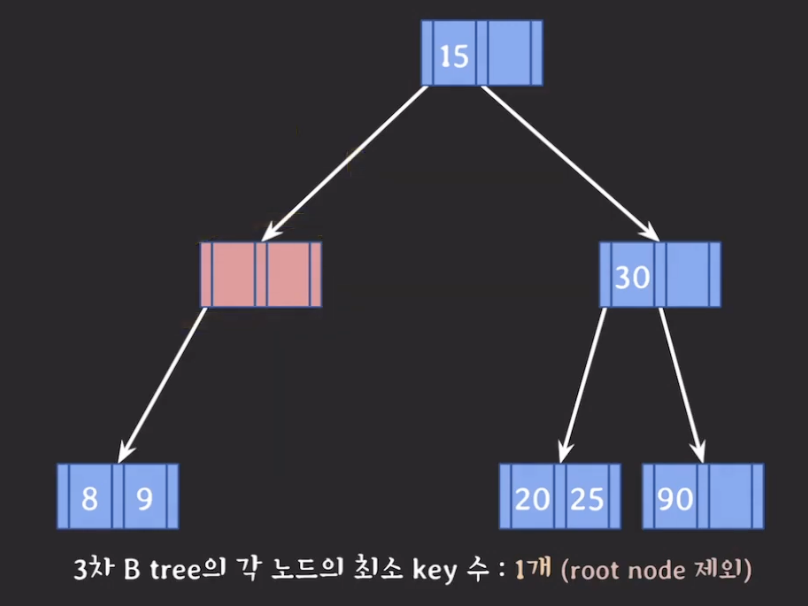
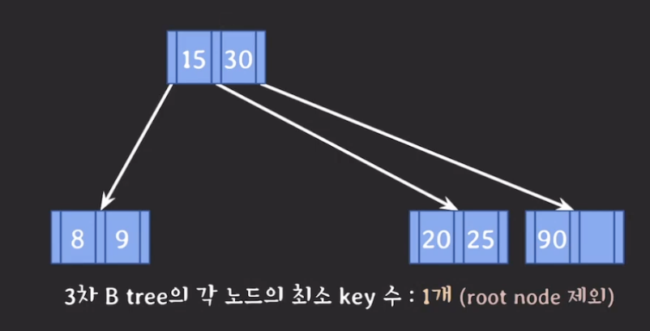
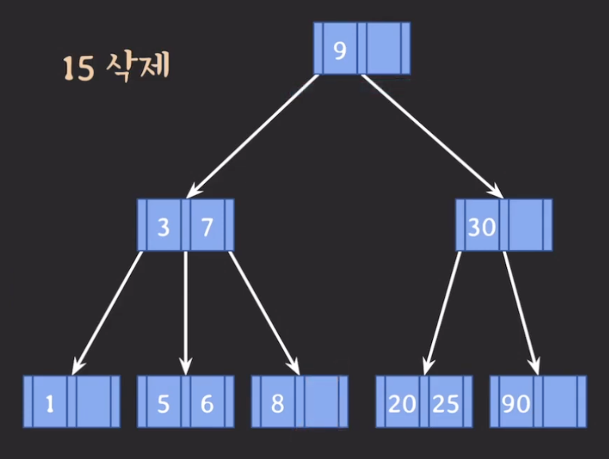

B-tree의 특징을 간단히 정리하면 아래와 같다.

- `M` : 각 노드의 최대 자녀 노드 수
- `M - 1` : 각 노드의 최대 key 수
- `[M/2]` : 각 노드의 최소 자녀 노드 수
- `[M/2]-1` : 각 노드의 최소 key 수(단 root node 제외)

## B-tree 데이터 삭제

---

B-tree 데이터 삭제는 항상 leaf 노드에서 발생한다. 만약 **삭제 후 최소 key 수보다 적어졌다면 재조정**을 해야한다.

- 3차 B-tree 에서 각 노드의 최소 key 수 &rarr; 1개

재조정은 크게 두 가지로 나눈다. 하나는 leaf 노드에서 재조정하는 경우이고 다른 하나는 internal 노드에서 재조정하는 경우이다.

## leaf 노드에서 데이터 삭제

---

leaf 노드에서만 데이터를 삭제하는 예를 들어보자.

위의 B-tree에서 첫 번째로 key 5, 6을 삭제하는 경우이다. 이 결과 아래와 같은 B-tree가 만들어진다.

위의 경우는 형제가 key 수가 여유가 있다. 따라서 형제의 지원을 받아 key를 하나 가져온다.

여기서 3을 삭제하면 key 수가 최소 key 수보다 적어진다. 따라서 재조정 과정을 거친다. 이때, 동생 노드는 key의 수에 여유가 없기 때문에 형의 key를 가져온다.

위의 B-tree에서 7을 삭제하면 key 수가 최소 key 수보다 적어 제조정해야한다. 하지만, 형제 모두 여유 키가 존재하지 않는다. 이런 경우 부모의 지원을 받고 형제와 합치는 과정으로 재조정을 거쳐야한다.

여기서 2와 1을 삭제하려고 한다. 2를 먼저 삭제할 때는 key 수가 최소 key 수보다 적어지지 않기 때문에 재조정 과정이 필요하지 않다. 하지만 1을 삭제할 때는 key 수가 최소 key 수보다 적어지기 때문에 재조정 과정을 거쳐야한다.

하지만 위의 경우는 부모 노드가 비는 경우가 생긴다. 이 경우는 그 위치에서 재조정하는 과정을 거쳐야한다. 이 과정을 거치면 아래와 같은 B-tree가 만들어진다.

B-tree leaf 노드에서 재조정과정을 정리하면 다음과 같이 정리할 수 있다.

1. key 수가 여유있는 형제의 지원을 받는 경우
   - 동생(왼쪽 형제)이 여유가 있으면 도앵의 가장 큰 key를 부모 노드의 나와 동생 사이에 두고 원래 그 자리에 있던 key는 나의 가장 왼쪽에 둔다.
   - 형(오른쪽 형제)이 여유가 있으면 형의 가장 작은 key를 부모 노드의 나와 형 사이에 두고 원래 그 자리에 있던 key는 나의 가장 오른쪽에 둔다.
2. 형제의 지원이 불가능해 부모의 지원을 받는 경우
   - 동생이 있으면 동생과 나 사이의 key를 부모로부터 받으며 그 key와 나의 key를 차례대로 동생에게 합치고 나의 노드를 삭제한다.
   - 동생이 없으면 형과 나 사이의 key를 부모로 부터 받으며 그 key와 형의 key를 차례대로 나에게 합치고 형의 노드를 삭제한다.
3. 부모가 지원한 후 부모에 문제가 있다면 상황에 맞게 대응한다.
   - 부모가 root 노드가 아니라면 그 위치에서 부터 다시 1번부터 재조정을 시작한다.
   - 부모가 root 노드고 비어있다면 부모 노드를 삭제하고 직전에 합쳐진 노드가 root 노드가 된다.

## internal 노드에서 데이터 삭제

---

internal 노드에 있는 데이터를 삭제하려면 **leaf 노드에 있는 데이터와 위치를 바꾼 후** 삭제를 해야한다.

internal 노드에서 데이터를 삭제하는 예를 들어보자.

위의 b-tree에서 15를 삭제하기 위해서 leaf 노드에 있는 데이터와 위치를 바꿔야한다. 그렇다면 이때, leaf 노드에 있는 데이터 중에 어떤 데이터와 위치를 바꿔야 할까?

바꿔야하는 데이터는 **삭제할 데이터의 선임자나 후임자와 위치를 바꿔주어야**한다. 이때, 선임자와 후임자는 항상 leaf 노드에 있다.

- `선임자(predecessor)` : 나보다 작은 데이터들 중 가장 큰 데이터
- `후임자(successor)` : 나보다 큰 데이터들 중 가장 작은 데이터

이떄 선임자 데이터인 9와 바꾸고 15를 삭제하면 아래와 같은 B-tree가 만들어진다.

B-tree 데이터 삭제를 정리하면 아래와 같다.

- 삭제는 항상 leaf 노드에서
- internal 녿의 경우 선임자와 위치 바꾼 후 삭제
- 삭제 후 최소 key 수보다 적어졌다면 재조정
